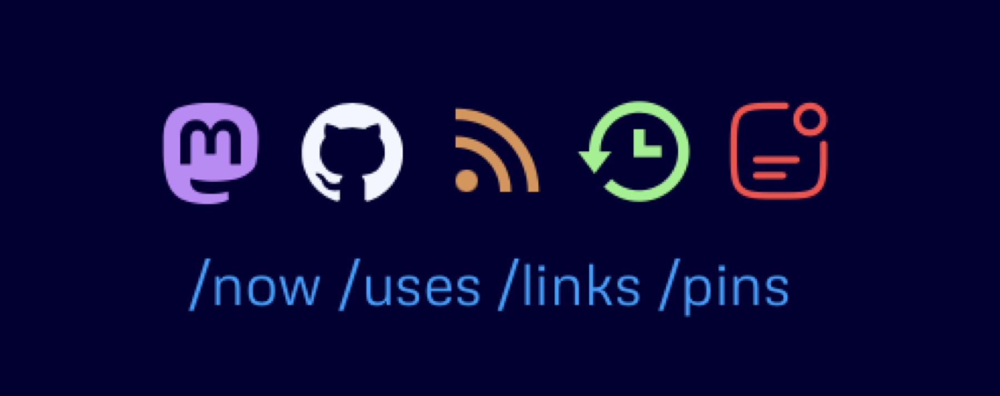
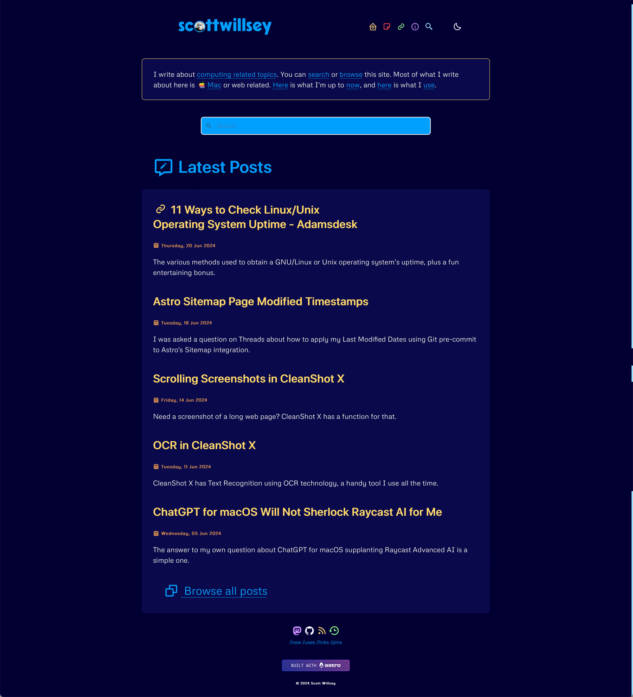
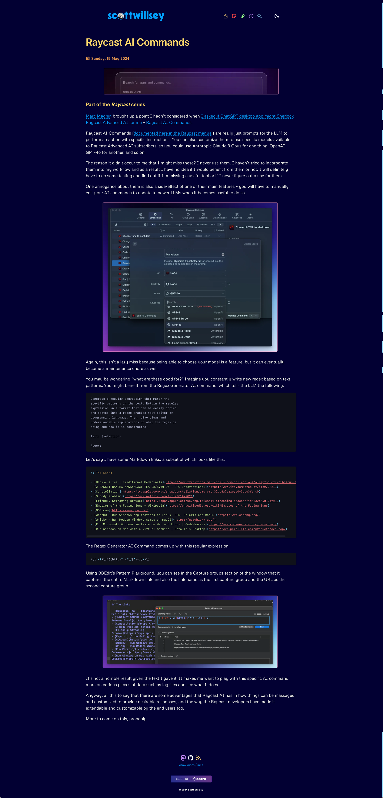
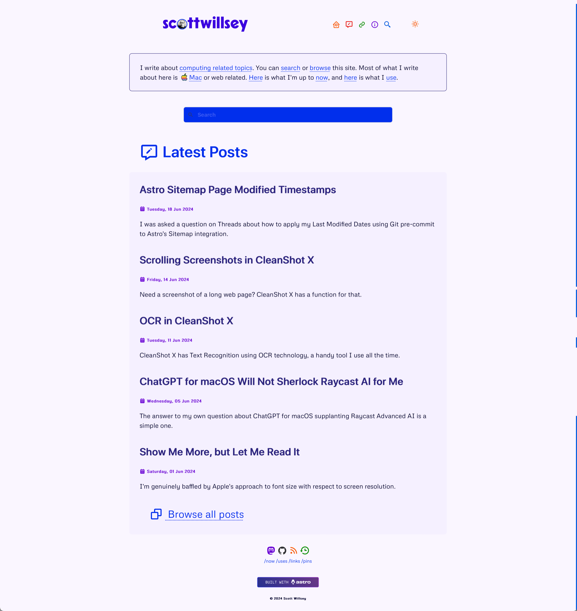
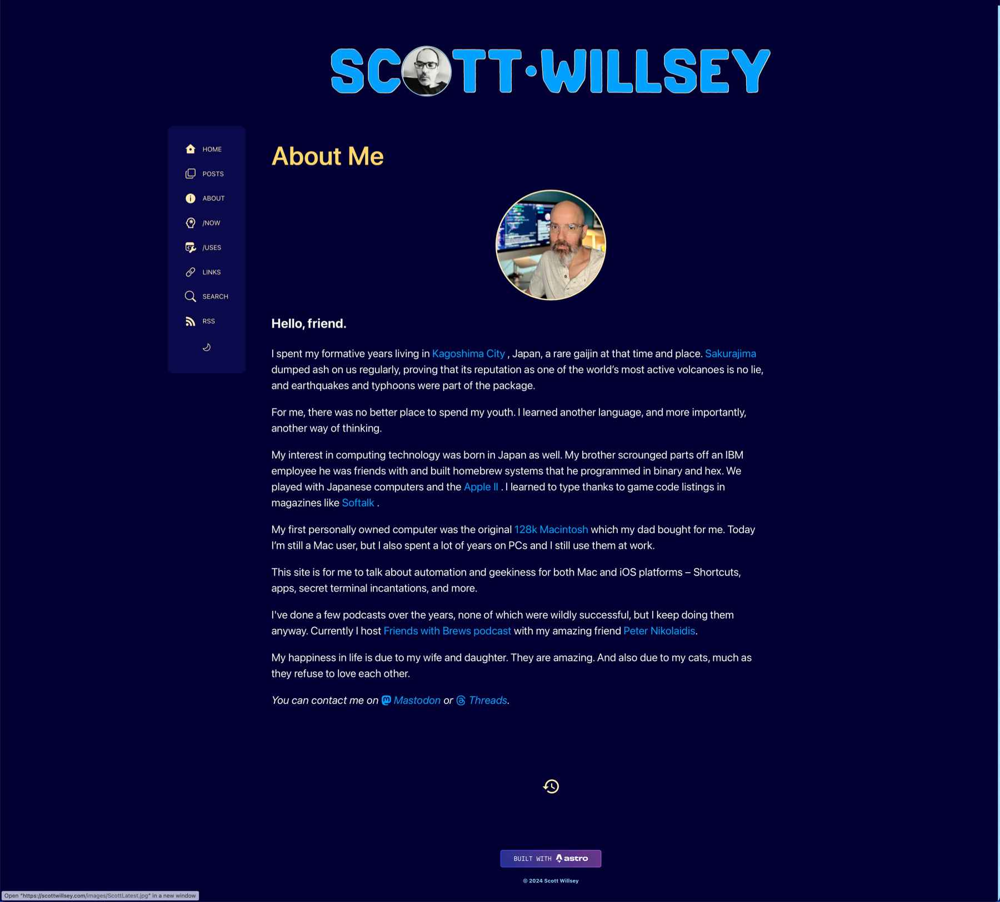
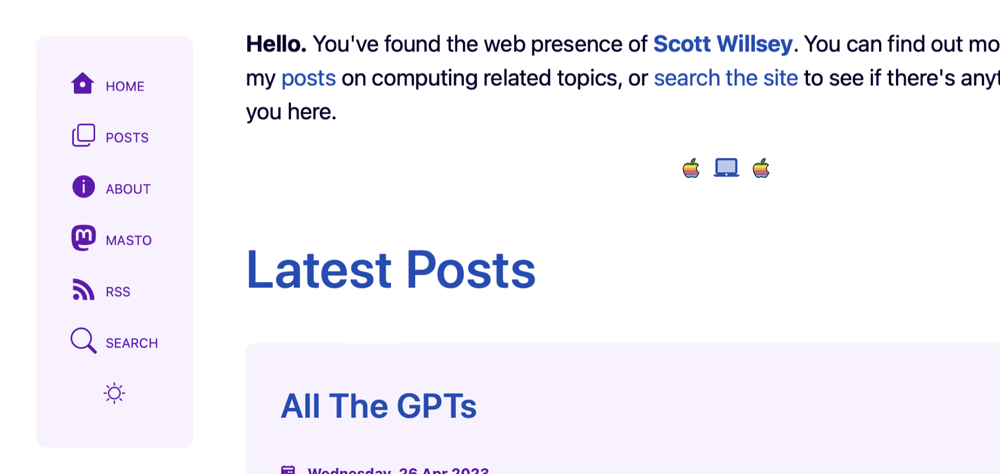
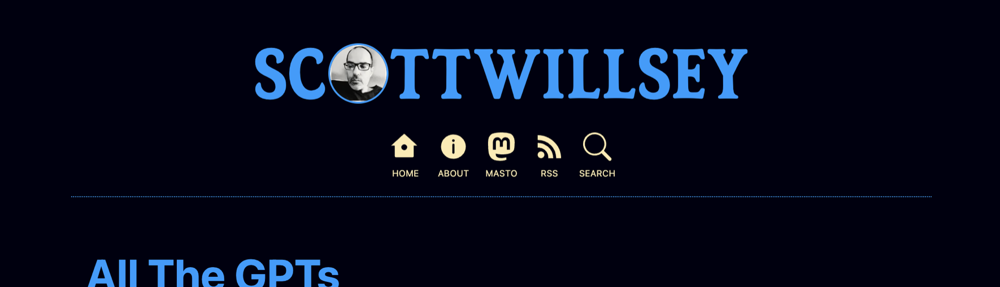

### 2024-12-29

Upgrades to Astro 5 Content Layer API (replacing legacy Content Collections API)

### 2024-12-07

Upgrades to Astro 5. Still needs Content Collections moved to new Content Layer API.

### 2024-11-13

Gets rid of Pins.

### 2024-10-16

Add a link in [Cool Site Spotlight](/links/#cool-site-spotlight) section to the [Cool Sites Archive](/links/#cool-sites-archive) section.

### 2024-10-04

Added link to [Weekly Reads](/reads/1) [RSS feed](/reads/rss.xml) on Weekly Reads page and added footer icon for Weekly Reads page.

### 2024-09-28

Adds [Weekly Reads](/reads/1) for links that I would normally send to my dad and brother, complete with an [RSS feed](/reads/rss.xml).

### 2024-08-10

I took out the YouTube section on the [/now](/now) page because there's no good way (or any way, for that matter) to get YouTube watch history.

### 2024-06-22

A whole new redesign to clean it up, make it sleeker, and hopefully make it easier to read posts. Loses persistent side menu and reverts to header menu (icons only again!). Better colors, no gradients anywhere.

### 2024-06-05

Fixed an awkward image link mistake that resulted in 404s on full-sized images

### 2024-05-27

New light theme and wider body on large viewports.

### 2024-05-26

Wildly overhauls dark theme.

### 2024-05-25

Removed Fathom analytics, not because they were bad, but just because I wanted to quit paying for them. Also fixed a really dumb image overflow issue.

### 2024-05-23

Converted the full-sized images that the optimized post images link to from png to jpeg. Shout out to [Tiffany White](https://www.tiffwhite.me) for noticing some slow-loading gigantic pngs!

### 2024-04-08

Updated home page so that link posts show a link in front of the title. The post title on the home page still links to the blog post page, and then the title on the blog post page itself links to the external site. Maybe this is confusing, I don't know.

### 2024-03-28

I changed the light theme quite a bit and also revamped the [/uses](/uses) page completely.

### 2024-03-04

Added and styled this site changelog. Added Articles Worth Reading and Newsletters sections to Links page.

### 2024-02-06

Added Cool Site Spotlight to Links page.

### 2024-02-05

Changed light theme colors.

### 2024-01-09

Implemented [rehype-accessible-emojis - npm](https://www.npmjs.com/package/rehype-accessible-emojis) to make emoji accessible.

### 2024-01-07

Revamped the dark theme to make it nicer and easier on the eyes.

### 2024-01-06

Added the [/links](/links) page! Also added auto-timestamp generation for links page, now page, uses page, and pins page..

### 2024-01-05

Implemented [remarkjs/remark-toc: plugin to generate a table of contents (TOC)](https://github.com/remarkjs/remark-toc) for auto-TOC generation in blog posts if desired.

### 2024-01-04

Added a [/now](/now) page!

### 2023-12-27

Completely revamped the site menu and added font smoothing.

### 2023-12-23

Added Fathom analytics.

### 2023-12-12

Upgraded to Astro 4.

### 2023-09-07

Finished conversion to Astro 3.

### 2023-05-01

Redesign! New persistent side menu instead of header menu, some theme colors with both dark and light modes.

The previous menu was an iteration of a long-used header menu and looked like this:

