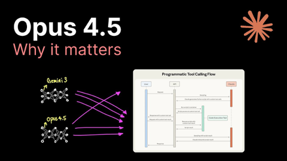
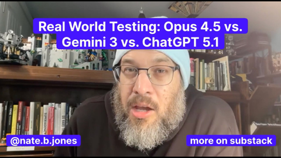

## Current Personal Status
>
> It's hard to believe it's the end of the year already. I have a lot of work related things I need to make progress on in the next 3 months just for life to be sustainable. I'm probably not being proactive enough about some of them.

## Stuff I've recently enjoyed

### Podcasts

*Podcast episodes without links are members-only but I think are interesting enough to post in case you want to investigate them.*

 [Risky Bulletin – Srsly Risky Biz: DeepSeek and Musk’s Grok both toe the party line](https://overcast.fm/+5Sl_iSVL8)
 Judge John Hodgman – Opening the Members Only Mailbag
 David Pakman Member Feed – 11/26/25: Leaked call exposes Trump as approval craters, Republicans raise alarm
 David Pakman Member Feed – 11/26/25: TDPS Bonus Show
 The Race F1 Podcast (Members) – Newey to become Aston Martin team boss - but is it a good move? (ad-free)
 [Pluribus: The Official Podcast – S1E5: Got Milk](https://overcast.fm/+BTOhUhpE9M)
 [Revolution.Social – Enshittification and “Breaking Kings” (with Cory Doctorow at Web Summit)](https://overcast.fm/+BQTxh1OUBE)
 The Race F1 Podcast (Members) – Edd answers your questions on his Las Vegas driver rankings
 [Channels with Peter Kafka – What Happens To Media When The Web Goes Away, with Tony Haile](https://overcast.fm/+QL2clEu50)
 The 404 Media Podcast (Premium Feed) – A Massive Breach Reveals the Truth Behind ‘Secret Desires AI’

### Books

[Buried in the Sky • 2012 • Climbers are nuts. People keep dying on these peaks in really unnecessary ways and it very often seems like the result of the most idiotic decisions on the part of people who are supposed to be experienced. Really gripping tale. • Loved It!
](/images/posts/png-image4fe5bf59280-review-07d00041-80c5-40df-96f4-1e73860e4edd.jpg)
[First Contact • 2025 • Becky Ferreira • A delightful look at the science, superstitions, stories, and suppositions behind the search for alien life throughout history. • Loved It!
](/images/posts/png-image447c967d8c0-review-c3a0b328-23e4-4f0e-bdf2-c3320ace2a6f.jpg)

### Movies

[Wick Is Pain • 2025 • Jeffrey Doe • A fun look behind the scenes and lives of the people who made the John Wick movies. Really only these people could have made these movies. • Loved It!
](/images/posts/png-image48b090780c0-review-9b121a86-9efa-44ef-94d0-3484b4c3a18b.jpg)

### TV Shows

[Pluribus • 2025 • In progress. I honestly didn't know what to think of this for about 1 and a half episodes, but wow, has it got me hooked now. Rhea Seehorn is always amazing and Karolina Wydra is perfect in her unsettling role as Zosia. • Loved It!
](/images/posts/png-image434192b3d00-review-d7b6f915-5eba-4de8-bb96-62f51502c240.jpg)
[Dark Winds • 2022 • Season 3 - Just starting Season 3. I think this series has evolved from a "must watch" to "there are things I like about it, and I'll get to it when and if I have time" show for me. There's a funny couple cameos in S3E1 though. • Liked It
](/images/posts/png-image44259b22750-review-1ab7b3f3-74fd-427c-ae6b-8623370cf16f.jpg)

### YouTube

Channel – [Shu Matsuo Post](https://www.youtube.com/@shumatsuopost)

[The Real Reason Japan’s Homes Are So Cheap](https://www.youtube.com/watch?v=i-4uJ-dkZu8&t=506s)

Channel – [Theo - t3․gg](https://www.youtube.com/@t3dotgg)

[Google won image generation (it's not even close) NANO BANANA PRO BREAKDOWN](https://www.youtube.com/watch?v=UV9GqinedQ8)

Channel – [Theo - t3․gg](https://www.youtube.com/@t3dotgg)

[You’re all wrong](https://www.youtube.com/watch?v=KJfz9ChQ0A0&t=37s)

Channel – [Theo - t3․gg](https://www.youtube.com/@t3dotgg)

[The model wars continue (do we even have jobs anymore??)](https://www.youtube.com/watch?v=--wsjXaoTR4)

Channel – [Caleb Writes Code](https://www.youtube.com/@CalebWritesCode)

[Claude Opus 4.5](https://www.youtube.com/watch?v=lznmsF4-afA)

Channel – [Tetsu Sensei](https://www.youtube.com/@tetsujpjp)

[“です” vs “ます” Explained Simply! | Japanese Grammar Made Easy](https://www.youtube.com/watch?v=BxIpK4eKW8I)

Channel – [AI News & Strategy Daily | Nate B Jones](https://www.youtube.com/@NateBJones)

[Real World Testing: Opus 4.5 vs. Gemini 3 vs. ChatGPT 5.1](https://www.youtube.com/watch?v=EbZbGPi8ftA)

Channel – [Jimmy Kimmel Live](https://www.youtube.com/@JimmyKimmelLive)

[Trump is Hot for Mamdani, Marjorie Taylor Greene Resigns from Congress & RFK Jr’s Explicit Poems](https://www.youtube.com/watch?v=BL0pFxTqK-A&t=634s)

Channel – [Mick Schumacher](https://www.youtube.com/@MickSchumacher)

[I'M RACING INDYCAR NEXT SEASON! Behind the scenes at my first IndyCar test!](https://www.youtube.com/watch?v=vLTjEsRoUek&pp=0gcJCRYKAYcqIYzv)

### Food

 [Home | Long's Vietnamese Kitchen LLC](https://longsvietnamesekitchen.square.site)

