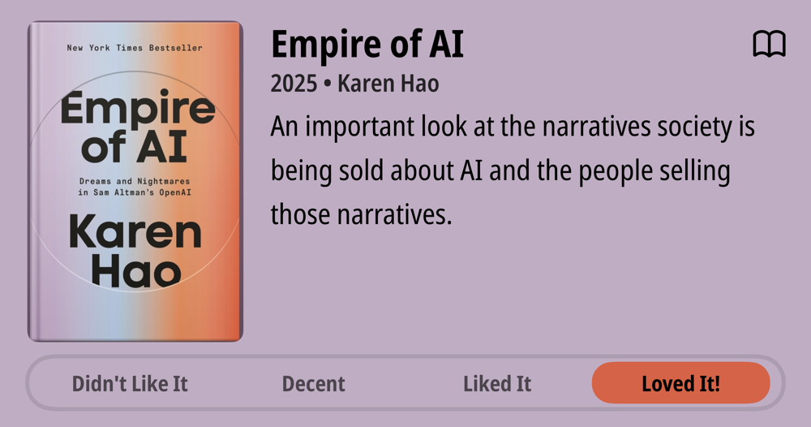

### Current Personal Status

Boy. I keep getting sick, and it's not helping me get things done. I also have the roots of a [Chinese Empress](https://www.bhg.com/gardening/trees-shrubs-vines/trees/empress-tree/) to dig out. It literally took over the entire underground of our backyard, and apparently some other yards too. Don't ever let your in-laws give you any Chinese Empress trees. They grow fast, are nice to look at, give great shade, but they take over the universe.

### Podcasts

*Podcast episodes without links are members-only but I think are interesting enough to post in case you want to investigate them.*

[Accidental Tech Podcast 653: Warning Stories](https://atp.fm/653)
[Risky Bulletin – Risky Bulletin: Child sextortion cases linked to scam compounds](https://overcast.fm/+5Sl_t-H2o)
[Judge John Hodgman – The Rule of Make it Two](https://overcast.fm/+YJM3EnNRk)
[Risky Business – Risky Business #803 — Oracle’s CSO Mary Ann Davidson quietly departs](https://overcast.fm/+It0iuQwPI)
 The Race F1 Podcast (Members) – Driving Style Secrets S2 E1: Michael Schumacher
[Tech Won't Save Us – Will the Pope Be An Ally Against AI? w/ Paolo Benanti](https://overcast.fm/+ZpQCapceY)
[Whisky Whiskey – 112: Spending Time With vs Single Review](https://overcast.fm/+BLIhelzQ0A)
[Risky Business – Risky Biz Soap Box: How to measure vulnerability reachability](https://overcast.fm/+It0gasVb8)
 The 404 Media Podcast (Premium Feed) – The Inside Story of Tea
[Techdirt – Why Data Portability Is Crucial For The AI Future](https://overcast.fm/+DyYW0vFSg)

### Books

[Empire of AI • 2025 • Karen Hao • An important look at the narratives society is being sold about AI and the people selling those narratives. • Loved It!
](/images/posts/png-image4537a0c7710-review-48d5430a-a2f5-4bb7-9a50-e43faa10c2ec.jpg)
[Things Become Other Things • 2025 • Craig Mod Craig is a fascinating guy, not least because of the fact he's ingrained himself into the culture of Japan, a country I grew up in, but because he's an artful storyteller and photographer. In this book, he brings the reader along on one of his long walks through the Japan countryside as he ties the pieces of his past together with his present in a way that few people can. • Loved It!
](/images/posts/png-image43aeb2d0160-review-c7853685-8e59-44d3-a5c3-8972cd1ce8ca.jpg)

### Movies

[Ballerina • 2025 • Len Wiseman • Sometimes you just want to see people get shot and stabbed, and this is a lot of fun for that. John Wick movies always have interesting choreography and fights. Ana de Armas is fine as Eve and the action is all very well done. • Loved It!
](/images/posts/PngImage4A7CA53B7C0-review-a5e3466d-ac29-4207-a480-7dd4a72f8beb.jpg)

### TV Shows

[Dark Winds Season 1 • 2022 • Dark Winds started off incredibly well - suspenseful, well-paced, well-written, and then faded slightly as it reached the end of season 1. Readers will know I find this to be an issue with much of TV. Still, I loved it and recommend season 1! • Loved It!
](/images/posts/png-image4e3784f0b70-review-f8dcca30-8b1e-4f3d-9932-c57667120ec4.jpg)

### YouTube

- [Why This Sherpa Let His Climber Die](https://www.youtube.com/watch?v=5QEi_Cr7GIs)
- [UH-OH: Do Trump’s “trade deals” NOT EXIST?](https://www.youtube.com/watch?v=kvjitFBXaLo)
- [He Was Loved. Then Hated. Then Dead.](https://www.youtube.com/watch?v=LGbHQ_Wfu8o)
- [They fixed Astro DB types!](https://www.youtube.com/watch?v=dzRr7Req4ZA)
- [🤔 Will Lewis Hamilton retire from F1 in 2026?](https://www.youtube.com/watch?v=y_5n9IN4SSo)
- [Spot The Mistake 🔍 | Grill The Grid 2025 | Episode 3](https://www.youtube.com/watch?v=ecPoPCvKDOA)
- [I spent $200 on an "AI web browser"](https://www.youtube.com/watch?v=Xw21dwlKdSM)
- [Trump Admits He's Taking Orders From Putin](https://www.youtube.com/watch?v=r5Do6LUvna8)
- [Trump’s confusion on full display #shorts](https://www.youtube.com/watch?v=w4tBdhWWrXs)
- [The 7 year wait is over...](https://www.youtube.com/watch?v=KFVLmkhAgv4)
