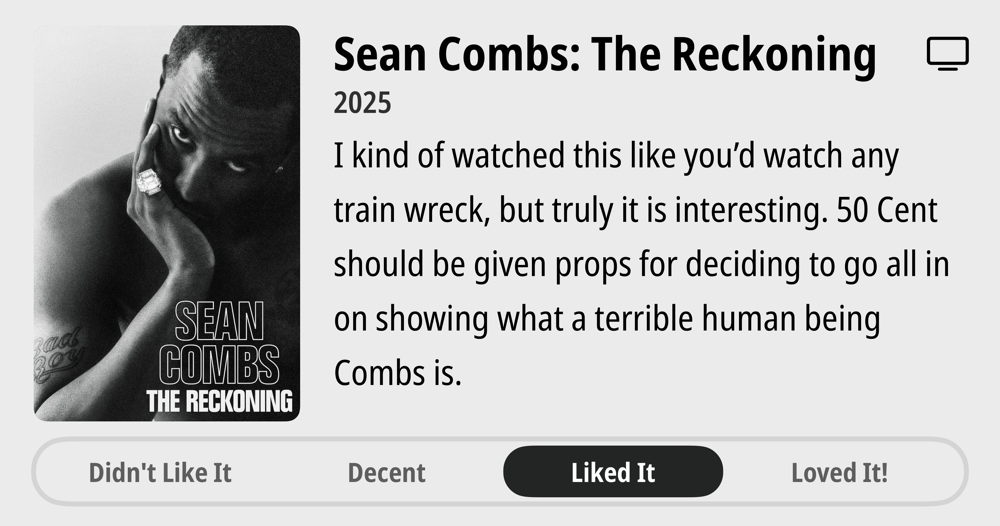
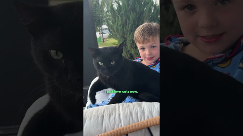
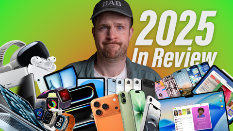
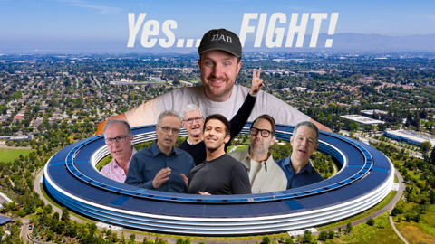

## Current Personal Status
>
> Be kind to people during the holidays by not bludgeoning them over the head with the holidays. Being happy and cheerful during the holidays in 2025 is a priviledge, not a given.

## Current Projects

- Learning Korean
- Expanding our client base

## Stuff I've recently enjoyed

### Podcasts

*Podcast episodes without links are members-only but I think are interesting enough to post in case you want to investigate them.*

 [Whisky Whiskey – 148: The Macallan 18 Year Sherry Oak 2017 vs 2024](https://overcast.fm/+BLIhfjbVqg)
 Tech Won't Save Us (Premium) – The Year in Tech w/ Jathan Sadowski & Brian Merchant
 [Judge John Hodgman – Snack Judgment with Michael Ian Black & Tom Cavanagh](https://overcast.fm/+YJM1shJx0)
 Accidental Tech Podcast – 671: Even Apple Can’t Beat the Sun
 The Vergecast: Ad-Free Edition – The Vergecast RAM Holiday Spec-Tacular
 The 404 Media Podcast (Premium Feed) – We Tracked Ourselves with Exposed Flock Cameras
 [Pluribus: The Official Podcast – S1E9: La Chica o El Mundo](https://overcast.fm/+BTOhX_0PiY)
 The Race F1 Podcast (Members) – Book Club: Marcus Ericsson’s tales about his Brawn F1 test, Indy 500 win …and ghosting the king of Sweden
 The Race F1 Podcast (Members) – Explaining the 2026 engine loophole controversy (ad-free)
 Decoder: Ad-Free Edition – What’s next for Netflix and Paramount in the Warner Bros. battle

### Books

[Grid to Glory • 2025 • Alex Jacques • Alex Jacques is one of my favorite F1 commentators. His personality shines, and he's clearly a hard worker who knows what he's doing. The stories he's chosen for this book are compelling, but the writing style pulls me out of them. He uses sentence fragments instead of commas, and sometimes the background explanations are slightly muddled. Good, not great. • Decent
](/images/posts/png-image4dd09994160-review-c50952a1-62fd-4f67-a41d-85082a7e6f69.jpg)
[First Contact • 2025 • Becky Ferreira • A delightful look at the science, superstitions, stories, and suppositions behind the search for alien life throughout history. • Loved It!
](/images/posts/png-image447c967d8c0-review-c3a0b328-23e4-4f0e-bdf2-c3320ace2a6f.jpg)

### Movies

[Tinker Tailor Soldier Spy • 2011 • Tomas Alfredson • They don't make many movies like this anymore. Both intelligently written and yet not overly- wrought with twists and surprises, it's a subtly played movie staring Gary Oldman at his best, but with a stellar cast in general. Highly recommended. • Loved It!
](/images/posts/png-image48638ea78c0-review-3aedf0b6-0108-41da-a3e3-2096c4e6cd7e.jpg)
[Wick Is Pain • 2025 • Jeffrey Doe • A fun look behind the scenes and lives of the people who made the John Wick movies. Really only these people could have made these movies. • Loved It!
](/images/posts/png-image48b090780c0-review-9b121a86-9efa-44ef-94d0-3484b4c3a18b.jpg)

### TV Shows

[UNTAMED • First Time Watch • 2025 • I wish I could rate this higher. It started off great. The premise was good. The acting was pretty good. There were some slightly unbelievable plot points and twists, but overall I still recommend it. • Liked It
](/images/posts/png-image42abbc3f4f0-review-4677620a-9875-4737-8694-315fd092b752.jpg)
[Sean Combs: The Reckoning • 2025 • I kind of watched this like you'd watch any train wreck, but truly it is interesting. 50 Cent should be given props for deciding to go all in on showing what a terrible human being Combs is. • Liked It
](/images/posts/png-image44e3b47b3e0-review-25cc21a6-cab8-41ae-8928-efa829be2123.jpg)

### Music

[primitive god • 2022 • Chris Ballew • I had no idea who Chris Ballew was (although obviously I'd heard of the Presidents of the United States of America) until I stumbled across his albums in Apple Music recently. To say he's prodigious is an understatement, but the good news is that a lot of it is very good, including "primitive god". Love it! • Loved It!
](/images/posts/png-image40c4b8c1520-review-ac176396-df13-46c9-b279-8570195ad525.jpg)

### YouTube

Channel – [lisha](https://www.youtube.com/@lisha_aaa)

[He'd be a swimwear model! 🩳🤣 " We asked the @f1 red carpet "If they weren't an F1 Driver...](https://www.youtube.com/watch?v=w6WmWJx4M7I)

Channel – [The Dodo](https://www.youtube.com/@TheDodo)

[Black Cat Decides Not To Be A Stray One Day.. | The Dodo](https://www.youtube.com/watch?v=znteK0wopqU)

Channel – Benn Jordan and 404 Media

[This Flock Camera Leak is like Netflix For Stalkers](https://www.youtube.com/watch?v=vU1-uiUlHTo&t=41s)

Channel – [Snazzy Labs](https://www.youtube.com/@snazzy)

[Why Apple’s Great Year Doesn’t Feel Great](https://www.youtube.com/watch?v=HNy8BtG9OKs)

Channel – [Chris Norlund](https://www.youtube.com/@realchris)

[Republicans WALK OUT as Trump cards crumble](https://www.youtube.com/watch?v=JdWETI-UkEY&t=713s)

Channel – [Lisa and Josh](https://www.youtube.com/@LisaAndJosh)

[Quit Your Job, Travel The World, Start A YouTube Channel](https://www.youtube.com/watch?v=8BctMbuG1U4)

Channel – [Captain Steeeve](https://www.youtube.com/@CaptainSteeeve)

[Greg Biffle Crash Update | What We Know So Far](https://www.youtube.com/watch?v=WY3YX6UDlfw)

Channel – [Samurai Daddy](https://www.youtube.com/@samurai-daddy)

[What do Japanese people think about Immigrants?｜Life in Japan](https://www.youtube.com/watch?v=LQnxMfFjma0)

Channel – [Snazzy Labs](https://www.youtube.com/@snazzy)

[Apple Is Falling Apart (On Purpose)](https://www.youtube.com/watch?v=e1E-yfcKdUw)

