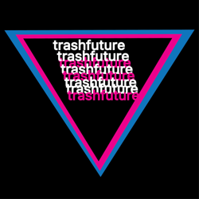
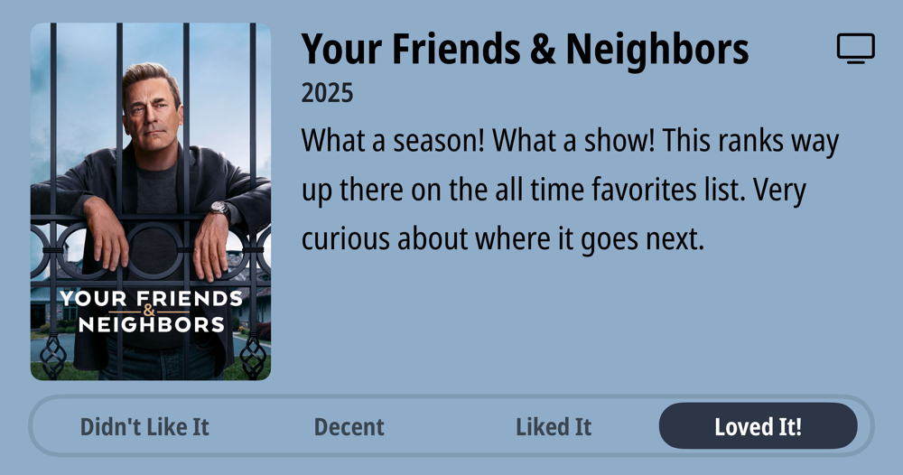
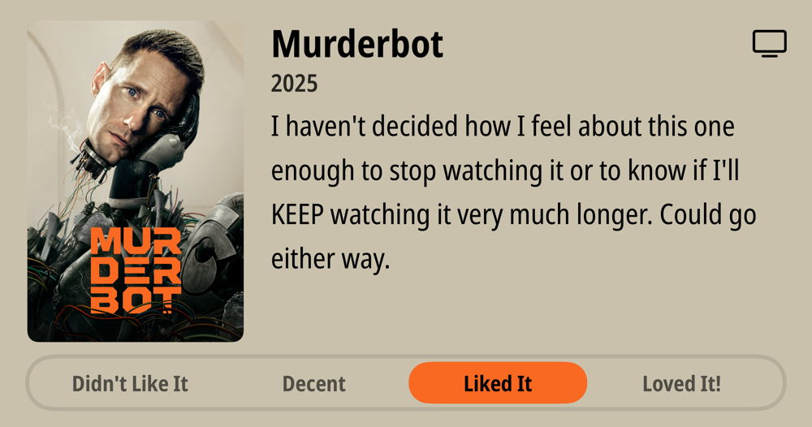
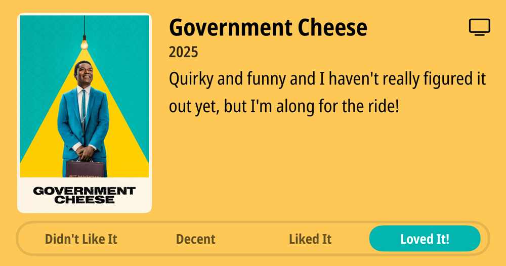

### Podcasts

*Podcast episodes without links are members-only but I think are interesting enough to post in case you want to investigate them.*

[Risky Bulletin – Between Two Nerds: NSA’s thinking on information warfare](https://overcast.fm/+5Sl-js7hs)
[楽しいラジオ「ドングリFM」 – 1184 いまオススメの場所は鮮魚店](https://overcast.fm/+9ABIxJc94)
[Whisky Whiskey – 78: Westward Pinot Noir Cask Single Malt Whisky](https://overcast.fm/+BLIhfVKg7M)
[Ctrl-Alt-Speech – Algorithm Shrugged](https://overcast.fm/+BHRYHchoIs)
[NPC: Next Portable Console – The Year of Weird Handhelds: RG Slide Edition](https://overcast.fm/+BI63pXmFOE)
[TRASHFUTURE – Wrench! A Musical ft. Séamus Malekafzali](https://overcast.fm/+0MYubsSSU)
[P1 with Matt and Tommy – Spanish GP Driver Ratings](https://overcast.fm/+_U3oytDiU)
[Accidental Tech Podcast – 641: We’re Saving That for the Egg](https://atp.fm/641)
The Race F1 Podcast (Members) – Nine things we learned from the Spanish GP (ad-free)
The Race F1 Podcast (Members) – Spanish Grand Prix race review (ad-free)

### Books

[Apple in China • 2025 • Patrick McGee • Yes, another book I'm reading. Just started, very detailed, interesting, and informative. Though provoking, even. • Loved It!
](/images/posts/PngImage4E66B0E7360-review-453b70ef-bc9d-4c44-b396-2661a9985c76.jpg)
[Things Become Other Things • 2025 • Craig Mod Craig has been wandering Japan on foot for decades, photographing and talking and observing, and he does brings the experience to life in a very spiritual way. He brings to life the importance of caring about things in the way that modern techno-fascist ideologies do exactly the opposite of. I'm hooked and trying to keep from racing through this. • Loved It!
](/images/posts/PngImage448EBd8A8B0-review-f01235a8-8438-4a0b-9367-e774289563b4.jpg)

### TV Shows

[Your Friends & Neighbors • 2025 • What a season! What a show! This ranks way up there on the all time favorites list. Very curious about where it goes next. • Loved It!
](/images/posts/PngImage408C8502Fa0-review-a1dd1633-678b-44fd-ad50-055df7276f98.jpg)
[Murderbot • 2025 • I haven't decided how I feel about this one enough to stop watching it or to know if I'll KEEP watching it very much longer. Could go either way. • Decent
](/images/posts/PngImage4B219998Fb0-review-496904a1-810a-48fa-8fe4-0834c60f82dc.jpg)
[Government Cheese • 2025 • Quirky and funny and I haven't really figured it out yet, but I'm along for the ride! • Loved It!
](/images/posts/PngImage4518932DAd0-review-b31a20ad-4155-48fd-8752-5f57ee733a28.jpg)
[Long Way Home • 2025 • The Long Way series are always very entertaining, and two episodes in, this is no exception. I really love the European focus of this one. Will keep watching. • Loved It!
](/images/posts/PngImage45C88D92520-review-176fb98d-e50d-4881-964a-f0cb2542add3.jpg)

### Food and Drink

- [Cornflake Cookies | Wholesale Unlimited Inc.](https://wholesaleunlimitedhi.com/products/cornflake-cookies)
- [Pacific Flyway – Water Avenue Coffee](https://wateravenuecoffee.com/collections/beans/products/pacific-flyway)
- [Tilikum Crossing Decaf - 12oz Whole Bean](https://www.portlandcoffeeroasters.com/consumer/tilikum-crossing-decaf-12oz-whole-bean)
