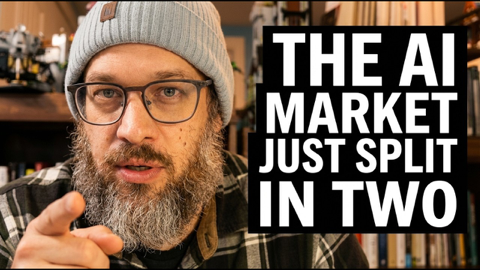
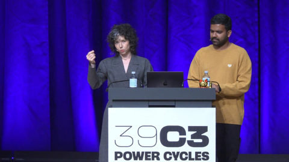

## Current Personal Status
>
> I'm not a huge fan of what the US is becoming. You should not have to occupy your own cities unless you're afraid of something that you yourself have caused. Have the courage to allow people to be free again.

## Current Projects

- Japanese and Korean study (somewhat proficient in J, complete newb to K)

## Stuff I've recently enjoyed

### Podcasts

*Podcast episodes without links are members-only but I think are interesting enough to post in case you want to investigate them.*

 [Whisky Whiskey – 159: Penderyn Madeira Finish Single Malt Whisky](https://overcast.fm/+BLIhfBDHxY)
 [The Weekly Planet – Best of The Weekly Planet 2025](https://overcast.fm/+1HFKufeY0)
 [Podcast by Yuka Studio // ユカスタポッドキャスト – Ep.129 【CES 2026】初参加🔥現地体験をもとに振り返り＆注目トレンド✨](https://overcast.fm/+-w720VhFc)
 [Risky Bulletin – Between Two Nerds: Lights out!](https://overcast.fm/+5Sl-NSjBY)
 Decoder: Ad-Free Edition – CEO Sam Reich on the business of subscription comedy
 [NosillaCast Apple Podcast – NC #1079 Happy AppleCare Stories, iMazing Preserves Memories, Moen Smart Water Monitor, Donut Lab’s Solid State Battery](https://overcast.fm/+BJFaIrNZJs)
 [Programming By Stealth – PBS Tidbit 16 — How Podfeet.com Works](https://overcast.fm/+JGaAZ0Iu4)
 [Risky Bulletin – Sponsored: What AI workloads mean for Cloud security](https://overcast.fm/+5Sl9Od49A)
 AppStories+ – A Very Nerdy Holiday Break
![Who will be 2026 F1 champion? Hill and Herbert’s verdict | Stay On Track E3 [ad-free]](../../assets/images/oc_artwork/5853415787771139-c28fbe62-14b9-4159-9b04-f745023eaf97.png) Stay On Track with Damon Hill and Johnny Herbert – Who will be 2026 F1 champion? Hill and Herbert’s verdict | Stay On Track E3 [ad-free]

### Books

[The Convenience Store by the Sea • First Time Read • 2020 • Sonoko Machida • I didn't know what to think of this book initially. It felt slightly stilted, whether due to translation or not, I'm not sure. But I kept reading. And it started drawing me in by brilliantly building intertwined moments of social interactions and vignettes of character development. • Loved It!
](/images/posts/png-image458cbadfd70-review-68981979-9b1f-4d9e-9ae9-1c29c838e7c5.jpg)
[Grid to Glory • 2025 • Alex Jacques • Alex Jacques is one of my favorite F1 commentators. His personality shines, and he's clearly a hard worker who knows what he's doing. The stories he's chosen for this book are compelling, but the writing style pulls me out of them. He uses sentence fragments instead of commas, and sometimes the background explanations are slightly muddled. Good, not great. • Decent
](/images/posts/png-image4dd09994160-review-c50952a1-62fd-4f67-a41d-85082a7e6f69.jpg)

### Movies

[The Perfect Neighbor • First Time Watch • 2025 • Geeta Gandbhir • You kind of have to be into crime documentaries to like this, but the real takeaway here is how stupid Stand Your Ground laws and the people who think they're a good idea are. Also, this lady was whack. • Liked It
](/images/posts/png-image4c91b6db330-review-a705ca39-8f1d-429b-a3bd-f461b37a31ea.jpg)

### YouTube

Channel – [Animamille🐰🐱 Travel to meet animals.](https://www.youtube.com/@animamille)

[8 Cats Welcomed Me to This Secret Guesthouse in Japan 🐱✨| Nostalgic Ryokan with Cats | Nekotamaru](https://www.youtube.com/watch?v=SlXL7hEk3ZU&t=2s)

Channel – [Adam Mockler](https://www.youtube.com/@adammockler)

[Minnesota Drops Bombshell that ROCKS Trump](https://www.youtube.com/watch?v=Ns40tLYbtok&t=1s)

Channel – [Steve Shives](https://www.youtube.com/@SteveShives)

[Can A.I. Predict Which Country Trump Will Invade Next?](https://www.youtube.com/watch?v=Y2rPujI3HOc&t=8s)

Channel – [GNCA - GamersNexus Consumer Advocacy](https://www.youtube.com/@GNCAInvestigates)

[Palantir Crashes Out in Response to GN](https://www.youtube.com/watch?v=5Idb_D4Tdu8&t=1593s)

Channel – [AI News & Strategy Daily | Nate B Jones](https://www.youtube.com/@NateBJones)

[What Sam Altman and Dario Amodei Disagree About (And Why It Matters for You)](https://www.youtube.com/watch?v=M9TJizOxNFk)

Channel – [Captain Steeeve](https://www.youtube.com/@CaptainSteeeve)

[A321 Turns Back Shortly After Takeoff on Alaska AS923 | Captain Steeeve](https://www.youtube.com/watch?v=xV8_Xz285xg)

Channel – [THE RACE](https://www.youtube.com/@WeAreTheRace)

[Every 2026 F1 driver line-up ranked from worst to best](https://www.youtube.com/watch?v=-TP3h3zfy8Y)

Channel – [media.ccc.de](https://www.youtube.com/@mediacccde)

[39C3 - AI Agent, AI Spy](https://www.youtube.com/watch?v=0ANECpNdt-4&t=31s)

Channel – [Shu Matsuo Post](https://www.youtube.com/@shumatsuopost)

[A Different Kind of Tokyo House 🏠 #AkiyaHub #JapaneseHouse #VacationHome #Tokyo #Japan](https://www.youtube.com/watch?v=cXXdP9gTu9I)

### Food

 [KACHKA  - EAT. CLINK. DRINK. REPEAT.](https://www.kachkapdx.com)

