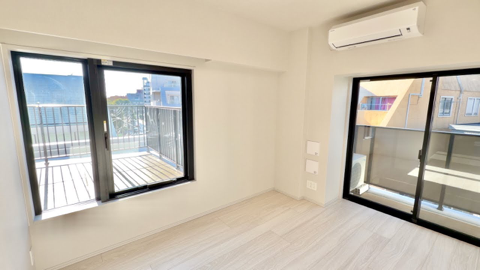
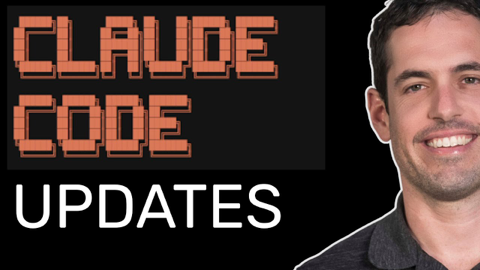
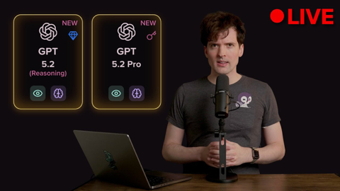

## Current Personal Status
>
> HEY!! I got the Sophos XGS 88 Firewall installed as my gateway router, so now I can do what it's intended for and start playing with and learning more about current Sophos Firewall SFOS builds.

## Stuff I've recently enjoyed

### Podcasts

*Podcast episodes without links are members-only but I think are interesting enough to post in case you want to investigate them.*

 [Whisky Whiskey – 145: Glen Scotia Victoriana Single Malt Whisky](https://overcast.fm/+BLIhdG6G1E)
 [MacStories Unwind – Best Videogames of 2025](https://overcast.fm/+BTuhLsRHKQ)
 Decoder: Ad-Free Edition – Stack Overflow users don’t trust AI. They’re using it anyway
 [Blurring The Lines Podcast – Episode 243 - Cold Runs, Warm Beaches, and Better Wi-Fi](https://overcast.fm/+GsOkMqXJU)
 [ゆかのにほんごカフェ – #19 スプーンとスープと日本人の関係](https://overcast.fm/+BGWX2hlV1k)
 The 404 Media Podcast (Premium Feed) – Why Are We Obsessed With Aliens? (With Becky Ferreira)
 [Pluribus: The Official Podcast – S1E7: The Gap](https://overcast.fm/+BTOhXj_ymg)
 [Pluribus: The Official Podcast – S1E6: Jennifer Bryan](https://overcast.fm/+BTOhV84WcQ)
 [Comfort Zone – I Got a Flu From This Keyboard](https://overcast.fm/+BI6NQHNkVU)
 Accidental Tech Podcast – 669: Ternus, Take the Wheel

### Books

[First Contact • 2025 • Becky Ferreira • A delightful look at the science, superstitions, stories, and suppositions behind the search for alien life throughout history. • Loved It!
](/images/posts/png-image447c967d8c0-review-c3a0b328-23e4-4f0e-bdf2-c3320ace2a6f.jpg)

### Movies

[Tinker Tailor Soldier Spy • 2011 • Tomas Alfredson • They don't make many movies like this anymore. Both intelligently written and yet not overly- wrought with twists and surprises, it's a subtly played movie staring Gary Oldman at his best, but with a stellar cast in general. Highly recommended. • Loved It!
](/images/posts/png-image48638ea78c0-review-3aedf0b6-0108-41da-a3e3-2096c4e6cd7e.jpg)
[Wick Is Pain • 2025 • Jeffrey Doe • A fun look behind the scenes and lives of the people who made the John Wick movies. Really only these people could have made these movies. • Loved It!
](/images/posts/png-image48b090780c0-review-9b121a86-9efa-44ef-94d0-3484b4c3a18b.jpg)

### TV Shows

[Sean Combs: The Reckoning • 2025 • I kind of watched this like you'd watch any train wreck, but truly it is interesting. 50 Cent should be given props for deciding to go all in on showing what a terrible human being Combs is. • Liked It
](/images/posts/png-image44e3b47b3e0-review-25cc21a6-cab8-41ae-8928-efa829be2123.jpg)

### YouTube

Channel – General Motors and Cadillac

[Inside Cadillac Formula 1 Team’s First Race Simulation](https://www.youtube.com/watch?v=Uzca7fdhL7s)

Channel – [A Micro Apartment Life](https://www.youtube.com/@usui503)

[Micro Apartment Tour in Tokyo with a Spacious Balcony! 🏠🪴 (Ep. 95)](https://www.youtube.com/watch?v=BIXwG8aWPG0&t=413s)

Channel – [Yaron Been](https://www.youtube.com/@YaronBeen)

[CLAUDE CODE NEW UPDATE](https://www.youtube.com/watch?v=FmXZaByjyCI)

Channel – [Theo - t3․gg](https://www.youtube.com/@t3dotgg)

[I'm not liking 5.2 that much...](https://www.youtube.com/watch?v=7OlfVFT5zV4)

Channel – [Captain Steeeve](https://www.youtube.com/@CaptainSteeeve)

[NTSB Releases Delta 56 Turbulence Report – Captain Steeeve Reacts](https://www.youtube.com/watch?v=USDun-QF4tI)

Channel – [DRIVE](https://www.youtube.com/@prodbydrive)

[Why There Will NEVER Be Another Kimi Raikkonen](https://www.youtube.com/watch?v=JqT2El5H1KA&pp=0gcJCSkKAYcqIYzv)

Channel – [for nomads.](https://www.youtube.com/@fornomads.global)

[Why He Left USA for Japan (Inside His $400 MONTH Apartment)](https://www.youtube.com/watch?v=w2rTwEdhDyk)

Channel – [Theo - t3․gg](https://www.youtube.com/@t3dotgg)

[Claude Code's latest update is really cool (when it works...)](https://www.youtube.com/watch?v=hFMQ5LkkS98&pp=0gcJCSkKAYcqIYzv)

Channel – [Yamada Anthony](https://www.youtube.com/@Anchaninjapan)

[What $820 Gets You in Japan | Apartment Tour Fukuoka](https://www.youtube.com/watch?v=umS8iR-AzRE)

