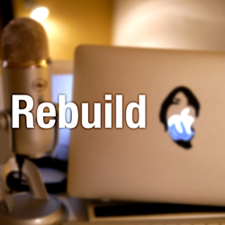
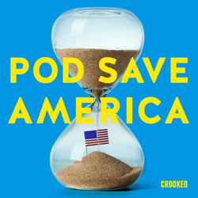
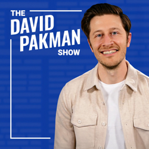
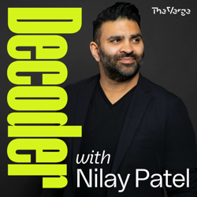

## Current Personal Status

My daughter started college so that should tell you how old I feel. Fortunately she's still living here. She could live with us forever and I'd be fine with it, personally.

And I'm back to digging up the roots of our cursed, ever-living Empress tree. Never, ever, EVER put one of these in your yard.

## Stuff I've recently enjoyed

### Podcasts

*Podcast episodes without links are members-only but I think are interesting enough to post in case you want to investigate them.*

[Uncanny Valley | WIRED – BIG INTV: Signal’s Meredith Whittaker Says AI Is Just A Branding Term](https://overcast.fm/+BFs14B-S9E)
[Risky Business – Risky Business #806 — Apple’s Memory Integrity Enforcement is a big deal](https://overcast.fm/+It0izYos0)
[Rebuild – 414: The Rain in Spain Stays Mainly in the Plain (hak)](https://overcast.fm/+mfcRhvM)
[Risky Bulletin – Between Two Nerds: How the US can win the cyber war](https://overcast.fm/+5Sl-3AJYw)
[Pod Save America – The Roots of Political Violence and How We Prevent It](https://overcast.fm/+5dsp7aaTg)
[The David Pakman Show – 9/22/25: Charlie Kirk funeral goes fascist as Trump threatens everyone](https://overcast.fm/+9CvutP65Y)
[Mac Geek Gab — Apple Tips, Tricks, and Troubleshooting – CarPlay Widgets, eSIM Swaps, Photo Preservation & AI Assisted Living](https://overcast.fm/+6TZ_H-mOU)
[Decoder with Nilay Patel – Dropout CEO Sam Reich on business, comedy, and keeping culture weird](https://overcast.fm/+QLduXgqSQ)
[Risky Bulletin – Risky Bulletin: Cyberattack disrupts airports across Europe](https://overcast.fm/+5Sl8EMNC8)
 The Race F1 Podcast (Members) – Azerbaijan GP review (ad-free)

### Books

[Fluke • 2025 • Brian Klaas • (In progress) You'd thinking finding out everything is random and our smallest choices and actions can change everything would be scary and depressing, but in fact this book is interesting and though provoking and not at all depressing. That sounds like I’m just tolerating it, but I’m in fact enjoying it quite a bit. • Loved It!
](/images/posts/png-image481d813ee50-review-8aece3be-1f6e-4a0c-a3b3-9d3105d407dc.jpg)
[To Say Nothing of the Dog • 2013 • Connie Willis • Book 3 of the Oxford Time Travel series. It's funny and cute and compelling, even if I miss Mr. Dunworthy's constant presence ala Doomsday Book. But Ned Henry and all the other characters make this a fun book that's hard to put down. • Loved It!
](/images/posts/png-image4ebabaea1b0-review-954dbef9-86ea-478b-a0dd-e2bc85854b6a.jpg)

### Movies

[Kandahar • 2023 • Ric Roman Waugh • Not bad, not stupendous, but it was perfect for late night before sleep. Navid Negahban ("Mo") and Bahador Foladi (Farzad) were the most compellingly played characters for me. • Liked It
](/images/posts/png-image4fe6856a7f0-review-8522247f-65e8-442c-aa93-63a6809c8a34.jpg)

### TV Shows

[Black Rabbit • 2025 • It's hard to like the two main characters in this show, but they do become sympathetic characters over time. There's plenty of tension, action, and family dynamics to go around. Some people are bad for themselves and everyone around them. • Liked It
](/images/posts/png-image4871b18c150-review-6fbb83bc-9e41-4708-978d-2389029b8df7.jpg)

### YouTube

- [Watch Fox Host DIE INSIDE After Kimmel DEFEATS TRUMP!](https://www.youtube.com/watch?v=y8_Jl9Ca5QM) — [Jack Cocchiarella](https://www.youtube.com/@JackCocchiarellaShow)
- [MAGA Mike PANICS and CANCELS ALL VOTES in House](https://www.youtube.com/watch?v=7NM2vDpdp_w&t=1108s) — [MeidasTouch](https://www.youtube.com/@MeidasTouch)
- [Jake Takes Alonzo’s Stolen Money and Leaves Him to His Fate [CLIP] | Training Day (2001) | TNT](https://www.youtube.com/watch?v=3zw2NyCpdBs) — [TNT](https://www.youtube.com/@TNT)
- [Kemp PANICS Hyundai has left forever](https://www.youtube.com/watch?v=h_gEFFFh-sY) — [Chris Norlund](https://www.youtube.com/@realchris)
- [Training Day - How Denzel Washington Improvised as Alonzo Harris](https://www.youtube.com/watch?v=tejPYrhtuSk&pp=0gcJCesJAYcqIYzv) — [Just an Observation](https://www.youtube.com/@JustanObservation)
- [Better Call Saul - Why Tony Dalton Is So Captivating As Lalo Salamanca](https://www.youtube.com/watch?v=ddXnhoQ1I-4&t=9s) — [Just an Observation](https://www.youtube.com/@JustanObservation)
- [The Most Horrifying Pilot Mistake I've Ever Talked About!](https://www.youtube.com/watch?v=r4GEaJeSNJQ&t=237s) — [Pilot Debrief](https://www.youtube.com/@pilot-debrief)
- [Crashing after 22 seconds?? Delta 1141](https://www.youtube.com/watch?v=sBm_s2f6V9s) — [Green Dot Aviation](https://www.youtube.com/@GreenDotAviation)
- [The ENTIRE Story Of Better Call Saul in 18 Minutes](https://www.youtube.com/watch?v=R1b8iD3o-q4) — [Seriesly](https://www.youtube.com/@SerieslyYT)
