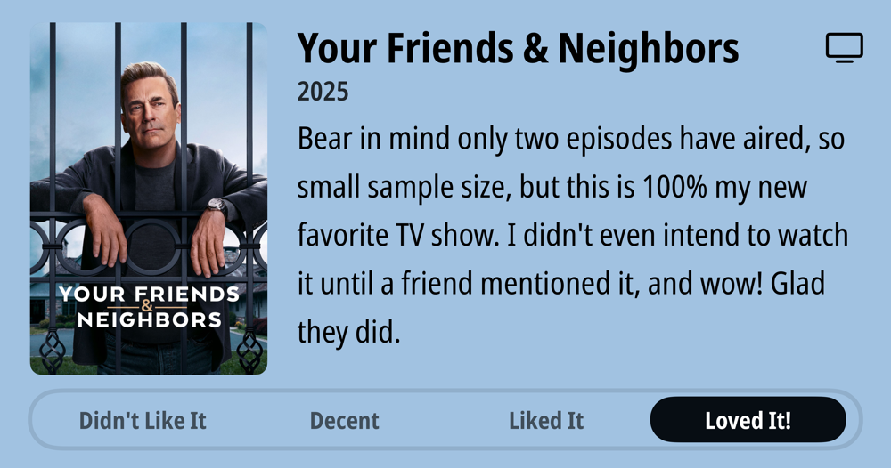

### Podcasts

*Podcast episodes without links are members-only but I think are interesting enough to post in case you want to investigate them.*

- The Race F1 Podcast (Members) – Edd and Jon on the Bahrain qualifying surprises - In-car insights
- [Smashing Security – Signalgate sucks, and the quandary of quishing](https://overcast.fm/+SD4MNmk1k)
- [Decoder with Nilay Patel – Why DOGE is killing the agency that stops banks from ripping you off](https://overcast.fm/+QLdvvzLhM)
- [Click Here – Mic Drop: AI’s unexpected Roman holiday](https://overcast.fm/+BL5Zi6-q8U)
- [Risky Bulletin – Risky Bulletin: Trump orders investigation into former CISA director Chris Krebs](https://overcast.fm/+5Sl8QHm4w)
- [Tech Won't Save Us – Can Europe End Its Dependence on US Tech? w/ Aline Blankertz](https://overcast.fm/+ZpQC64Vzg)
- [Whisky Whiskey – 55: Ned’s Grand Reward Australian Whisky](https://overcast.fm/+BLIhdNt8yw)
- [Risky Business – Wide World of Cyber: How the Trump admin is changing the cybersecurity landscape](https://overcast.fm/+It0iRBzjg)
- [The Vergecast – How the tech world is responding to tariff chaos](https://overcast.fm/+QN1rGSxK8)
- [System Crash – What the Trade War Means for Tech, Musk, and American Workers](https://overcast.fm/+BL8c2IRq6Y)

### TV Shows

### Food and Drink

- [Yonder - Forecast Coffee Company](https://forecastcoffeecompany.com/product/yonder/)
- [Rogue Hazelnut Brown Ale](https://www.rogue.com/shop/beer/core/hazelnut-brown-ale/)
- [Wayfinder Beer](https://www.wayfinder.beer/) LA MAGIE - FRENCH PILSNER
