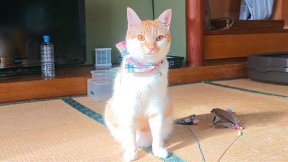

## Current Personal Status
>
> This is a good look at Flock and the damage they're doing to our civil liberties. We seem to have an abundance of self-appointed sheriff wanna-bes who just happen to be getting rich by subjecting us all to mass surveillance. I don't know who raised these kids, but they failed. [Flock Safety Loses Another City After CEO’s Email Backfires - YouTube](https://www.youtube.com/watch?v=hwbE5ks7dFg&t=952s)

## Current Projects

- Learning Korean
- Expanding Paradigm's client base and launching its vulnerabilty management service
- Building up my running distance again

## Stuff I've recently enjoyed

### Podcasts

*Podcast episodes without links are members-only but I think are interesting enough to post in case you want to investigate them.*

 [Blurring The Lines Podcast – Episode 245 - Choosing Better Lines](https://overcast.fm/+GsOnvB0Ng)
 Accidental Tech Podcast – 672: Wi Hyphen Fi
 [Whisky Whiskey – 155: Amber Lane Earth Single Malt Whisky](https://overcast.fm/+BLIhd-JYTg)
 [The Talk Show With John Gruber – 438: ‘2025 Year in Review’, With Rene Ritchie](https://overcast.fm/+B7NCJmikk)
 The Race F1 Podcast (Members) – F1 2026: The big stories to watch for (ad-free)
 Accidental Tech Podcast: Unedited Live Stream – 672: Wi Hyphen Fi
 [Talk To Me In Korean – Level 1 Lesson 2](https://overcast.fm/+6-OK5nhEE)
 [Talk To Me In Korean – Level 1 Lesson 1](https://overcast.fm/+6-OLm8dQg)
 [Learn Korean Language – Learn Korean Language Episode No 01](https://overcast.fm/+BRUVX0TkUE)
 [Sales Logic - Selling Strategies That Work – The Most Important Sales Trends of 2026](https://overcast.fm/+X6nPA9hS8)

### Books

[The Convenience Store by the Sea • First Time Read • 2020 • Sonoko Machida • I didn't know what to think of this book initially. It felt slightly stilted, whether due to translation or not, I'm not sure. But I kept reading. And it started drawing me in by brilliantly building intertwined moments of social interactions and vignettes of character development. • Loved It!
](/images/posts/png-image458cbadfd70-review-68981979-9b1f-4d9e-9ae9-1c29c838e7c5.jpg)
[Grid to Glory • 2025 • Alex Jacques • Alex Jacques is one of my favorite F1 commentators. His personality shines, and he's clearly a hard worker who knows what he's doing. The stories he's chosen for this book are compelling, but the writing style pulls me out of them. He uses sentence fragments instead of commas, and sometimes the background explanations are slightly muddled. Good, not great. • Decent
](/images/posts/png-image4dd09994160-review-c50952a1-62fd-4f67-a41d-85082a7e6f69.jpg)
[First Contact • 2025 • Becky Ferreira • A delightful look at the science, superstitions, stories, and suppositions behind the search for alien life throughout history. • Loved It!
](/images/posts/png-image447c967d8c0-review-c3a0b328-23e4-4f0e-bdf2-c3320ace2a6f.jpg)

### Movies

[The Perfect Neighbor • First Time Watch • 2025 • Geeta Gandbhir • You kind of have to be into crime documentaries to like this, but the real takeaway here is how stupid Stand Your Ground laws and the people who think they're a good idea are. Also, this lady was whack. • Liked It
](/images/posts/png-image4c91b6db330-review-a705ca39-8f1d-429b-a3bd-f461b37a31ea.jpg)
[Tinker Tailor Soldier Spy • 2011 • Tomas Alfredson • They don't make many movies like this anymore. Both intelligently written and yet not overly- wrought with twists and surprises, it's a subtly played movie staring Gary Oldman at his best, but with a stellar cast in general. Highly recommended. • Loved It!
](/images/posts/png-image48638ea78c0-review-3aedf0b6-0108-41da-a3e3-2096c4e6cd7e.jpg)

### TV Shows

[Plur1bus 1 • First Time Watch • 2025 • l've seen complaints about the slow pacing, but the people saying this must have never watched anything from Vince Gilligan before. He is NOT afraid to build a story. Season 1 was weird and compelling. Recommend! • Loved It!
](/images/posts/png-image4af1b3adda0-review-8a0fdb3c-07a2-4fde-8c58-981674a73262.jpg)

### YouTube

Channel – [Business Reform](https://www.youtube.com/@businessreform)

[Flock Safety Loses Another City After CEO’s Email Backfires](https://www.youtube.com/watch?v=hwbE5ks7dFg&t=952s)

Channel – [Tripwebcam](https://www.youtube.com/@tripwebcam)

[Japan Live Cam - Rolling Tour | Tokyo, Cities, Beaches & Landscapes](https://www.youtube.com/watch?v=884x72G-XQ4)

Channel – [Yamada Anthony](https://www.youtube.com/@Anchaninjapan)

[One Hour of Tokyo Apartments](https://www.youtube.com/watch?v=gNaeCslk6ac&t=21s)

Channel – [Chris Norlund](https://www.youtube.com/@realchris)

[Trump kidnaps Maduro in Venezuela strike](https://www.youtube.com/watch?v=QH4z_x3UXag&pp=0gcJCU0KAYcqIYzv)

Channel – [Disaster Breakdown](https://www.youtube.com/@DisasterBreakdown)

[Turbulence So Bad It Broke The Plane (BOAC Flight 911) - DISASTER BREAKDOWN](https://www.youtube.com/watch?v=LkFWMIfV9G0)

Channel – [Animamille🐰🐱 Travel to meet animals.](https://www.youtube.com/@animamille)

[Cat Paradise 💕🐱 A Japanese Retro Inn Where 13 Cats Come to Your Room. | Shoraku Ryokan in Ozu | 松楽旅館](https://www.youtube.com/watch?v=wNbIG4mH5hY)

Channel – [Yamada Anthony](https://www.youtube.com/@Anchaninjapan)

[$1180 Japanese Apartment Tour | Fukuoka](https://www.youtube.com/watch?v=nAvwVhsSBmw)

Channel – [Muxedotask](https://www.youtube.com/@muxedo)

[Why JAPAN Let CITY POP Artists DIE: A LOST Generation](https://www.youtube.com/watch?v=OyZUZJb3zGk)

Channel – [THE RACE](https://www.youtube.com/@WeAreTheRace)

[Why Mercedes went from F1 dominator to four years of failure](https://www.youtube.com/watch?v=n38NpAOuo8I)

