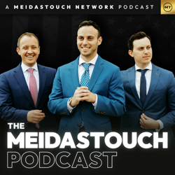
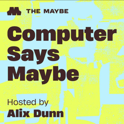

## Current Personal Status

Words. What do they mean? Truth is easily twisted. Liars lie. And that's how Portland is portrayed as "WAR RAVAGED", in the words of dementia man, [to send in the troops to Portland](https://www.theatlantic.com/national-security/archive/2025/10/portland-ice-protest-national-guard-trump/684439/).

Well, f#$% those guys.

## Stuff I've recently enjoyed

### Podcasts

*Podcast episodes without links are members-only but I think are interesting enough to post in case you want to investigate them.*

 [Risky Bulletin – Risky Bulletin: Scam compound operators sentenced to death in China](https://overcast.fm/+5Sl81u0fE)
 [The MeidasTouch Podcast – Trump Has Thursday Meltdown as His Shutdown Is Backfiring](https://overcast.fm/+anFD04R80)
 [Computer Says Maybe – Gotcha! ScamGPT w/ Lana Swartz & Alice Marwick](https://overcast.fm/+BGreGPwy_s)
 David Pakman Member Feed – 10/2/25: Governor urges Trump’s removal as shutdown drama escalates
 [The MeidasTouch Podcast – WH Holds DISASTER Press Conference as SHUTDOWN Backfires on Them](https://overcast.fm/+anFBm9siQ)
 [The MeidasTouch Podcast – Leader Jeffries Challenges Trump to Public Meeting on Funding](https://overcast.fm/+anFAEtx_0)
 [Decoder with Nilay Patel – The good, the bad, and the future of AI agents](https://overcast.fm/+QLdsJzcn8)
 The Race F1 Podcast (Members) – New Horner return options + ‘heat hazard’ declared: Singapore Thursday debrief with Jon and Scott
 David Pakman Member Feed – 10/2/25: TDPS Bonus Show
 [Accidental Tech Podcast – 659: Lose the Ear Lottery](https://atp.fm/659)

### Books

[Fluke • 2025 • Brian Klaas • (In progress) You'd thinking finding out everything is random and our smallest choices and actions can change everything would be scary and depressing, but in fact this book is interesting and though provoking and not at all depressing. That sounds like I’m just tolerating it, but I’m in fact enjoying it quite a bit. • Loved It!
](/images/posts/png-image481d813ee50-review-8aece3be-1f6e-4a0c-a3b3-9d3105d407dc.jpg)
[To Say Nothing of the Dog • 2013 • Connie Willis • Book 3 of the Oxford Time Travel series. It's funny and cute and compelling, even if I miss Mr. Dunworthy's constant presence ala Doomsday Book. But Ned Henry and all the other characters make this a fun book that's hard to put down. • Loved It!
](/images/posts/png-image4ebabaea1b0-review-954dbef9-86ea-478b-a0dd-e2bc85854b6a.jpg)

### Movies

[The Equalizer 3 • 2023 • Antoine Fuqua • Sometimes you just want to watch crisp, effective killing of bad guys, and Denzel always delivers in spades. I particularly enjoyed watching Marco get stabbed with his own knife he was still holding. • Loved It!
](/images/posts/png-image4dfa8c43f10-review-d2bf8b83-4aab-4a2f-82a2-6010349e6a3d.jpg)
[Highest 2 Lowest • 2025 • Spike Lee • Denzel Washington is always great. This movie was ultimately more uplifting than I expected, and that's ok. The world needs more of that. • Liked It
](/images/posts/png-image41bf880d270-review-15992669-eb47-4747-b1eb-5684492ff8cd.jpg)

### TV Shows

[Black Rabbit • 2025 • It's hard to like the two main characters in this show, but they do become sympathetic characters over time. There's plenty of tension, action, and family dynamics to go around. Some people are bad for themselves and everyone around them. • Liked It
](/images/posts/png-image4871b18c150-review-6fbb83bc-9e41-4708-978d-2389029b8df7.jpg)

### YouTube

- [The Day Intel Said NO to Steve Jobs (And Lost Everything)](https://www.youtube.com/watch?v=hUK9xK2iuOU) — [Snazzy Labs](https://www.youtube.com/@snazzy)
- [Jamie Raskin DESTROYS Kash Patel With SH0CKING Video Proof Of His Past](https://www.youtube.com/watch?v=AEyqIhHeKj4&t=15s) — [CONGRESS NEWS TV](https://www.youtube.com/@congressnewstv12)
- [Trump suffers public brain rot, generals STUNNED](https://www.youtube.com/watch?v=7HSOX0_V_Ro&t=16s) — [David Pakman Show](https://www.youtube.com/@thedavidpakmanshow)
- [Comedians' BRUTAL Insults Leave Trump Supporters SEETHING](https://www.youtube.com/watch?v=TcnMvZ-VnFc) — [TYT Sports](https://www.youtube.com/@tytsports)
- [Drivers Look Ahead To Race Weekend | 2025 Singapore Grand Prix](https://www.youtube.com/watch?v=VS8SVHWAluo) — [FORMULA 1](https://www.youtube.com/@Formula1)
- [I've Not Been Doing Well](https://www.youtube.com/watch?v=NYVv1kiZIUo&t=84s) — [vlogbrothers](https://www.youtube.com/@vlogbrothers)
- [Breaking Down Claude 4.5's LEAKED System Prompt](https://www.youtube.com/watch?v=u4D6hEdM_XQ) — [Mark Kashef](https://www.youtube.com/@Mark_Kashef)
- [Building the future of agents with Claude](https://www.youtube.com/watch?v=XuvKFsktX0Q&t=1026s) — [Anthropic](https://www.youtube.com/@anthropic-ai)
- [F1's Secret Paddle That Baffled Everyone](https://www.youtube.com/watch?v=y_RBtr7DL_U) — [Driver61](https://www.youtube.com/@Driver61)
- [“We don’t have a military full of Nordic pagans.” — Pete Hegseth declares war on beards 👀](https://www.youtube.com/watch?v=cnPAxk8vFDA) — [Diaper Diplomacy](https://www.youtube.com/@DiaperDiplomacy)
