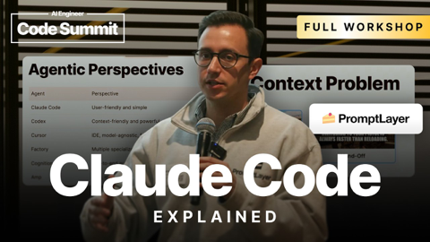

## Current Personal Status
>
> I've completely automated every aspect of creating a blog post in Astro just by writing a post in Obsidian and running a script. It handles images, link posts, keywords (tags), and more. It's so great.

## Current Projects

- Learning Korean
- Expanding Paradigm's client base and launching its vulnerabilty management service
- Building up my running distance again

## Stuff I've recently enjoyed

### Podcasts

*Podcast episodes without links are members-only but I think are interesting enough to post in case you want to investigate them.*

 [Whisky Whiskey – 126: Wilson’s 21 Year Old Blended Whisky](https://overcast.fm/+BLIhcFNYas)
 [Whisky Whiskey – 131: Tamdhu Batch Strength 007 Single Malt Whisky](https://overcast.fm/+BLIhdrGf_k)
 [Whisky Whiskey – 150: Amber Lane Silk Lane Single Malt Whisky](https://overcast.fm/+BLIhdhw2H4)
 The Vergecast: Ad-Free Edition – Version History: iPhone 4
 [Risky Bulletin – Sponsored: Why you’re probably doing Zero Trust wrong](https://overcast.fm/+5Sl_cyenM)
 [Risky Bulletin – Sponsored: Prowler uses AI how AI works best](https://overcast.fm/+5Sl8XQtCA)
 [The Weekly Planet – 600 Predator: Badlands & Pluribus](https://overcast.fm/+1HFKvLjxI)
 [Whisky Whiskey – 138: Laphroaig 18 Year Old Single Malt Whisky](https://overcast.fm/+BLIhde4CDc)
 [Whisky Whiskey – 149: Amber Lane Equinox Single Malt Whisky Re-review](https://overcast.fm/+BLIhfyBXkk)
 [Rebuild – 418: Just Figure Out What’s Next (hak)](https://overcast.fm/+meNH_LA)

### Books

[Grid to Glory • 2025 • Alex Jacques • Alex Jacques is one of my favorite F1 commentators. His personality shines, and he's clearly a hard worker who knows what he's doing. The stories he's chosen for this book are compelling, but the writing style pulls me out of them. He uses sentence fragments instead of commas, and sometimes the background explanations are slightly muddled. Good, not great. • Decent
](/images/posts/png-image4dd09994160-review-c50952a1-62fd-4f67-a41d-85082a7e6f69.jpg)
[First Contact • 2025 • Becky Ferreira • A delightful look at the science, superstitions, stories, and suppositions behind the search for alien life throughout history. • Loved It!
](/images/posts/png-image447c967d8c0-review-c3a0b328-23e4-4f0e-bdf2-c3320ace2a6f.jpg)

### Movies

[Tinker Tailor Soldier Spy • 2011 • Tomas Alfredson • They don't make many movies like this anymore. Both intelligently written and yet not overly- wrought with twists and surprises, it's a subtly played movie staring Gary Oldman at his best, but with a stellar cast in general. Highly recommended. • Loved It!
](/images/posts/png-image48638ea78c0-review-3aedf0b6-0108-41da-a3e3-2096c4e6cd7e.jpg)
[Wick Is Pain • 2025 • Jeffrey Doe • A fun look behind the scenes and lives of the people who made the John Wick movies. Really only these people could have made these movies. • Loved It!
](/images/posts/png-image48b090780c0-review-9b121a86-9efa-44ef-94d0-3484b4c3a18b.jpg)

### TV Shows

[Plur1bus 1 • First Time Watch • 2025 • l've seen complaints about the slow pacing, but the people saying this must have never watched anything from Vince Gilligan before. He is NOT afraid to build a story. Season 1 was weird and compelling. Recommend! • Loved It!
](/images/posts/png-image4af1b3adda0-review-8a0fdb3c-07a2-4fde-8c58-981674a73262.jpg)
[UNTAMED • First Time Watch • 2025 • I wish I could rate this higher. It started off great. The premise was good. The acting was pretty good. There were some slightly unbelievable plot points and twists, but overall I still recommend it. • Liked It
](/images/posts/png-image42abbc3f4f0-review-4677620a-9875-4737-8694-315fd092b752.jpg)

### Music

[primitive god • 2022 • Chris Ballew • I had no idea who Chris Ballew was (although obviously I'd heard of the Presidents of the United States of America) until I stumbled across his albums in Apple Music recently. To say he's prodigious is an understatement, but the good news is that a lot of it is very good, including "primitive god". Love it! • Loved It!
](/images/posts/png-image40c4b8c1520-review-ac176396-df13-46c9-b279-8570195ad525.jpg)

### YouTube

Channel – [Chris Norlund](https://www.youtube.com/@realchris)

[Trump ushers bankruptcy tsunami](https://www.youtube.com/watch?v=490wbrkh8v4)

Channel – [9 News Australia](https://www.youtube.com/@9NewsAUS)

[One dead and 26 others injured in a massive crash in Japan | 9 News Australia](https://www.youtube.com/watch?v=lzBsojSeX5A)

Channel – [UndeadHumor](https://www.youtube.com/@TheUndeadHumor)

[Santa's Powers Are STUPID](https://www.youtube.com/watch?v=2aeI-Q1TH7M&t=1s)

Channel – [Mixed Signals](https://www.youtube.com/@arbitersofsound)

[The fascinating world of Japanese train melodies](https://www.youtube.com/watch?v=-KxQIEhsFQk)

Channel – [AI Engineer](https://www.youtube.com/@aiDotEngineer)

[How Claude Code Works - Jared Zoneraich, PromptLayer](https://www.youtube.com/watch?v=RFKCzGlAU6Q)

Channel – [AI News & Strategy Daily | Nate B Jones](https://www.youtube.com/@NateBJones)

[Claude Code Snuck in 7 Updates in 2 Weeks—Here's What You Need to Know in 10 Minutes](https://www.youtube.com/watch?v=0jSE0NABcY8)

Channel – [Captain Steeeve](https://www.youtube.com/@CaptainSteeeve)

[This Changes Things — New Cockpit Audio from the Greg Biffle Crash](https://www.youtube.com/watch?v=WP2MsDuwnx0)

Channel – [AI Engineer](https://www.youtube.com/@aiDotEngineer)

[Don't Build Agents, Build Skills Instead – Barry Zhang & Mahesh Murag, Anthropic](https://www.youtube.com/watch?v=CEvIs9y1uog)

Channel – [Adam Mockler](https://www.youtube.com/@adammockler)

[Trump just f*cked up bad…](https://www.youtube.com/watch?v=WvYBYbdGk8I)

