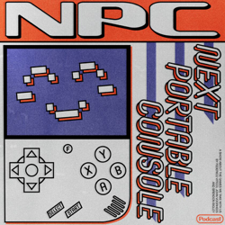

### Current Personal Status

**2025-06-15 – 2025-06-30**

I had the joy of touring Japan with my daughter for two weeks from mid-June to end of June, revisiting places I lived in Japan as a boy (Karuizawa and Kagoshima), as well as Tokyo and Kyoto. I will have a photos site to share photos from the trip on available shortly.

Some of the highlights:

- Visiting the old house I lived in in Karuizawa, and generally enjoying the beautiful weather and scenery there.
- Visiting Kagoshima, eating some amazing food there (they have the best food in Japan, in my opinion), and riding the ferry to Sakurajima, the active volcano that overlooks the city.
- Enjoying the chaos of Tokyo Asakusa, and visiting the Senso-ji temple, as well as Shibuya and Akihabara.
- Spending time in some lesser known temples and bamboo groves in Kyoto. Also the city was nice and the food was outstanding.
- THE FOOD, THE FOOD, THE FOOD!!

### Podcasts

*Podcast episodes without links are members-only but I think are interesting enough to post in case you want to investigate them.*

[Risky Bulletin – Between Two Nerds: The opportunity in Asia](https://overcast.fm/+5Sl_pA8iA)
[Risky Bulletin – Sponsored: Why Linux is the dark matter of the internet](https://overcast.fm/+5Sl_-e_Bw)
The Race F1 Podcast (Members) – Edd answers your questions about his F1 British GP driver rankings
[Risky Bulletin – Risky Bulletin: Chinese researchers claim to find new North American APT](https://overcast.fm/+5Sl_cxfSM)
[楽しいラジオ「ドングリFM」 – 1194 進まないすごろく](https://overcast.fm/+9ABKPGZY8)
The Race F1 Podcast (Members) – British Grand Prix review (ad-free)
[Tech Won't Save Us – Chatbots Are Repeating Social Media’s Harms w/ Nitasha Tiku](https://overcast.fm/+ZpQB3I8pU)
[Risky Bulletin – Between Two Nerds: Microsoft embraces digital sovereignty](https://overcast.fm/+5Sl_Ar26U)
[NPC: Next Portable Console – You’re Holding It Wrong: Dbrand and the Joy-Con Gap](https://overcast.fm/+BI63odUFs4)
[The Vergecast – The movie and TV tech we actually want to use](https://overcast.fm/+QN1poQ6gs)  

### Movies

[Ballerina • 2025 • Len Wiseman • Sometimes you just want to see people get shot and stabbed, and this is a lot of fun for that. John Wick movies always have interesting choreography and fights. Ana de Armas is fine as Eve and the action is all very well done. • Loved It!
](/images/posts/PngImage4A7CA53B7C0-review-a5e3466d-ac29-4207-a480-7dd4a72f8beb.jpg)

### TV Shows

[Your Friends & Neighbors • 2025 • What a season! What a show! This ranks way up there on the all time favorites list. Very curious about where it goes next. • Loved It!
](/images/posts/PngImage408C8502Fa0-review-a1dd1633-678b-44fd-ad50-055df7276f98.jpg)
[Long Way Home • 2025 • The Long Way series are always very entertaining, and two episodes in, this is no exception. I really love the European focus of this one. Will keep watching. • Loved It!
](/images/posts/PngImage45C88D92520-review-176fb98d-e50d-4881-964a-f0cb2542add3.jpg)

### Food and Drink

- [Fuji Ramen](https://maps.apple.com/place?address=24-5,%20Asakusa%201-Ch%C5%8Dme,%20Taito,%20Tokyo,%20Japan%20111-0032&coordinate=35.712421,139.792413&name=Fuji%20Ramen&place-id=I8EE20D2C8493F88&map=explore) (富士らーめん) in Asakusa, Tokyo – A great ramen shop with a very friendly owner who tries to learn the languages of all his foreign guests. The ramen was delicious.
- [Matcha Cafe](instagram.com/kotobukiseian) in Asakusa, Tokyo – Wow, the matcha shakes and the matcha pudding and the Mozzarella cheese toast!
- [Michiya Tonkatsu](https://michiya-kagoshima.com/) (みちや) in Kagoshima – The best tonkatsu – not *I think*, but *I KNOW*, I've ever had, and I've had a lot of tonkatsu.
