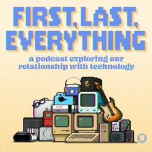

## Current Personal Status

Remember how I thought my 2024 M4 MacBook Pro has a broken Thunderbolt 5 port because it quit recognizing anything plugged into it (including my TB4 hub)? Well, I took it to Apple and when then genius bar employee put it into diag mode, it apparently fixed whatever SOFTWARE issue was causing the problem, because it immediately started working for her, and it's worked for me ever since too.

Oh, Apple. How many times in the past few years has your software driven me to drink?

## Stuff I've recently enjoyed

### Podcasts

*Podcast episodes without links are members-only but I think are interesting enough to post in case you want to investigate them.*

 David Pakman Member Feed – 10/21/25: Anger is building as White House demolition begins
 [Risky Bulletin – Risky Bulletin: Clever worm hits the VS Code scene](https://overcast.fm/+5Sl90qacw)
 The 404 Media Podcast (Premium Feed) – Hackers Dox ICE
 David Pakman Member Feed – 10/21/25: TDPS Bonus Show
 [Techdirt – An Insider’s View Of Decentralized Social Media](https://overcast.fm/+DyYXOv5cI)
 [First, Last, Everything – Joe Rosensteel, VFX Artist, Podcaster and writer](https://overcast.fm/+BRZq7ImfR4)
 [The Vergecast: Ad-Free Edition – The new Xbox is not an Xbox](https://overcast.fm/+BSp7tMBtuo)
 [Whisky Whiskey – 130: Oamaruvian Double Wood Cask Strength Single Malt Whisky](https://overcast.fm/+BLIhfW69C8)
 David Pakman Member Feed – 10/20/25: No Kings protests rattle MAGA as US approaches failed state
 [Risky Bulletin – Between Three Nerds: India, the sleeping cyber superpower](https://overcast.fm/+5Sl9oE1Pg)

### Books

[A History of What Comes Next • M Sylvain Neuvel • 2021 • A wonderful historical fiction novel that becomes... sci-fi? Yes, and it's a great premise too. It's not always an easy read, because there is a lot of tension and bad times, but it IS a worthy read. • Loved It!
](/images/posts/png-image492cb8af700-review-a142100d-fff7-45c3-9a2c-cbf1609682df.jpg)

### Movies

[Havoc • 2025 • Gareth Evans • I'm all for a good violent movie now and again, but I'm also a fan of things being basically believable. Also the only likable character here was Ellie, played by Jessie Mei Li. Even Forest Whitaker seemed to be phoning it in for the most part. Not bad if you're working on something while you watch. • Decent
](/images/posts/png-image41818924df0-review-47de6e01-d96a-4fab-b1d6-062a25d547b7.jpg)

### TV Shows

[The Last Frontier • 2025 • Another Apple TV+ series. Two episodes in, not sure how I'm going to feel about it. Started off well in some ways, hand-wavy in others. Seems like it's worth giving a chance though. • Liked It
](/images/posts/png-image41b9a9fec20-review-7a31e41f-7f85-4844-9544-87b1d32b09d7.jpg)

### YouTube

- [Copilot Update: Microsoft Adds NEW 'Connectors' (Link OneDrive, Google Drive & More)](https://www.youtube.com/watch?v=-kveNM_Y5Jw&t=3s) — [BrenTech](https://www.youtube.com/@BrenTech)
- [MAGA Voter THREATENS Protestors… INSTANTLY BACKFIRES!](https://www.youtube.com/watch?v=70TmI_RxjhU&t=403s) — [Adam Mockler](https://www.youtube.com/@adammockler)
- [Tech Titans. Tiny Thinking. Will AI Save or Sink Us?](https://www.youtube.com/watch?v=zwO3CKa6RuY&t=1944s) — [Josh Johnson](https://www.youtube.com/@JoshJohnsonComedy)
- [Radio Rewind | 2025 United States Grand Prix | Paramount+](https://www.youtube.com/watch?v=ZXAUZBcV_d8) — [FORMULA 1](https://www.youtube.com/@Formula1)
- [Sucked Through a Tiny Hole - Byford Dolphin Incident](https://www.youtube.com/watch?v=j8XgLX5FLdY) — [Storified](https://www.youtube.com/@Storified1)
- [Cat narrowly escapes coyote attack in Surfside Beach](https://www.youtube.com/watch?v=HEPC8YEI7yg) — [ABC13 Houston](https://www.youtube.com/@ABC13Houston)
- [Quick Thinking Attorney GOES TO WAR For His Client And WINS!](https://www.youtube.com/watch?v=pRLMGx6mLvE) — [Audit the Audit](https://www.youtube.com/@AuditTheAudit)
- [⚖️ Judge FLEISCHER: Shoddy Police Report and Parking While Black | Judging Judges](https://www.youtube.com/watch?v=G19SKEevVKA) — [Judging Judges](https://www.youtube.com/@JudgingJudges)
- [⚖️ Judge FLEISCHER Shuts Down Arrest for Living While Black | Judging Judges](https://www.youtube.com/watch?v=lvZHKjlrtO4) — [Judging Judges](https://www.youtube.com/@JudgingJudges)
- [Dr. Phil Facing Financial RUIN After Going Full MAGA](https://www.youtube.com/watch?v=R6Qk6j_7fF4) — [Farron Balanced](https://www.youtube.com/@FarronBalanced)
