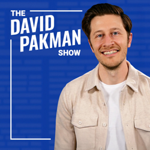
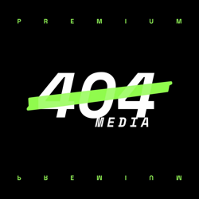
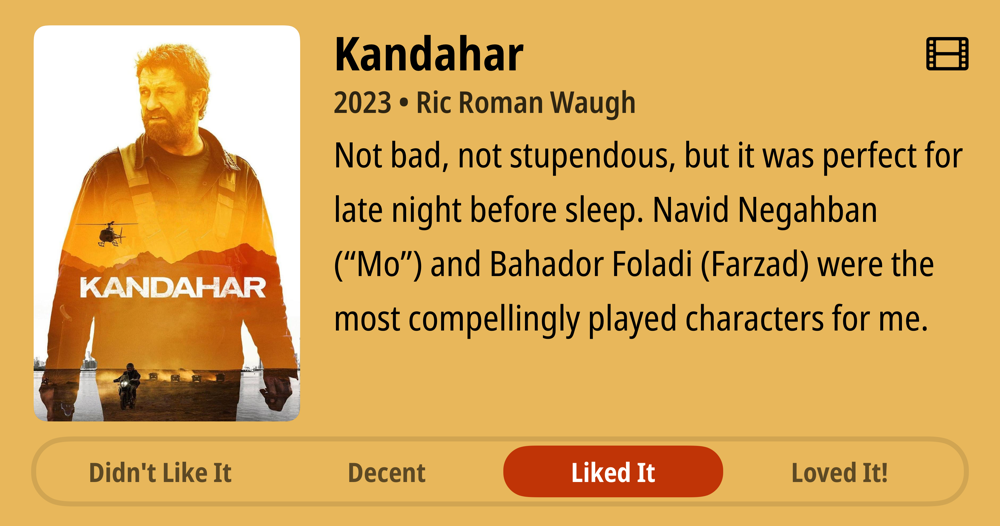
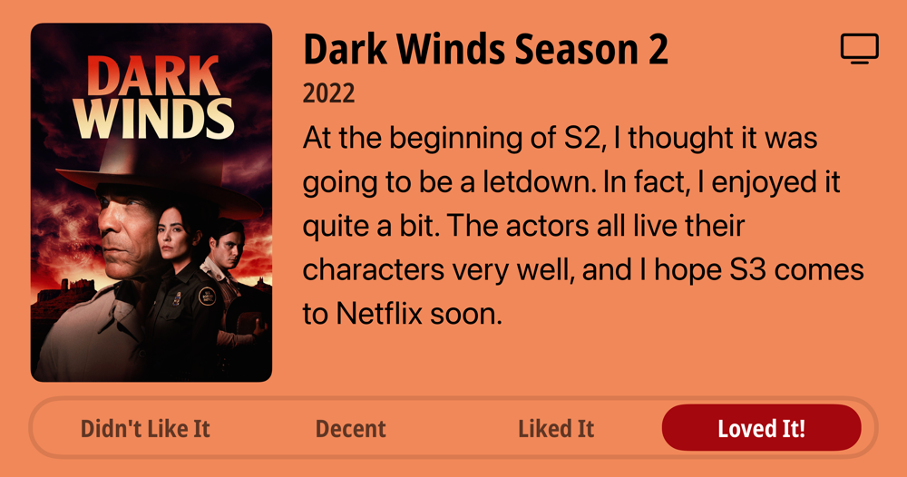

## Current Personal Status

Currently looking for work contracting for customer support, documentation and procedure writing, and support triage. Also looking to find additional SMB clients for Paradigm Consulting Company for IT and security services.

## Stuff I've recently enjoyed

### Podcasts

*Podcast episodes without links are members-only but I think are interesting enough to post in case you want to investigate them.*

[Judge John Hodgman – I Was Dreaming When I Wrote This, So Sue Me if I Judge Too Fast LIVE in Portland, ME!](https://overcast.fm/+YJM2cgTPQ)
[Accidental Tech Podcast – 656: A Long T-Shirt](https://atp.fm/656)
[Friends with Brews – One Topic Yubikey](https://overcast.fm/+9SHh5o2H8)
[Mac Geek Gab — Apple Tips, Tricks, and Troubleshooting – Apple Keynote Reactions: Always On for Everyone!](https://overcast.fm/+6TZ_Mcbgk)
[The Vergecast – The orange iPhone stole the show](https://overcast.fm/+QN1qsuw5w)
 The Race F1 Podcast (Members) – Are F1’s latest racing rules already failing? (ad-free)
[The David Pakman Show – 9/9/25: Trump’s Epstein drawing released as Dem Governor shuts him down](https://overcast.fm/+9Cvu2Y-xU)
 The 404 Media Podcast (Premium Feed) – AI Slop Is Drowning Out Human YouTubers
[Techdirt – Copyright And The First Amendment Collide At The Supreme Court](https://overcast.fm/+DyYWe46b0)
 The Race F1 Podcast (Members) – Edd answers your questions about his Italian GP F1 driver rankings

### Books

[Fluke • 2025 • Brian Klaas • (In progress) You'd thinking finding out everything is random and our smallest choices and actions can change everything would be scary and depressing, but in fact this book is interesting and though provoking and not at all depressing. That sounds like I’m just tolerating it, but I’m in fact enjoying it quite a bit. • Loved It!
](/images/posts/png-image481d813ee50-review-8aece3be-1f6e-4a0c-a3b3-9d3105d407dc.jpg)
[To Say Nothing of the Dog • 2013 • Connie Willis • Book 3 of the Oxford Time Travel series. It's funny and cute and compelling, even if I miss Mr. Dunworthy's constant presence ala Doomsday Book. But Ned Henry and all the other characters make this a fun book that's hard to put down. • Loved It!
](/images/posts/png-image4ebabaea1b0-review-954dbef9-86ea-478b-a0dd-e2bc85854b6a.jpg)

### Movies

[Kandahar • 2023 • Ric Roman Waugh • Not bad, not stupendous, but it was perfect for late night before sleep. Navid Negahban ("Mo") and Bahador Foladi (Farzad) were the most compellingly played characters for me. • Liked It
](/images/posts/png-image4fe6856a7f0-review-8522247f-65e8-442c-aa93-63a6809c8a34.jpg)

### TV Shows

[Dark Winds Season 2 • 2022 • At the beginning of S2, I thought it was going to be a letdown. In fact, I enjoyed it quite a bit. The actors all live their characters very well, and I hope S3 comes to Netflix soon. • Loved It!
](/images/posts/png-image4ff089b42d0-review-e076f104-60f1-4410-b06a-94351f18eae0.jpg)

### YouTube

- [The Problem of AI That Seems Alive](https://www.youtube.com/watch?v=BPm_FaaOuMQ&t=330s&pp=0gcJCckJAYcqIYzv) — [The AI Daily Brief: Artificial Intelligence News](https://www.youtube.com/@AIDailyBrief)
- [The Real Pilot Mistake That Got Nicole Killed!](https://www.youtube.com/watch?v=iVgOpLMna2o) — [Pilot Debrief](https://www.youtube.com/@pilot-debrief)
- [Trump TRIES TO STOP Epstein Survivors EXPOSING HIM](https://www.youtube.com/watch?v=TQpnSNywkKE&t=8s) — [Adam Mockler](https://www.youtube.com/@adammockler)
- [Baby Elephant Tula-Tu Plays With A Big Ball](https://www.youtube.com/watch?v=76hsq2seTeM) — [Oregon Zoo](https://www.youtube.com/@oregonzoo)
- [The Dark Side of Formula One - 18 Stories They Don't Want You to Know](https://www.youtube.com/watch?v=iu5dcJXk1NE) — [The F1 Explained](https://www.youtube.com/@thef1explained)
- [GPT-5 Finally Beats Gemini 2.5 Pro 🤯 (Google AI, ChatGPT, NotebookLM News)](https://www.youtube.com/watch?v=g-ifKOXpZRE&t=106s) — [Your AI Workflow](https://www.youtube.com/@youraiworkflow)
- [How To Install Google Gemini on Mac](https://www.youtube.com/watch?v=DFHQ5EAHekQ) — [Aldo James](https://www.youtube.com/@AldoJames)
- [AirPods Pro 3: Huge Upgrade in Sound & Experience](https://www.youtube.com/watch?v=GLuktcf-_kI&t=1s) — [Dallas Taylor](https://www.youtube.com/@dallastaylor.mp3)
- [It's not just you (Claude did get dumber)](https://www.youtube.com/watch?v=Px2ksfuAowo&t=2610s) — [Theo - t3․gg](https://www.youtube.com/@t3dotgg)
- [Trump FBI Admits They Lost Charlie Kirk Shooter](https://www.youtube.com/watch?v=_eSQs58eSOs) — [Adam Mockler](https://www.youtube.com/@adammockler)
