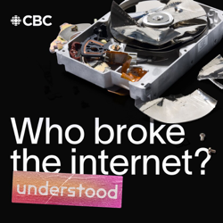

### Current Personal Status

Somehow I've managed to be sick the majority of the 3 weeks I've been back from Japan. EVEN MORE REASON I SHOULD NEVER HAVE COME BACK!!

Oh, well.

### Podcasts

*Podcast episodes without links are members-only but I think are interesting enough to post in case you want to investigate them.*

[Understood: Who Broke the Internet? – Kick ‘Em in the Dongle](https://overcast.fm/+_pI3C8qjQ)
[Understood: Who Broke the Internet? – In God We Antitrust](https://overcast.fm/+_pI0JWw9s)
[Understood: Who Broke the Internet? – Ctrl, Ctrl, Ctrl](https://overcast.fm/+_pI2qipjI)
[Understood: Who Broke the Internet? – Don’t Be Evil](https://overcast.fm/+_pI0nJStc)
[Understood: Who Broke the Internet? – Introducing Understood: Who Broke the Internet?](https://overcast.fm/+_pI1E6Qog)
[Understood: Who Broke the Internet? – The Naked Emperor BONUS | Guilty: The fall of Sam Bankman-Fried](https://overcast.fm/+_pI3E2FMA)
[Understood: Who Broke the Internet? – The Naked Emperor BONUS: The Trial of Sam Bankman-Fried](https://overcast.fm/+_pI30U66s)
[Understood: Who Broke the Internet? – The Naked Emperor BONUS: Binance and its CEO sued in major crypto case](https://overcast.fm/+_pI0gGd18)
[Risky Bulletin – Between Two Nerds: The Aeroflot hack](https://overcast.fm/+5Sl-xu5Cw)
[Mac Geek Gab — Apple Tips, Tricks, and Troubleshooting – Life’s Too Short to Deal With Bad Cables](https://overcast.fm/+6TZ8BnrXQ)

### Books

[Sir Lewis • 2025 • Michael Sawyer Look. Lewis is an actual role model, and he's also a true legend. This book was just a little too willing to bypass nuances in a couple cases and overstate its case. It did not need to do that, because Lewis' life and work speaks for itself. • Liked It
](/images/posts/PngImage498A9F6D680-review-9e725bb8-827b-4445-9e2c-5b07a9cad227.jpg)

### Movies

[Ballerina • 2025 • Len Wiseman • Sometimes you just want to see people get shot and stabbed, and this is a lot of fun for that. John Wick movies always have interesting choreography and fights. Ana de Armas is fine as Eve and the action is all very well done. • Loved It!
](/images/posts/PngImage4A7CA53B7C0-review-a5e3466d-ac29-4207-a480-7dd4a72f8beb.jpg)

### TV Shows

[Murderbot S1 • 2025 • I didn't expect to love this. I didn't even want to like it after a couple episodes. But I do! I love it! It's fun and somehow heartwarming. • Loved It!
](/images/posts/PngImage4Cee8279170-review-8f5cff22-2481-41cf-83f2-8ba425311f71.jpg)
[Somebody Feed Phil • 2018 • 8 seasons in, this is one of the happiest and insistently must-see shows I know of. Watch it. Pay for the goddamned Netflix account JUST FOR THIS. If you don't, I have to ask - why do you hate yourself? • Loved It!
](/images/posts/PngImage4Bbc86C7Ea0-review-99b30486-a314-4ae9-a35a-b140f463e70f.jpg)

### YouTube

- [Adam Mockler - YouTube](https://www.youtube.com/@adammockler)
- [Jozen - YouTube](https://www.youtube.com/@jozendesu)
- [Miku Real Japanese - YouTube](https://www.youtube.com/@mikurealjapanese)
- [NihongoDekita with Sayaka - YouTube](https://www.youtube.com/@NihongoDekita)
- [Pilot Debrief - YouTube](https://www.youtube.com/@pilot-debrief)
- [Sunny in Japan - YouTube](https://www.youtube.com/@Sunny_in_Japan)
- [Tetsu Sensei - YouTube](https://www.youtube.com/@tetsujpjp)
- [THE RACE - YouTube](https://www.youtube.com/WeAreTheRace)
- [Yuko Sensei - YouTube](https://www.youtube.com/@YukoSensei)

### Food and Drink

- [Home | ramen-ryoma](https://www.ramenryoma.net/) Don't get me wrong, it's very good, but... it's not Japan. IT'S NOT JAPAN!!
- [Fuji Ramen](https://maps.apple.com/place?address=24-5,%20Asakusa%201-Ch%C5%8Dme,%20Taito,%20Tokyo,%20Japan%20111-0032&coordinate=35.712421,139.792413&name=Fuji%20Ramen&place-id=I8EE20D2C8493F88&map=explore) (富士らーめん) in Asakusa, Tokyo – A great ramen shop with a very friendly owner who tries to learn the languages of all his foreign guests. The ramen was delicious.
- [Matcha Cafe](instagram.com/kotobukiseian) in Asakusa, Tokyo – Wow, the matcha shakes and the matcha pudding and the Mozzarella cheese toast!
- [Michiya Tonkatsu](https://michiya-kagoshima.com/) (みちや) in Kagoshima – The best tonkatsu – not *I think*, but *I KNOW*, I've ever had, and I've had a lot of tonkatsu.
