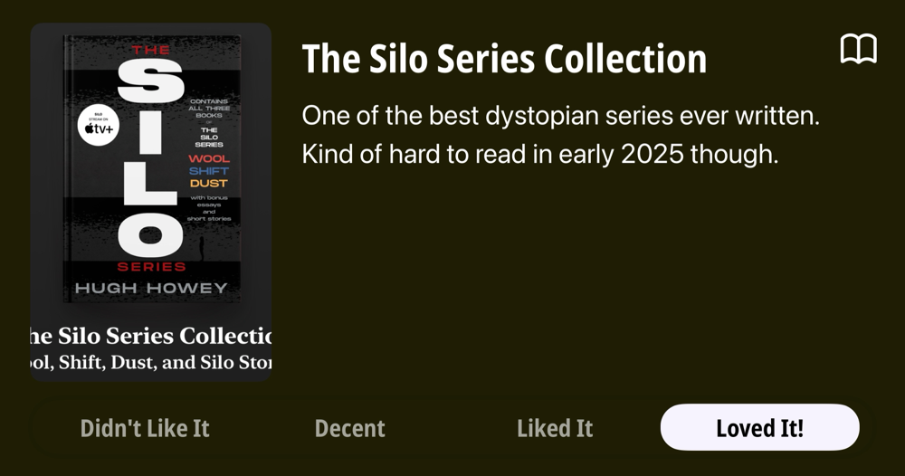
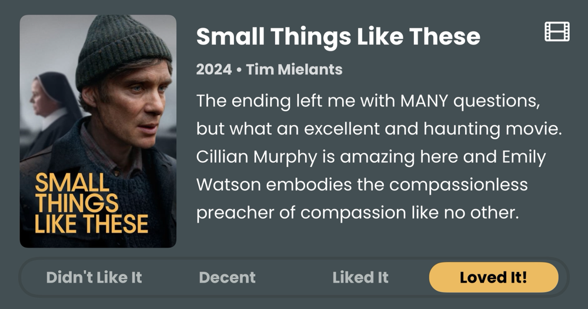
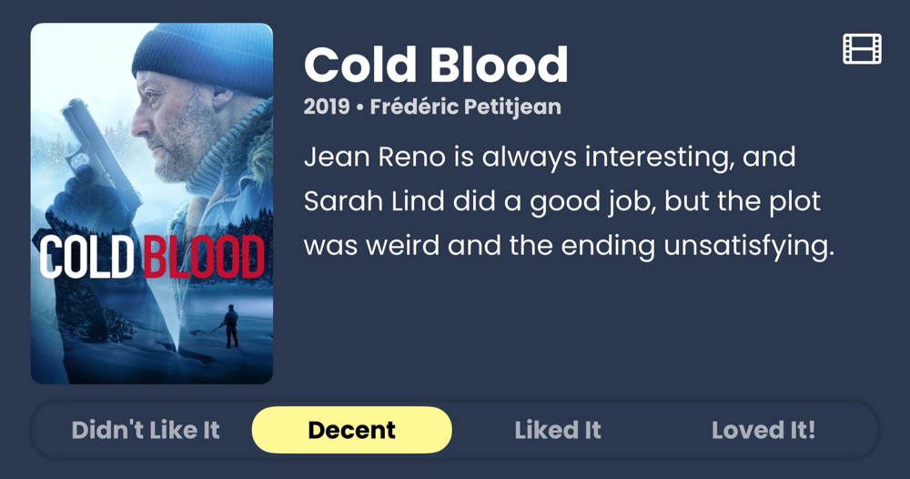
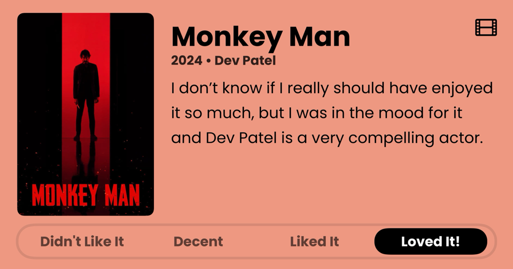
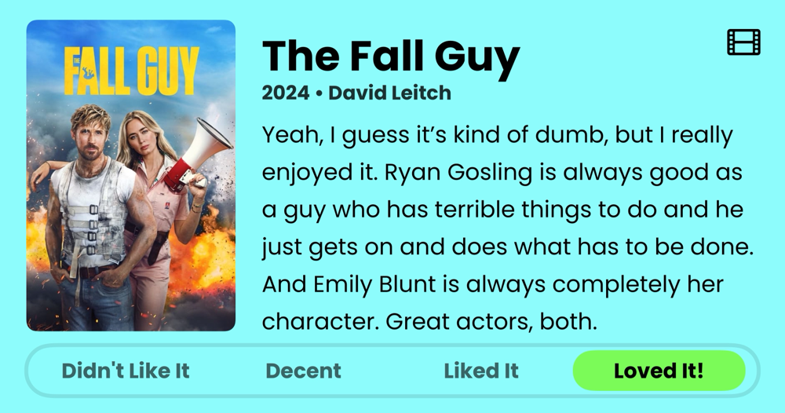
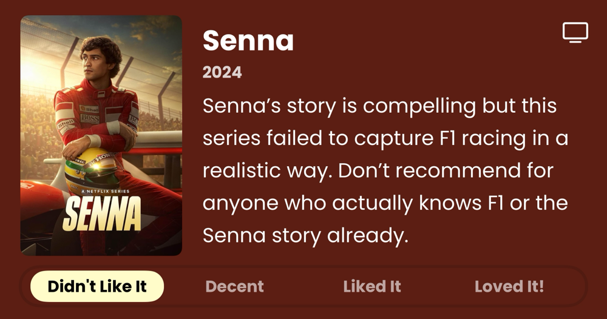
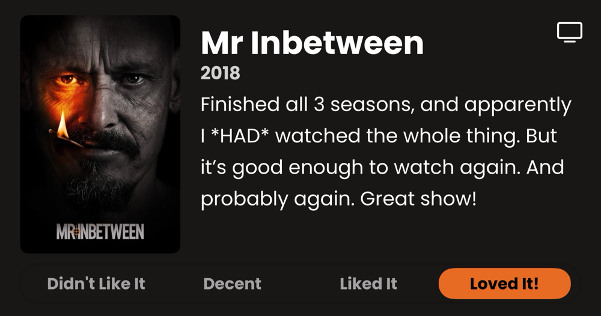
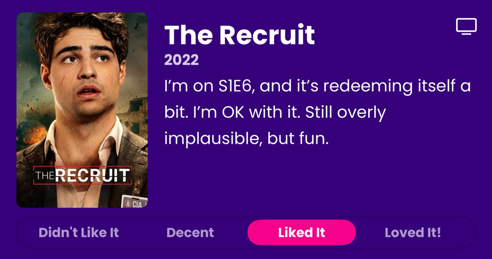
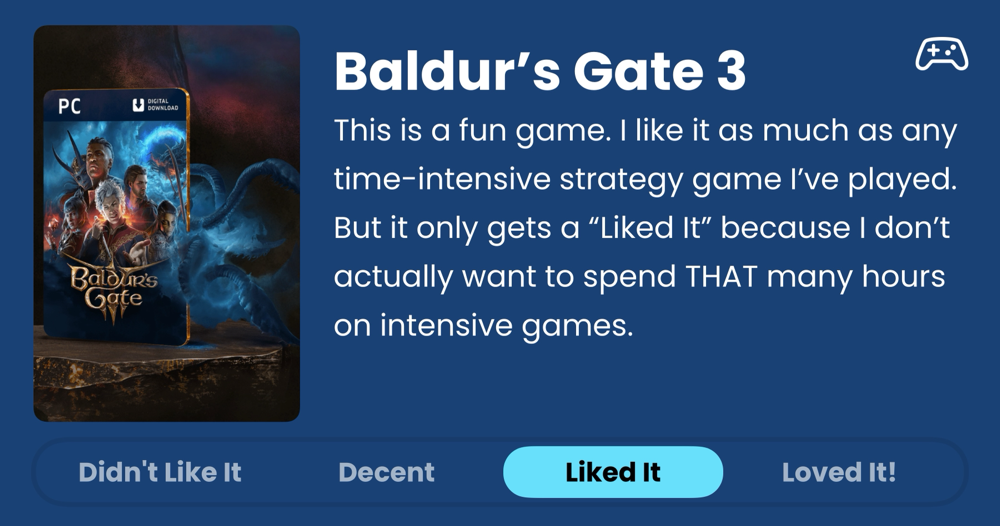

### Podcasts

*Podcast episodes without links are members-only but I think are interesting enough to post in case you want to investigate them.*

- Six Colors – Apple Intelligence Take 2 (6C Podcast)
- The Race Members' Club 2025 – BBV10s S11 E8: Panis’s sensational sole F1 win (early access)
- The Race Members' Club 2025 – Why McLaren has gone ‘aggressive’ with 2025 F1 car (ad-free)
- [Accidental Tech Podcast: Unedited Live Stream – 626: No Longer ery Good](https://atp.fm/626)
- [The High Performance Podcast – Calum Nicholas on the ‘Real Max Verstappen’ & Lewis Hamilton’s F1 Legacy (E328)](https://overcast.fm/+qG21EZ1T0)
- [Smashing Security – Podcast not found](https://overcast.fm/+SD4OQD_Ag)
- [The Rebound – 533: His Name Is Milkshake Duck](https://overcast.fm/+De1n5SmuY)
- [Risky Business – Risky Business #779 — DOGE staffer linked to The Com](https://overcast.fm/+It0hy6DE8)
- The 404 Media Podcast (Premium Feed) – AI Is Breaking Our Brains
- [F1: Beyond The Grid – Racing for Ferrari: Vettel, Prost + Mansell from the BTG Archive](https://overcast.fm/+Nv8ILP0tQ)

### Books

*Don't be surprised when the book list stays constant for awhile. Reading time is harder to come by these days. 😞*  

### Movies

### TV Shows

### Games

### Food and Drink

- [Baerlic Beer Co](https://www.baerlicbrewing.com/) Downlow Czech Dark Lager
- [Hetty Alice Beers](https://www.hettyalicebeers.com/) Porter
