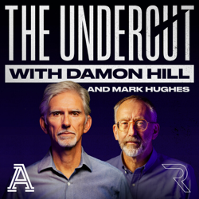
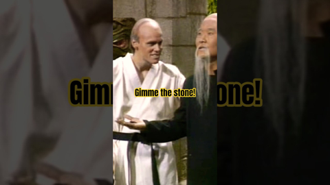
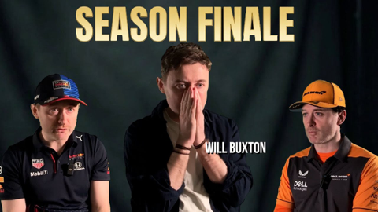
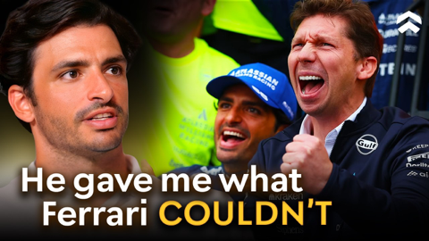
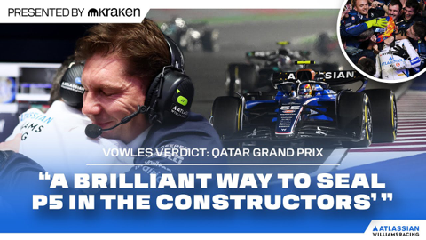

## Current Personal Status
>
> Work was fun this week. Whatever's going on with my body isn't. However, I have vastly improved my sleep quality by getting rid of the big traditional American bed and going to the floor with a futon. Wow! When I wake up I feel like I actually SLEPT through the night in a way I haven't in a long time.

## Stuff I've recently enjoyed

### Podcasts

*Podcast episodes without links are members-only but I think are interesting enough to post in case you want to investigate them.*

 [Comfort Zone – Entering My Dad Era](https://overcast.fm/+BI6NQIvaQo)
 [Pluribus: The Official Podcast – S1E5: Mark Hansen](https://overcast.fm/+BTOhUS7hKc)
 The Race F1 Podcast (Members) – In-Car Insights: 2025 Abu Dhabi GP Thursday - looking ahead to F1’s three-way title fight decider!
 Accidental Tech Podcast: Unedited Live Stream – 668: So Happy for All Parties Involved
 [Judge John Hodgman – An Undigested Bit of Beef LIVE in Brookline](https://overcast.fm/+YJM03DpYA)
 [Shell Game – Episode 4: The Startup Chronicles](https://overcast.fm/+BJNsbdiFZU)
 The Race F1 Podcast (Members) – Ben answers your questions about his Qatar GP F1 driver rankings
 The Race F1 Podcast (Members) – In-Airport Insights: Scott searches for a lost Edd in Doha to save The Race’s Abu Dhabi F1 plans
 [The Undercut with Damon Hill and Mark Hughes – Premiere: The Undercut with Damon Hill and Mark Hughes - episode 1!](https://overcast.fm/+BT6gg5AkXU)
 The 404 Media Podcast (Premium Feed) – This Podcast Will Hack You

### Books

[Buried in the Sky • 2012 • Climbers are nuts. People keep dying on these peaks in really unnecessary ways and it very often seems like the result of the most idiotic decisions on the part of people who are supposed to be experienced. Really gripping tale. • Loved It!
](/images/posts/png-image4fe5bf59280-review-07d00041-80c5-40df-96f4-1e73860e4edd.jpg)
[First Contact • 2025 • Becky Ferreira • A delightful look at the science, superstitions, stories, and suppositions behind the search for alien life throughout history. • Loved It!
](/images/posts/png-image447c967d8c0-review-c3a0b328-23e4-4f0e-bdf2-c3320ace2a6f.jpg)

### Movies

[Tinker Tailor Soldier Spy • 2011 • Tomas Alfredson • They don't make many movies like this anymore. Both intelligently written and yet not overly- wrought with twists and surprises, it's a subtly played movie staring Gary Oldman at his best, but with a stellar cast in general. Highly recommended. • Loved It!
](/images/posts/png-image48638ea78c0-review-3aedf0b6-0108-41da-a3e3-2096c4e6cd7e.jpg)
[Wick Is Pain • 2025 • Jeffrey Doe • A fun look behind the scenes and lives of the people who made the John Wick movies. Really only these people could have made these movies. • Loved It!
](/images/posts/png-image48b090780c0-review-9b121a86-9efa-44ef-94d0-3484b4c3a18b.jpg)

### TV Shows

[Pluribus • 2025 • In progress. I honestly didn't know what to think of this for about 1 and a half episodes, but wow, has it got me hooked now. Rhea Seehorn is always amazing and Karolina Wydra is perfect in her unsettling role as Zosia. • Loved It!
](/images/posts/png-image434192b3d00-review-d7b6f915-5eba-4de8-bb96-62f51502c240.jpg)

### YouTube

Channel – [FutonBedsFromJapan.com](https://www.youtube.com/@Futonbedsfromjapan1)

[Futon Beds | What to Expect When You Order a Futon from Us](https://www.youtube.com/watch?v=wJXMVy0wO9c)

Channel – [Exjapter](https://www.youtube.com/@Exjapter)

[Retire in Japan? Obstacles and Advice on Healthcare, Pension, Investments. [Reupload] #japanese](https://www.youtube.com/watch?v=1K_rqtnm4ww&t=2s)

Channel – [Epic Lines](https://www.youtube.com/@EpicLinesClips)

[Jim Carrey’s FUNNIEST Kung Fu Sketch Ever 😂🥋 | In Living Color Classic](https://www.youtube.com/watch?v=P3iK_0pQKmU)

Channel – [THE RACE](https://www.youtube.com/@WeAreTheRace)

[What’s really going on with wild McLaren claims at F1’s title showdown](https://www.youtube.com/watch?v=SLFTGOCqj6k)

Channel – [Daily Dose Of Internet](https://www.youtube.com/@DailyDoseOfInternet)

[The Dumbest Drivers Ever](https://www.youtube.com/watch?v=xWs6Qij112Y)

Channel – [Conor Moore Racing](https://www.youtube.com/@conormooref1)

[F1 ABU DHABI grand prix preview | DTS](https://www.youtube.com/watch?v=eAjyhFCEjT4)

Channel – [Theo - t3․gg](https://www.youtube.com/@t3dotgg)

[How I code with AI right now](https://www.youtube.com/watch?v=-g1yKRo5XtY&t=1s)

Channel – [High Performance](https://www.youtube.com/@HighPerformancePodcast)

[Carlos Sainz Reveals James Vowles' Masterplan For Williams F1](https://www.youtube.com/watch?v=DKBq57-PXmo&t=331s)

Channel – [Atlassian Williams Racing](https://www.youtube.com/@WilliamsF1TV)

[James Vowles Reflects on Securing P5 in the Constructors'! | Vowles Verdict | Qatar GP](https://www.youtube.com/watch?v=tDtOdRIL4Y4)

### Food

 [Home | ramen-ryoma](https://www.ramenryoma.net)

