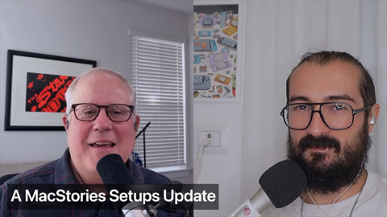

## Current Personal Status

I have a lot of thoughts about AI that I should write up at some point, regarding my own stance on using AI, what it's good for, what it's NOT good for, and how I can justify its use given the many valid concerns about the Silicon Valley companies making these models, the environmental effects of the "scale forever" approach to LLMs, and all the other disturbing parts of modern Silicon Valley (hint: a lot of it relates to venture capitalism and capitalism in general).

I know a lot of people are going to get mad immediately, and I think I alienated some people in the MacStories discord that I didn't mean to because I'm not staunchly anti-AI, but it's very hard to have these conversations in text without people seeing what they want to see in whatever you say. For the record, Federico Viticci and John Voorhees of MacStories themselves have been (in my opinion) very pragmatic and open-minded on the topic. They've denounced that "artistic" and content-creation uses of AI as well as the problems to society, while also being pragmatic about the things that it is good for. This is very much inline with my views on the topic.

Anyway... my track record of accidentally alienating people online continues.

## Stuff I've recently enjoyed

### Podcasts

*Podcast episodes without links are members-only but I think are interesting enough to post in case you want to investigate them.*

 [Whisky Whiskey – 139: Ardbeg 5 Year Old ‘Wee Beastie’ Single Malt Whisky](https://overcast.fm/+BLIhegGMmo)
 The Race F1 Podcast (Members) – In-Casino Insights: Edd, Jon and Las Vegas qualifying’s big talking points (spoilers!)
 David Pakman Member Feed – 11/21/25: Middle class collapsing as Trump threatens everyone
 [MacStories Unwind – Tech Nostalgia](https://overcast.fm/+aQipL8P9Y)
 David Pakman Member Feed – 11/21/25: TDPS Bonus Show
 [Uncanny Valley | WIRED – WIRED Roundup: Epstein Files Fallout, NVIDIA Earnings, Gemini 3 Release](https://overcast.fm/+BFs17PlsNI)
 The Vergecast: Ad-Free Edition – AI agents are invading your PC
 The 404 Media Podcast (Premium Feed) – Luxury Surveillance (With Chris Gilliard)
 The Race F1 Podcast (Members) – In-Casino Insights: Edd and Jon debrief a disrupted night of Las Vegas practice
 [Comfort Zone – Sorry, Danielle](https://overcast.fm/+BI6NTMZrt4)

### Books

[Buried in the Sky • 2012 • Climbers are nuts. People keep dying on these peaks in really unnecessary ways and it very often seems like the result of the most idiotic decisions on the part of people who are supposed to be experienced. Really gripping tale. • Loved It!
](/images/posts/png-image4fe5bf59280-review-07d00041-80c5-40df-96f4-1e73860e4edd.jpg)
[First Contact • 2025 • Becky Ferreira • A delightful look at the science, superstitions, stories, and suppositions behind the search for alien life throughout history. • Loved It!
](/images/posts/png-image447c967d8c0-review-c3a0b328-23e4-4f0e-bdf2-c3320ace2a6f.jpg)

### TV Shows

[Pluribus • 2025 • In progress. I honestly didn't know what to think of this for about 1 and a half episodes, but wow, has it got me hooked now. Rhea Seehorn is always amazing and Karolina Wydra is perfect in her unsettling role as Zosia. • Loved It!
](/images/posts/png-image434192b3d00-review-d7b6f915-5eba-4de8-bb96-62f51502c240.jpg)
[Dark Winds • 2022 • Season 3 - Just starting Season 3. I think this series has evolved from a "must watch" to "there are things I like about it, and I'll get to it when and if I have time" show for me. There's a funny couple cameos in S3E1 though. • Liked It
](/images/posts/png-image44259b22750-review-1ab7b3f3-74fd-427c-ae6b-8623370cf16f.jpg)

### YouTube

Channel – [Theo - t3․gg](https://www.youtube.com/@t3dotgg)

[You’re all wrong](https://www.youtube.com/watch?v=KJfz9ChQ0A0)

Channel – [404 Media](https://www.youtube.com/@404Mediaco)

[How Big Tech Has Convinced Us to Surveil Ourselves and Each Other [SUBSCRIBERS]](https://www.youtube.com/watch?v=hjXALk8FOkk&t=1305s)

Channel – [Racing Avenue](https://www.youtube.com/@racingavenuechannel)

[Bottas Claims Hamilton Criticism Is Overblown But Ferrari Underestimated Leclerc](https://www.youtube.com/watch?v=qPcqcZBTjI8)

Channel – [Amazon MGM Studios](https://www.youtube.com/@AmazonMGMStudios)

[Project Hail Mary | Official Trailer 2](https://www.youtube.com/watch?v=5VYsnngkS_U)

Channel – [World History](https://www.youtube.com/@WorldHistoryVideos)

[He Begged, Screamed & Shook: Execution of Belgian Nazi Collaborator](https://www.youtube.com/watch?v=oa_Z5AMAz5w)

Channel – [Captain Steeeve](https://www.youtube.com/@CaptainSteeeve)

[DC-10 Planes Grounded After MD-11 Crash — FAA Issues New Emergency Order](https://www.youtube.com/watch?v=3-rFJ-RIFfM)

Channel – [Rebecca Watson (Skepchick)](https://www.youtube.com/@RebeccaWatson)

[So I'm in the Epstein Files](https://www.youtube.com/watch?v=VNLdyWPAz18&pp=0gcJCQsKAYcqIYzv)

Channel – [Mentour Now!](https://www.youtube.com/@MentourNow)

[The LRD issue Might Be BIGGER Than We Thought!](https://www.youtube.com/watch?v=ULgLKfE6CvU)

Channel – [MacStories](https://www.youtube.com/@MacStories09)

[A MacStories Setups Update](https://www.youtube.com/watch?v=-RhQhl_QuJI&t=14s)

### Food

 [Home | Long's Vietnamese Kitchen LLC](https://longsvietnamesekitchen.square.site)

 [Decadent Creations bakery in Hillsboro – Pumpkin bread](https://decadentcreations.com)

