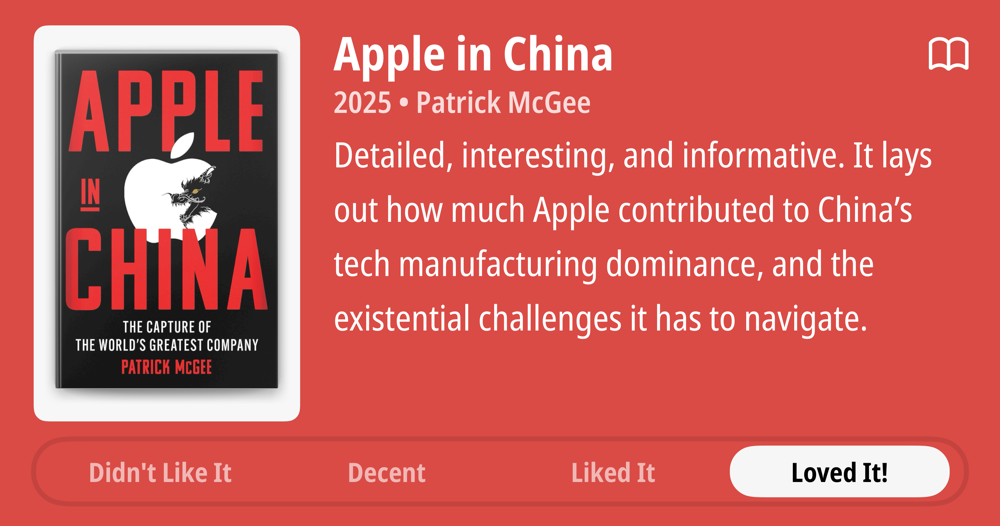

### Current Personal Status

**2025-06-15 – 2025-06-30**

I have the joy of touring Japan with my daughter for two weeks, revisiting places I lived in Japan as a boy (Karuizawa and Kagoshima), as well as Tokyo and Kyoto. I will have a photos site to share photos from the trip on after I get home.

Some of the highlights so far have been:

- Visiting the old house I lived in in Karuizawa, and generally enjoying the beautiful weather and scenery there.
- Visiting Kagoshima, eating some amazing food there (they have the best food in Japan, in my opinion), and riding the ferry to Sakurajima, the active volcano that overlooks the city.
- Enjoying the chaos of Tokyo Asakusa, and visiting the Senso-ji temple, as well as Shibuya and Harajuku.
- Spending time in some lesser known temples and bamboo groves in Kyoto. Also the city was nice and the food was outstanding.

### Podcasts

*Podcast episodes without links are members-only but I think are interesting enough to post in case you want to investigate them.*

[MacStories Unwind – The Big Update You Probably Didn’t Even Notice](https://overcast.fm/+aQipC-xVs)
Six Colors – Hot EU summer and unreliable AI shortcuts (6C Podcast)
The Race F1 Podcast (Members) – Feel-good fun or ‘an insult’ to F1 fans? Our no holds barred, spoiler-heavy review of F1: The Movie
[Accidental Tech Podcast – 644: You Have to Invert](https://atp.fm/644)
The Race F1 Podcast (Members) – Deconstructing Norris’s 2025 struggles + Austria preview (ad-free)

### Books

[Apple in China • 2025 • Patrick McGee • Detailed, interesting, and informative. It lays out how much Apple contributed to China's tech manufacturing dominance, and the existential challenges it has to navigate. • Loved It!
](/images/posts/PngImage401AA8309E0-review-bc3112ea-cb01-4386-88c0-61195a185576.jpg)

### TV Shows

[Your Friends & Neighbors • 2025 • What a season! What a show! This ranks way up there on the all time favorites list. Very curious about where it goes next. • Loved It!
](/images/posts/PngImage408C8502Fa0-review-a1dd1633-678b-44fd-ad50-055df7276f98.jpg)
[Long Way Home • 2025 • The Long Way series are always very entertaining, and two episodes in, this is no exception. I really love the European focus of this one. Will keep watching. • Loved It!
](/images/posts/PngImage45C88D92520-review-176fb98d-e50d-4881-964a-f0cb2542add3.jpg)

### Food and Drink

- [Fuji Ramen](https://maps.apple.com/place?address=24-5,%20Asakusa%201-Ch%C5%8Dme,%20Taito,%20Tokyo,%20Japan%20111-0032&coordinate=35.712421,139.792413&name=Fuji%20Ramen&place-id=I8EE20D2C8493F88&map=explore) (富士らーめん) in Asakusa, Tokyo – A great ramen shop with a very friendly owner who tries to learn the languages of all his foreign guests. The ramen was delicious.
- [Matcha Cafe](instagram.com/kotobukiseian) in Asakusa, Tokyo – Wow, the matcha shakes and the matcha pudding and the Mozzarella cheese toast!
- [Michiya Tonkatsu](https://michiya-kagoshima.com/) (みちや) in Kagoshima – The best tonkatsu – not *I think*, but *I KNOW*, I've ever had, and I've had a lot of tonkatsu.
