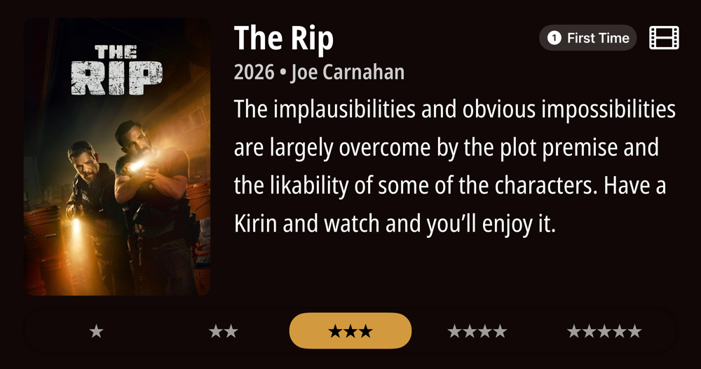
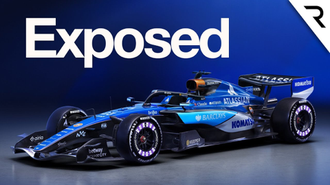
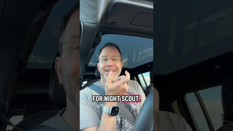
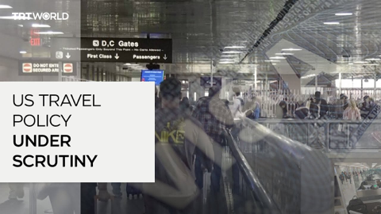
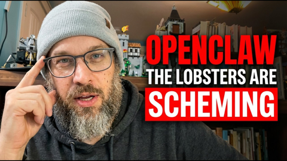
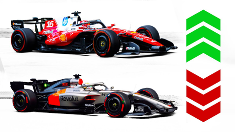
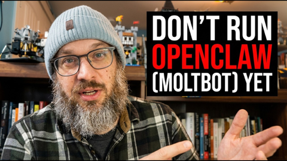

## Current Personal Status
>
> Now is a good time to have a finely tuned BS detector when it comes to tech. Too good to be true IS too good to be true. It's also a good time to have a high social BS detector. Too authoritarian IS too authoritarian.

## Current Projects

- Japanese and Korean study (somewhat proficient in J, complete newb to K). Using [Talk To Me In Korean Courses](https://courses.talktomeinkorean.com/).

## Stuff I've recently enjoyed

### Podcasts

*Podcast episodes without links are members-only but I think are interesting enough to post in case you want to investigate them.*

 [Firewalls Don't Stop Dragons Podcast – Debunking Hacklore](https://overcast.fm/+PvDbg1UKg)
 [Causality – 62: OceanGate Titan](https://overcast.fm/+fjzSk6Uug)
 The Race F1 Podcast (Members) – The key tech trends of F1’s 2026 cars (ad-free)
 [Firewalls Don't Stop Dragons Podcast – Best of 2025!](https://overcast.fm/+PvDYyv-B4)
 AppStories+ – The Future of Apps in an AI-Coded World
 [The Talk Show With John Gruber – 440: ‘Flush a Radar’, With Brent Simmons](https://overcast.fm/+B7NDFalZQ)
 Tech Won't Save Us (Premium) – Elon Musk Profits Off Non-Consensual Deepfakes w/ Kat Tenbarge
 [Talk To Me In Korean – Level 1 Lesson 3](https://overcast.fm/+6-OJ3FQOk)
 [Talk To Me In Korean – Level 1 Lesson 2](https://overcast.fm/+6-OK5nhEE)
 [Talk To Me In Korean – Level 1 Lesson 1](https://overcast.fm/+6-OLm8dQg)

### Books

[The Best Science Fiction and Fantasy of the Year Volume 2 • Jonathan Strahan • Mar 1, 2008 • This is a really good and varied compilation of stories. The thing these books do well is introduce you to stories and authors you wouldn't have found yourself, and that are certainly interesting and thought-proving. *****
](/images/posts/png-image477b8a8df50-review-085d7f25-50b9-400e-a578-287471d5d87e.jpg)
[The Convenience Store by the Sea • First Time Read • 2020 • Sonoko Machida • I didn't know what to think of this book initially. It felt slightly stilted, whether due to translation or not, I'm not sure. But I kept reading. And it started drawing me in by brilliantly building intertwined moments of social interactions and vignettes of character development. • Loved It!
](/images/posts/png-image458cbadfd70-review-68981979-9b1f-4d9e-9ae9-1c29c838e7c5.jpg)

### Movies

[THE RIP • First Time Viewing • 2026 • Joe Carnahan • The implausibilities and obvious impossibilities are largely overcome by the plot premise and the likability of some of the characters. Have a Kirin and watch and you'll enjoy it. ***
](/images/posts/png-image47ce83965e0-review-0f62fa43-92c4-4650-8ff9-7a7bc650d6d0.jpg)

### TV Shows

[Shrinking • S3E1 • I still have mixed feelings about this show. Everyone is still snarky in the same way that big groups of friends/acquaintences actually aren't, and it does ruin the genuinely good overall story. ***
](/images/posts/png-image4272a21ca80-review-c8b45daa-b69f-4487-8382-ad44e00b4b16.jpg)

### YouTube

Channel – [THE RACE](https://www.youtube.com/@WeAreTheRace)

[What another late F1 car has exposed about Williams](https://www.youtube.com/watch?v=XTIxgbEeJ84)

Channel – [Low Level](https://www.youtube.com/@LowLevelTV)

[they got notepad++](https://www.youtube.com/watch?v=C8wKomo4Wds&pp=0gcJCZEKAYcqIYzv)

Channel – [Sabine Hossenfelder](https://www.youtube.com/@SabineHossenfelder)

[We are Much Closer to Kessler Syndrome Than We Thought](https://www.youtube.com/watch?v=8ag6gSzsGbc)

Channel – [Scott Hanselman](https://www.youtube.com/@shanselman)

[AI and OpenClaw (née Clawdbot) and tools like Claude Code and GitHub Copilot for non-technical folks](https://www.youtube.com/watch?v=y5B9XQ7_ubc)

Channel – [TRT World](https://www.youtube.com/@trtworld)

[Why are passports of American citizens flagged by the government?](https://www.youtube.com/watch?v=7Cf4n-DSYCo&t=7s&pp=0gcJCZEKAYcqIYzv)

Channel – [AI News & Strategy Daily | Nate B Jones](https://www.youtube.com/@NateBJones)

[OpenClaw Agents Are Hiring Each Other. Transferring Crypto. Building Societies. This Is Real.](https://www.youtube.com/watch?v=WEEKBlQfGt8&t=218s)

Channel – [Nick Saraev](https://www.youtube.com/@nicksaraev)

[Moltbook Is Stupid](https://www.youtube.com/watch?v=fM5LcS7VeL0)

Channel – [CyberInsider](https://www.youtube.com/@CyberInsiderHQ)

[Is Proton Leaving Switzerland? (No Longer Secure)](https://www.youtube.com/watch?v=jRuFxyuWF1Y&t=298s)

Channel – [Aldas](https://www.youtube.com/@Aldas001)

[All 11 F1 Teams Ranked After Barcelona Testing](https://www.youtube.com/watch?v=Fe002CWL09k)

Channel – [AI News & Strategy Daily | Nate B Jones](https://www.youtube.com/@NateBJones)

[Clawdbot to Moltbot to OpenClaw: The 72 Hours That Broke Everything (The Full Breakdown)](https://www.youtube.com/watch?v=p9acrso71KU)

Channel – [Brenna Perez](https://www.youtube.com/@perezbrenna)

[The Uncomfortable Truth: Jesus Ochoa and Raymundo Gutierrez](https://www.youtube.com/watch?v=EX_VFdPRom0&t=23s)

Channel – [David Pakman Show](https://www.youtube.com/@thedavidpakmanshow)

[They just NUKED TRUMP](https://www.youtube.com/watch?v=OEqpoBfzV3M)

