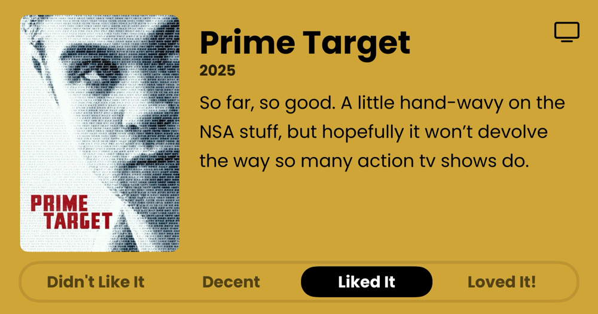
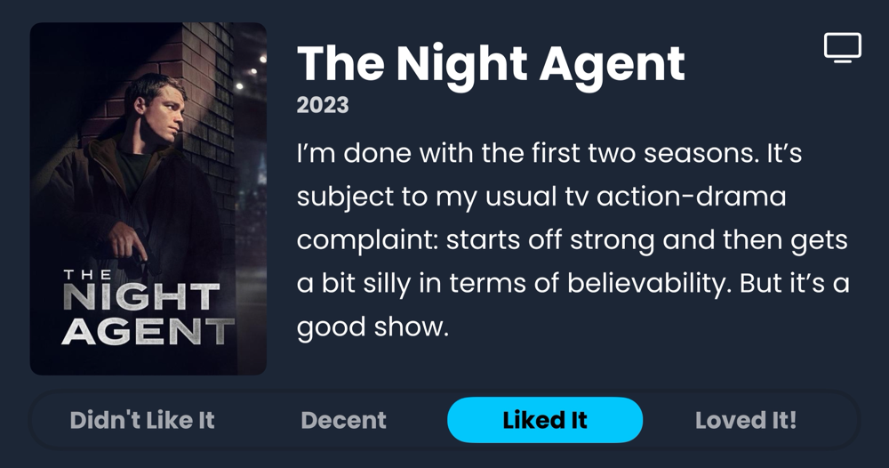

### Podcasts

*Podcast episodes without links are members-only but I think are interesting enough to post in case you want to investigate them.*

- [The Rebound – 531: Bananas Fact](https://overcast.fm/+De1m-RXSc)
- Six Colors – Continuity Camera theories, Ebooks and DRM, and Apple results (6C Podcast)
- The Race Members' Club 2025 – F1 Extra: Does F1 have a problem with tribal fan culture?
- [楽しいラジオ「ドングリFM」 – 1151 小学館のウラ漫が面白い #マンガワン](https://overcast.fm/+9ABKE3hg4)
- [Risky Bulletin – Risky Bulletin: Authorities seize the Cracked and Nulled cybercrime forums](https://overcast.fm/+5Sl9nZQdQ)
- [Ctrl-Alt-Speech – This Episode has Masculine Energy](https://overcast.fm/+BHRYF0Uzgk)
- [Judge John Hodgman – Cavy-at Emptor](https://overcast.fm/+YJM3iT000)
- Tech Won't Save Us (Premium) – The Problem With Cyberlibertarianism w/ Chris Gilliard
- [Accidental Tech Podcast: Unedited Live Stream – 624: Do Less Math in Computers](https://atp.fm/624)

### Books

*Don't be surprised when the book list stays constant for awhile. Reading time is harder to come by these days. 😞*  

### Movies

### TV Shows

### Games

### Food and Drink

- [Cloudburst Brewing](https://cloudburstbrew.com/)
- [Hetty Alice Beers](https://www.hettyalicebeers.com/)
- [OYATSUPAN](https://www.oyatsupan.com/)
- [CHEESE & CRACK SNACK SHOP](https://www.cheeseandcrack.com/)
