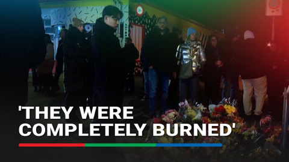
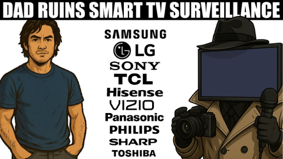

## Current Personal Status
>
> This is a good look at Flock and the damage they're doing to our civil liberties. We seem to have an abundance of self-appointed sheriff wanna-bes who just happen to be getting rich by subjecting us all to mass surveillance. I don't know who raised these kids, but they failed. [Flock Safety Loses Another City After CEO’s Email Backfires - YouTube](https://www.youtube.com/watch?v=hwbE5ks7dFg&t=952s)

## Current Projects

- Learning Korean
- Expanding Paradigm's client base and launching its vulnerabilty management service
- Building up my running distance again
- Completely reexamining how I use the Yubikey

## Stuff I've recently enjoyed

### Podcasts

*Podcast episodes without links are members-only but I think are interesting enough to post in case you want to investigate them.*

 [Pluribus: The Official Podcast – S1E9: Alison Tatlock & Darinka Arones](https://overcast.fm/+BTOhX5uSg8)
 [Whisky Whiskey – 154: Amber Lane Air Single Malt Whisky](https://overcast.fm/+BLIhfHXvS8)
 [Comfort Zone – Our 2026 Tech Predictions](https://overcast.fm/+BI6NTQMMBc)
 [Whisky Whiskey – 156: Amber Lane Fire Single Malt Whisky](https://overcast.fm/+BLIhdX5sIE)
 [NosillaCast Apple Podcast – NC #1078 Unite Tutorial, George from Tulsa from Christmases Past, Grammar in a Fiction Editing Pipeline by Eddie Tonkoi, Bart Busschots on Email Sender Validation](https://overcast.fm/+BJFaIRCjBI)
 [Blurring The Lines Podcast – Episode 245 - Choosing Better Lines](https://overcast.fm/+GsOnvB0Ng)
 Accidental Tech Podcast – 672: Wi Hyphen Fi
 [Whisky Whiskey – 155: Amber Lane Earth Single Malt Whisky](https://overcast.fm/+BLIhd-JYTg)
 [The Talk Show With John Gruber – 438: ‘2025 Year in Review’, With Rene Ritchie](https://overcast.fm/+B7NCJmikk)
 The Race F1 Podcast (Members) – F1 2026: The big stories to watch for (ad-free)

### Books

[The Convenience Store by the Sea • First Time Read • 2020 • Sonoko Machida • I didn't know what to think of this book initially. It felt slightly stilted, whether due to translation or not, I'm not sure. But I kept reading. And it started drawing me in by brilliantly building intertwined moments of social interactions and vignettes of character development. • Loved It!
](/images/posts/png-image458cbadfd70-review-68981979-9b1f-4d9e-9ae9-1c29c838e7c5.jpg)
[Grid to Glory • 2025 • Alex Jacques • Alex Jacques is one of my favorite F1 commentators. His personality shines, and he's clearly a hard worker who knows what he's doing. The stories he's chosen for this book are compelling, but the writing style pulls me out of them. He uses sentence fragments instead of commas, and sometimes the background explanations are slightly muddled. Good, not great. • Decent
](/images/posts/png-image4dd09994160-review-c50952a1-62fd-4f67-a41d-85082a7e6f69.jpg)
[First Contact • 2025 • Becky Ferreira • A delightful look at the science, superstitions, stories, and suppositions behind the search for alien life throughout history. • Loved It!
](/images/posts/png-image447c967d8c0-review-c3a0b328-23e4-4f0e-bdf2-c3320ace2a6f.jpg)

### Movies

[The Perfect Neighbor • First Time Watch • 2025 • Geeta Gandbhir • You kind of have to be into crime documentaries to like this, but the real takeaway here is how stupid Stand Your Ground laws and the people who think they're a good idea are. Also, this lady was whack. • Liked It
](/images/posts/png-image4c91b6db330-review-a705ca39-8f1d-429b-a3bd-f461b37a31ea.jpg)
[Tinker Tailor Soldier Spy • 2011 • Tomas Alfredson • They don't make many movies like this anymore. Both intelligently written and yet not overly- wrought with twists and surprises, it's a subtly played movie staring Gary Oldman at his best, but with a stellar cast in general. Highly recommended. • Loved It!
](/images/posts/png-image48638ea78c0-review-3aedf0b6-0108-41da-a3e3-2096c4e6cd7e.jpg)

### TV Shows

[Plur1bus 1 • First Time Watch • 2025 • l've seen complaints about the slow pacing, but the people saying this must have never watched anything from Vince Gilligan before. He is NOT afraid to build a story. Season 1 was weird and compelling. Recommend! • Loved It!
](/images/posts/png-image4af1b3adda0-review-8a0fdb3c-07a2-4fde-8c58-981674a73262.jpg)

### YouTube

Channel – [ABS-CBN News](https://www.youtube.com/@abscbnnews)

[Witness to Swiss blaze 'shocked for life' after seeing victims burning | ABC-CBN News](https://www.youtube.com/watch?v=ea0Y_83xmUA)

Channel – [Keith Edwards](https://www.youtube.com/@keithedwards)

[There is no f**king way he meant to say that..](https://www.youtube.com/watch?v=rOjl2vFHLAY)

Channel – [StarTalk Plus](https://www.youtube.com/@StarTalkPlus)

[Will AI Ever Be Conscious?](https://www.youtube.com/watch?v=VAFEmFSMfTg)

Channel – [APT](https://www.youtube.com/@APT_NEWS)

["I Couldn’t Breathe!" Hero Risked Life Twice to Save Friends in Deadly Swiss Fire | APT](https://www.youtube.com/watch?v=pDJ78giOUik)

Channel – [jeffostroff](https://www.youtube.com/@jeffostroff)

[Seconds to Escape: Why Switzerland’s Deadly Flashover Fire Spread FAST](https://www.youtube.com/watch?v=oz7agKrhkps)

Channel – [CBS News](https://www.youtube.com/@CBSNews)

[Swiss ski resort bar was packed with teens as deadly fire spread](https://www.youtube.com/watch?v=1kA8Xj_0jqA)

Channel – [Erin Talks Money](https://www.youtube.com/@ErinTalksMoney)

[STOP Contributing to Your 401(k)? The Truth No One Is Telling You](https://www.youtube.com/watch?v=wBdVTpSXrV8&t=72s)

Channel – [Captain Steeeve](https://www.youtube.com/@CaptainSteeeve)

[Gulf Air Aircraft Enters Active Runway as Plane Is Landing | Captain Steeeve Reacts](https://www.youtube.com/watch?v=Igc2vsBppwA)

Channel – [Dad, the engineer](https://www.youtube.com/@Dad-The-Engineer)

[Your TV is spying on you - Find out how, and turn it off!](https://www.youtube.com/watch?v=PXsERGUtSPo)

### Food

 [KACHKA  - EAT. CLINK. DRINK. REPEAT.](https://www.kachkapdx.com)

