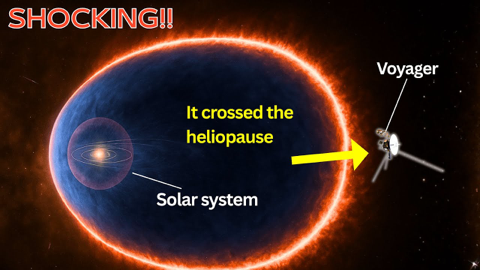
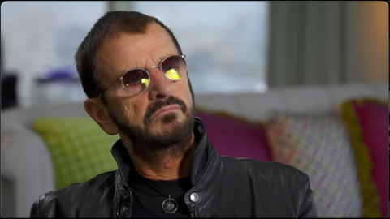
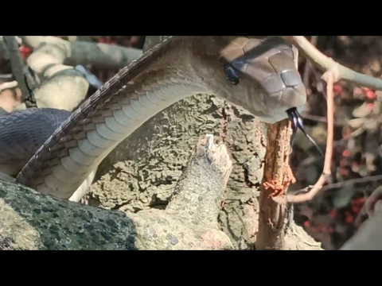
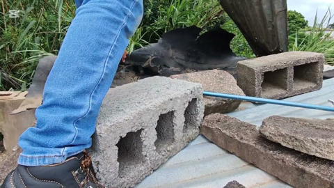
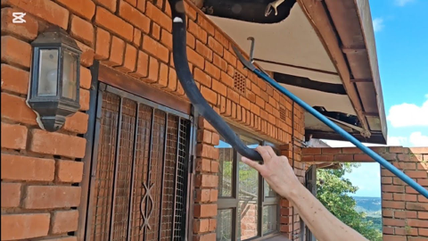

## Current Personal Status
>
> Created a cli dashboard for my website related utility scripts, which is nice - one place to run them all that does not depend on Shortcuts for anything.

## Current Projects

- Japanese and Korean study (somewhat proficient in J, complete newb to K)

## Stuff I've recently enjoyed

### Podcasts

*Podcast episodes without links are members-only but I think are interesting enough to post in case you want to investigate them.*

 The Race F1 Podcast (Members) – Alpine unveils new livery on cruise ship - but will the team sink or swim in 2026? (ad-free)
 The 404 Media Podcast (Premium Feed) – Exposing the People Behind Deepfake Porn Sites with Bellingcat Investigator Kolina Koltai
 The Race F1 Podcast (Members) – Ferrari launches new car + Why Williams are missing crucial first test (ad-free)
 [MacStories Unwind – Snowmageddon, Billionaire Blackmail, and Water Beds](https://overcast.fm/+BTuhKCI234)
 [The Incomparable Mothership – 801: Chekhov’s Chunga Palm](https://overcast.fm/+kMb4vi_M)
 Six Colors+ — Private – Tech collides with civilization
 The Race F1 Podcast (Members) – Our thoughts on Mercedes’ F1 car reveal and McLaren’s ‘clever’ upgrade strategy (ad-free)
 [Judge John Hodgman – Post-Holiday Leftovers](https://overcast.fm/+YJM1KxE70)
 [Last Week in AI – #231 - Claude Cowork, Anthropic $10B, Deep Delta Learning](https://overcast.fm/+BSN9xNM0-c)
 [Shell Game – Episode 8: Launch](https://overcast.fm/+BJNsZuoqdQ)

### Books

[The Convenience Store by the Sea • First Time Read • 2020 • Sonoko Machida • I didn't know what to think of this book initially. It felt slightly stilted, whether due to translation or not, I'm not sure. But I kept reading. And it started drawing me in by brilliantly building intertwined moments of social interactions and vignettes of character development. • Loved It!
](/images/posts/png-image458cbadfd70-review-68981979-9b1f-4d9e-9ae9-1c29c838e7c5.jpg)
[Grid to Glory • 2025 • Alex Jacques • Alex Jacques is one of my favorite F1 commentators. His personality shines, and he's clearly a hard worker who knows what he's doing. The stories he's chosen for this book are compelling, but the writing style pulls me out of them. He uses sentence fragments instead of commas, and sometimes the background explanations are slightly muddled. Good, not great. • Decent
](/images/posts/png-image4dd09994160-review-c50952a1-62fd-4f67-a41d-85082a7e6f69.jpg)

### Movies

[THE RIP • First Time Viewing • 2026 • Joe Carnahan • The implausibilities and obvious impossibilities are largely overcome by the plot premise and the likability of some of the characters. Have a Kirin and watch and you'll enjoy it. ***
](/images/posts/png-image47ce83965e0-review-0f62fa43-92c4-4650-8ff9-7a7bc650d6d0.jpg)

### YouTube

Channel – [Theo - t3․gg](https://www.youtube.com/@t3dotgg)

[AI mistakes you're probably making](https://www.youtube.com/watch?v=Jcuig8vhmx4&pp=2AakCQ%3D%3D)

Channel – [Japanese Food Noodles](https://www.youtube.com/@Japanese_Food_Noodles)

[The Master of 240 Bowls: Non-Stop Japanese Ramen & Fried Rice Service](https://www.youtube.com/watch?v=KzxvaX0vfJw)

Channel – [NASA Space News](https://www.youtube.com/@NSpaceNews)

[NASA’s Voyager Just Crossed the Edge of the Solar System — and Found Something Wild](https://www.youtube.com/watch?v=jmo0JyGOC3M)

Channel – [AXS TV](https://www.youtube.com/@AXSTV)

[Ringo Starr Gets Candid About The Beatles Not Getting Along](https://www.youtube.com/watch?v=VojwImd-RHs)

Channel – [PC Security Channel](https://www.youtube.com/@pcsecuritychannel)

[How hackers use Discord to control your computer](https://www.youtube.com/watch?v=7GuRZ8WEuBs&pp=0gcJCYcKAYcqIYzv)

Channel – [Fade To Black](https://www.youtube.com/@FadeToBlack-cinema)

[What Really Happened To James Woods?](https://www.youtube.com/watch?v=FqRiLbyMX4g)

Channel – [RaceMastery](https://www.youtube.com/@RaceMasteryy)

[At 77, Keke Rosberg Finally Revealed the 4 People He Hated the Most](https://www.youtube.com/watch?v=OB3CZ2EXURo)

Channel – [JASON ARNOLD - SNAKE HANDLER](https://www.youtube.com/@jasonarnold-snakeman)

[Crazy Close Black Mamba encounter!](https://www.youtube.com/watch?v=qWvx1jCazjo)

Channel – [pal2tech](https://www.youtube.com/@pal2tech)

[Fujifilm, we need to talk...](https://www.youtube.com/watch?v=Uo_XhTSZUAs)

Channel – [JASON ARNOLD - SNAKE HANDLER](https://www.youtube.com/@jasonarnold-snakeman)

[BLACK MAMBA CAPTURE - As dangerous as it gets!!](https://www.youtube.com/watch?v=8287BxATgHk)

Channel – [JASON ARNOLD - SNAKE HANDLER](https://www.youtube.com/@jasonarnold-snakeman)

[HOW MANY Black Mambas are ACTUALLY in this roof !!??](https://www.youtube.com/watch?v=WCYWNlNcDPA)

Channel – [Popcorn Picks](https://www.youtube.com/@PopcornPicksYT)

[Sosa Kills the Informant (Al Pacino, Paul Shenar) (Full Scene) | Scarface 4k HDR](https://www.youtube.com/watch?v=IiL6HFTe_qE)

### Food

 [GyroHouse Mediterranean Grill | Authentic Mediterranean Cuisine in Oregon](https://thegyrohouse.com)

