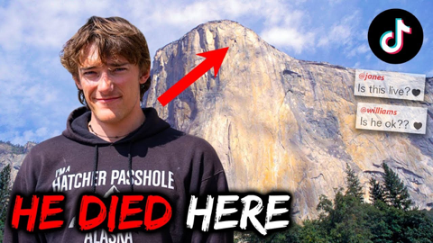
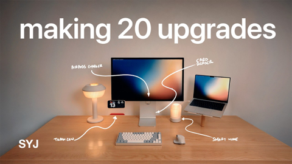

## Current Personal Status

In case you hadn't noticed, I redid the look of the site. I think it's nicer and easier on the eyes now. The old colors and fonts and article widths were getting on my nerves.

Tonight I had fun working on a bash script for a linux server that was failing to renew let's encrypt certs for sites with Cloudflare proxy enabled. The weird thing is that it does seem to work sometimes, on other servers with the same configuration.

## Stuff I've recently enjoyed

### Podcasts

*Podcast episodes without links are members-only but I think are interesting enough to post in case you want to investigate them.*

 Bring Back V10s (Members) – BBV10s Q&A: Trulli at Ferrari, ‘flipping’ Indy 2005 and what Villeneuve *should* have done
 David Pakman Member Feed – 11/18/25: TDPS Bonus Show
 The Race F1 Podcast (Members) – How Williams gets old FW14Bs to run!
 [Faceless – 2: The Korean Hit](https://overcast.fm/+8kaVg8hbI)
 [Faceless – 1: Bloodshed](https://overcast.fm/+8kaXBn3lI)
 [The Weekly Planet – 601 The Running Man](https://overcast.fm/+1HFK1RiUs)
 [Risky Bulletin – Between Two Nerds: Russia’s cyber war on wheat](https://overcast.fm/+5Sl8UGP6I)
 David Pakman Member Feed – 11/17/25: Epstein files go nuclear as autopen scandal hits Trump
 David Pakman Member Feed – 11/17/25: TDPS Bonus Show
 AppStories+ – Our Latest App and Automation Experiments

### Books

[Buried in the Sky • 2012 • Climbers are nuts. People keep dying on these peaks in really unnecessary ways and it very often seems like the result of the most idiotic decisions on the part of people who are supposed to be experienced. Really gripping tale. • Loved It!
](/images/posts/png-image4fe5bf59280-review-07d00041-80c5-40df-96f4-1e73860e4edd.jpg)
[First Contact • 2025 • Becky Ferreira • A delightful look at the science, superstitions, stories, and suppositions behind the search for alien life throughout history. • Loved It!
](/images/posts/png-image447c967d8c0-review-c3a0b328-23e4-4f0e-bdf2-c3320ace2a6f.jpg)

### TV Shows

[Dark Winds • 2022 • Season 3 - Just starting Season 3. I think this series has evolved from a "must watch" to "there are things I like about it, and I'll get to it when and if I have time" show for me. There's a funny couple cameos in S3E1 though. • Liked It
](/images/posts/png-image44259b22750-review-1ab7b3f3-74fd-427c-ae6b-8623370cf16f.jpg)

### YouTube

Channel – [Sam Witteveen](https://www.youtube.com/@samwitteveenai)

[Gemini 3 Pro - The Model You've Been Waiting For](https://www.youtube.com/watch?v=PFyccJhbQ6w&t=97s)

Channel – [Adam Mockler](https://www.youtube.com/@adammockler)

[Trump Doesn't Realize What He Did](https://www.youtube.com/watch?v=CfQQLgcsazE)

Channel – [eXtreme](https://www.youtube.com/@TheExtreme-Edge)

[He Didn’t Film Himself. But TikTok Watched Him Die.](https://www.youtube.com/watch?v=c6i5ow6ivEg)

Channel – [THE RACE](https://www.youtube.com/@WeAreTheRace)

[Why McLaren needs answers on Max Verstappen F1 engine change](https://www.youtube.com/watch?v=YXle8hCc324)

Channel – [Theo - t3․gg](https://www.youtube.com/@t3dotgg)

[Google just dropped their Cursor killer (FREE Gemini 3 Pro???)](https://www.youtube.com/watch?v=8dTN4PBD2rg&t=3s&pp=0gcJCQgKAYcqIYzv)

Channel – [Josh Johnson](https://www.youtube.com/@JoshJohnsonComedy)

[Epstein Files Fuel Trump vs MAGA Feud](https://www.youtube.com/watch?v=Y9Ja36XvNgg&pp=0gcJCQgKAYcqIYzv)

Channel – [Track Us Down!](https://www.youtube.com/@Track_Us_Down)

[Cost of Living 2025: Is Portugal Still the BEST Value for Expats?](https://www.youtube.com/watch?v=aEYpbvrAh5M&t=175s)

Channel – [Scott Yu-Jan](https://www.youtube.com/@ScottYuJan)

[leaving Google for this](https://www.youtube.com/watch?v=QYWEQo1t27k)

Channel – [Scott Yu-Jan](https://www.youtube.com/@ScottYuJan)

[Making 20 Upgrades for my Desk Setup - Dream Setups #2](https://www.youtube.com/watch?v=6er5oSPUGOI&t=1s)

### Food

 [Home | Long's Vietnamese Kitchen LLC](https://longsvietnamesekitchen.square.site)

 [Decadent Creations bakery in Hillsboro – Pumpkin bread](https://decadentcreations.com)

