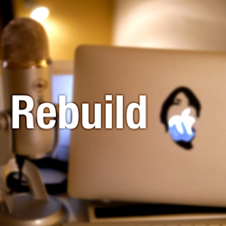
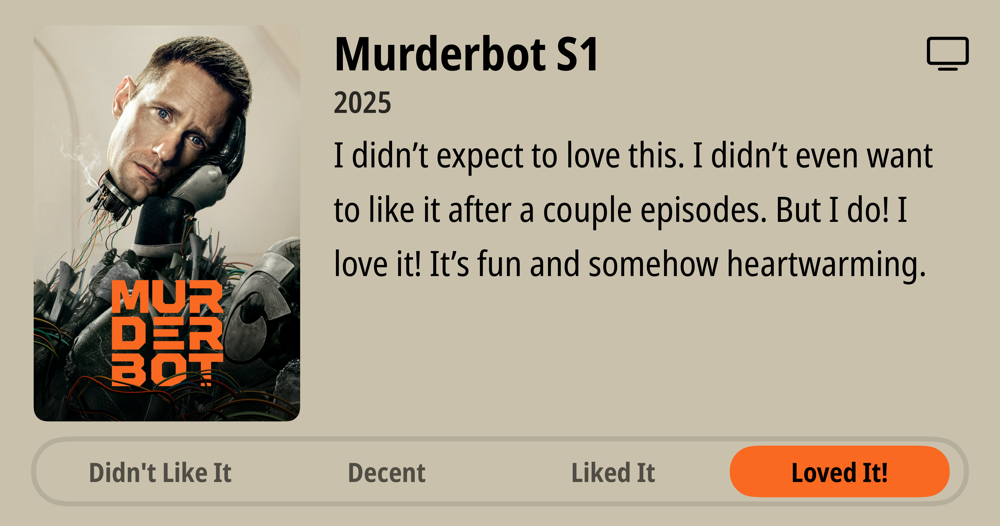
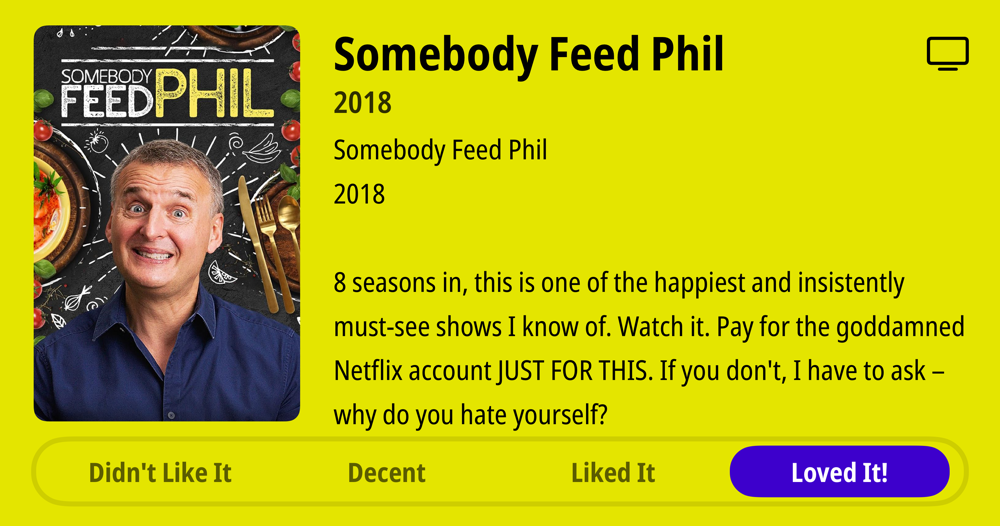

### Current Personal Status

Trying to get some work done, and also vibe coding myself a Mac app for time tracking using Claude Code with Opus 4.1. Hey, I need the app.

### Podcasts

*Podcast episodes without links are members-only but I think are interesting enough to post in case you want to investigate them.*

[Risky Bulletin – Sponsored: The phishing-resistant employee](https://overcast.fm/+5Sl__2MXs)
[Risky Bulletin – Risky Bulletin: Researcher scores $250,000 for Chrome bug](https://overcast.fm/+5Sl9yvZh0)
[Programming By Stealth – PBS Tidbit 13 — PowerShell Tames Monty](https://overcast.fm/+JGaCQ1tSE)
[Lazy Fluency - Japanese Podcast | 英会話 – Are Digital Nomads Good For a Country? - LF #181 (Japanese Listening)](https://overcast.fm/+3y6GLt8tE)
[Rebuild – 410: Hitting the Context Window Limit (naoya)](https://overcast.fm/+mdw5Prk)
[The Incomparable Mothership – 778: Oops! All Batman](https://overcast.fm/+kMY_P_oM)
[NosillaCast Apple Podcast – NC #1055 15 Years of Hazel, Another Brother PSA, Another MagGo Testimonial, Virtual Monitor HDMI Dongles, Adam Engst on New Mac Migration](https://overcast.fm/+BJFaIW460g)

### Books

[Sir Lewis • 2025 • Michael Sawyer Look. Lewis is an actual role model, and he's also a true legend. This book was just a little too willing to bypass nuances in a couple cases and overstate its case. It did not need to do that, because Lewis' life and work speaks for itself. • Liked It
](/images/posts/PngImage498A9F6D680-review-9e725bb8-827b-4445-9e2c-5b07a9cad227.jpg)

### Movies

[Ballerina • 2025 • Len Wiseman • Sometimes you just want to see people get shot and stabbed, and this is a lot of fun for that. John Wick movies always have interesting choreography and fights. Ana de Armas is fine as Eve and the action is all very well done. • Loved It!
](/images/posts/PngImage4A7CA53B7C0-review-a5e3466d-ac29-4207-a480-7dd4a72f8beb.jpg)

### TV Shows

[Murderbot S1 • 2025 • I didn't expect to love this. I didn't even want to like it after a couple episodes. But I do! I love it! It's fun and somehow heartwarming. • Loved It!
](/images/posts/PngImage4Cee8279170-review-8f5cff22-2481-41cf-83f2-8ba425311f71.jpg)
[Somebody Feed Phil • 2018 • 8 seasons in, this is one of the happiest and insistently must-see shows I know of. Watch it. Pay for the goddamned Netflix account JUST FOR THIS. If you don't, I have to ask - why do you hate yourself? • Loved It!
](/images/posts/PngImage4Bbc86C7Ea0-review-99b30486-a314-4ae9-a35a-b140f463e70f.jpg)

### YouTube

- [Why Every Japanese Person Will Have The Name Same- LF #177(Japanese / English Listening + Subtitles) - YouTube](https://www.youtube.com/watch?v=5G4a-_MEgS8)
- [Using Rules in Warp (Web Dev Version) - YouTube](https://www.youtube.com/watch?v=MU_xZ5sAU9w)
- [Setting up 5 MCP Servers in Warp (FULL Tutorial) - YouTube](https://www.youtube.com/watch?v=rrxfS9u1XRA)
- [Is the CHEAPEST Formula 1 Race Worth It?! - YouTube](https://www.youtube.com/watch?v=idmokrBRvz8&t=1413s)
- [The AI Bandwidth Wall & Co-Packaged Optics - YouTube](https://www.youtube.com/watch?v=G5r2OyCN5_s&t=255s)
