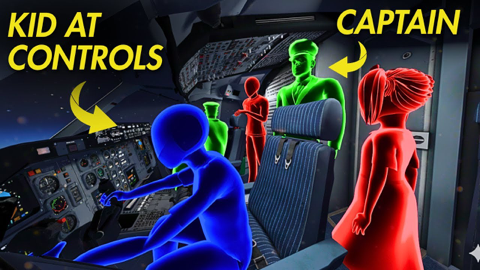
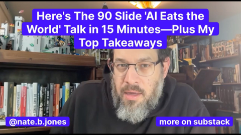
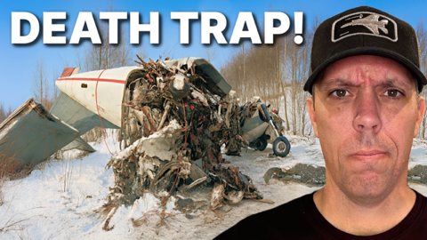
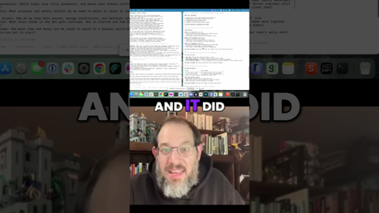

## Current Personal Status

In recent episodes of [Friends with Brews](https://friendswithbrews.com) I've been using the [Riverside](https://riverside.com) combined audio and editing it there to produce the shows, but for [ep 93](https://friendswithbrews.com/93/) I used both of our audio tracks and edited everything in Logic Pro again. The result is the best sounding episode in a long time, audio quality-wise.

I also have to say that the [Izotope RX 11](https://www.izotope.com/en/products/rx.html) Dialogue Isolate plugin does a really nice job. I'm pretty impressed with it.

## Stuff I've recently enjoyed

### Podcasts

*Podcast episodes without links are members-only but I think are interesting enough to post in case you want to investigate them.*

 [Mac Geek Gab — Apple Tips, Tricks, and Troubleshooting – Call Haptics, Photo GeoData Warnings, and Space-Saving iPhone Tricks](https://overcast.fm/+6TZ9K4vKs)
 Decoder: Ad-Free Edition – What the climate story gets wrong
 [Risky Bulletin – Between Two Nerds: Telcos bad, Cloud good.](https://overcast.fm/+5Sl_4lc30)
 David Pakman Member Feed – 11/24/25: MAGA civil war explodes as economic cracks widen
 David Pakman Member Feed – 11/24/25: TDPS Bonus Show
 [Friends with Brews – Big 50](https://overcast.fm/+9SHiMANyQ)
 Accidental Tech Podcast – 666: We Have Nothing That Hot
 [Chit Chat Across the Pond – CCATP #824 — Adam Engst on Can Agentic Web Browsers Count?](https://overcast.fm/+FcgJ9suJQ)
 AppStories+ – The Ever-Changing App Store
 The Race F1 Podcast (Members) – Las Vegas Grand Prix review (ad-free)

### Books

[Buried in the Sky • 2012 • Climbers are nuts. People keep dying on these peaks in really unnecessary ways and it very often seems like the result of the most idiotic decisions on the part of people who are supposed to be experienced. Really gripping tale. • Loved It!
](/images/posts/png-image4fe5bf59280-review-07d00041-80c5-40df-96f4-1e73860e4edd.jpg)
[First Contact • 2025 • Becky Ferreira • A delightful look at the science, superstitions, stories, and suppositions behind the search for alien life throughout history. • Loved It!
](/images/posts/png-image447c967d8c0-review-c3a0b328-23e4-4f0e-bdf2-c3320ace2a6f.jpg)

### Movies

[Wick Is Pain • 2025 • Jeffrey Doe • A fun look behind the scenes and lives of the people who made the John Wick movies. Really only these people could have made these movies. • Loved It!
](/images/posts/png-image48b090780c0-review-9b121a86-9efa-44ef-94d0-3484b4c3a18b.jpg)

### TV Shows

[Pluribus • 2025 • In progress. I honestly didn't know what to think of this for about 1 and a half episodes, but wow, has it got me hooked now. Rhea Seehorn is always amazing and Karolina Wydra is perfect in her unsettling role as Zosia. • Loved It!
](/images/posts/png-image434192b3d00-review-d7b6f915-5eba-4de8-bb96-62f51502c240.jpg)
[Dark Winds • 2022 • Season 3 - Just starting Season 3. I think this series has evolved from a "must watch" to "there are things I like about it, and I'll get to it when and if I have time" show for me. There's a funny couple cameos in S3E1 though. • Liked It
](/images/posts/png-image44259b22750-review-1ab7b3f3-74fd-427c-ae6b-8623370cf16f.jpg)

### YouTube

Channel – [AI LABS](https://www.youtube.com/@AILABS-393)

[Claude Just Introduced a New Way To Fix Your UI](https://www.youtube.com/watch?v=eLDq5TfIHys)

Channel – [Patrick Boyle](https://www.youtube.com/@PBoyle)

[Does OpenAI expect a Government Bailout](https://www.youtube.com/watch?v=cHiZ-7jI0Ew&t=383s)

Channel – [Snazzy Labs](https://www.youtube.com/@snazzy)

[The iPad's Software Problem Is Permanent](https://www.youtube.com/watch?v=bnYLpA5kAbo)

Channel – [Air Crash Investigation](https://www.youtube.com/@Aviationaccidents)

[The Teen in the Cockpit – The Tragedy of Aeroflot Flight 593](https://www.youtube.com/watch?v=w5xjbfyq8bA)

Channel – [AI News & Strategy Daily | Nate B Jones](https://www.youtube.com/@NateBJones)

[Here's the 90 Slide 'AI Eats the World' Talk in 15 Minutes—Plus My Top Takeaways](https://www.youtube.com/watch?v=iGvJpBWWGOU&t=658s)

Channel – [Pilot Debrief](https://www.youtube.com/@pilot-debrief)

[The Most DISTURBING Pilot I've Ever Investigated!](https://www.youtube.com/watch?v=DyY4AtpQLy8)

Channel – [THE RACE](https://www.youtube.com/@WeAreTheRace)

[Aston Martin's shock move for Christian Horner explained](https://www.youtube.com/watch?v=q66o4BriBSc)

Channel – [AI News & Strategy Daily | Nate B Jones](https://www.youtube.com/@NateBJones)

[Why Codex destroys Claude Code on AI clarity #ai #claude #claudecode #codex #llm #workwithai](https://www.youtube.com/watch?v=WhmGWavhSmE)

Channel – [Marques Brownlee](https://www.youtube.com/@mkbhd)

[AirPods Pro 3 Review: I Understand It Now!](https://www.youtube.com/watch?v=GB0b6KFZVq0&t=3s&pp=0gcJCRUKAYcqIYzv)

### Food

 [Home | Long's Vietnamese Kitchen LLC](https://longsvietnamesekitchen.square.site)

