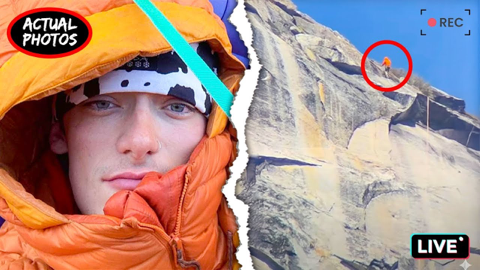
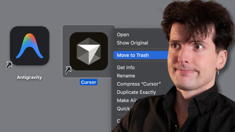

## Current Personal Status

In case you hadn't noticed, I redid the look of the site. I think it's nicer and easier on the eyes now. The old colors and fonts and article widths were getting on my nerves.

It's an interesting time in technology. I don't like what aboutisms and both-sidesing things, but I am a person who both hates the AI industry and also finds a lot of actual value in LLMs. I know just saying that automatically enrages people who think they're always wrong or lying – but that's just not true because they do have very good use cases. Those use cases comprise a much narrower range of application than the AI companies want you to use them for, unfortunately.

Now I can say that I'm absolutely onboard with the environmental and social concerns, I think they're valid, and I think the Paris Marxes of the world should keep banging the drum about them, and people who hate AI with a passion will still think I'm an unthinking, uncritical fanboy. You really can't win.

## Stuff I've recently enjoyed

### Podcasts

*Podcast episodes without links are members-only but I think are interesting enough to post in case you want to investigate them.*

 [Judge John Hodgman – Why Don’t We Get Drunk and Sue LIVE at SF Sketchfest](https://overcast.fm/+YJM192BYU)
 David Pakman Member Feed – 11/19/25: Trump loses Epstein vote as files will be released, GOP terrified
 David Pakman Member Feed – 11/19/25: TDPS Bonus Show
 [Odd Lots – The Politics of AI Are About to Explode](https://overcast.fm/+5AWMKnrAw)
 [Pluribus: The Official Podcast – S1E3: Miriam Shor](https://overcast.fm/+BTOhUilKKo)
 The Race F1 Podcast (Members) – In-Car Insights: Edd and Jon look ahead to Las Vegas on their road trip from LA
 The Race F1 Podcast (Members) – Previewing F1’s three-race title showdown (ad-free)
 [The Talk Show With John Gruber – 434: ‘Knee-Jerk Contrarian’, With Dan Frommer](https://overcast.fm/+B7ND_B4pE)
 Bring Back V10s (Members) – BBV10s Q&A: Trulli at Ferrari, ‘flipping’ Indy 2005 and what Villeneuve *should* have done
 David Pakman Member Feed – 11/18/25: TDPS Bonus Show

### Books

[Buried in the Sky • 2012 • Climbers are nuts. People keep dying on these peaks in really unnecessary ways and it very often seems like the result of the most idiotic decisions on the part of people who are supposed to be experienced. Really gripping tale. • Loved It!
](/images/posts/png-image4fe5bf59280-review-07d00041-80c5-40df-96f4-1e73860e4edd.jpg)
[First Contact • 2025 • Becky Ferreira • A delightful look at the science, superstitions, stories, and suppositions behind the search for alien life throughout history. • Loved It!
](/images/posts/png-image447c967d8c0-review-c3a0b328-23e4-4f0e-bdf2-c3320ace2a6f.jpg)

### TV Shows

[Pluribus • 2025 • In progress. I honestly didn't know what to think of this for about 1 and a half episodes, but wow, has it got me hooked now. Rhea Seehorn is always amazing and Karolina Wydra is perfect in her unsettling role as Zosia. • Loved It!
](/images/posts/png-image434192b3d00-review-d7b6f915-5eba-4de8-bb96-62f51502c240.jpg)
[Dark Winds • 2022 • Season 3 - Just starting Season 3. I think this series has evolved from a "must watch" to "there are things I like about it, and I'll get to it when and if I have time" show for me. There's a funny couple cameos in S3E1 though. • Liked It
](/images/posts/png-image44259b22750-review-1ab7b3f3-74fd-427c-ae6b-8623370cf16f.jpg)

### YouTube

Channel – [MacStories](https://www.youtube.com/@MacStories09)

[A MacStories Setups Update](https://www.youtube.com/watch?v=-RhQhl_QuJI&t=14s)

Channel – [Sam Witteveen](https://www.youtube.com/@samwitteveenai)

[Gemini 3 Pro - The Model You've Been Waiting For](https://www.youtube.com/watch?v=PFyccJhbQ6w&t=97s)

Channel – [Adam Mockler](https://www.youtube.com/@adammockler)

[Trump Doesn't Realize What He Did](https://www.youtube.com/watch?v=CfQQLgcsazE)

Channel – [eXtreme](https://www.youtube.com/@TheExtreme-Edge)

[He Didn’t Film Himself. But TikTok Watched Him Die.](https://www.youtube.com/watch?v=c6i5ow6ivEg)

Channel – [THE RACE](https://www.youtube.com/@WeAreTheRace)

[Why McLaren needs answers on Max Verstappen F1 engine change](https://www.youtube.com/watch?v=YXle8hCc324)

Channel – [Theo - t3․gg](https://www.youtube.com/@t3dotgg)

[Google just dropped their Cursor killer (FREE Gemini 3 Pro???)](https://www.youtube.com/watch?v=8dTN4PBD2rg&t=3s)

Channel – [Josh Johnson](https://www.youtube.com/@JoshJohnsonComedy)

[Epstein Files Fuel Trump vs MAGA Feud](https://www.youtube.com/watch?v=Y9Ja36XvNgg)

Channel – [Track Us Down!](https://www.youtube.com/@Track_Us_Down)

[Cost of Living 2025: Is Portugal Still the BEST Value for Expats?](https://www.youtube.com/watch?v=aEYpbvrAh5M&t=175s&pp=0gcJCQwKAYcqIYzv)

Channel – [Scott Yu-Jan](https://www.youtube.com/@ScottYuJan)

[leaving Google for this](https://www.youtube.com/watch?v=QYWEQo1t27k)

### Food

 [Home | Long's Vietnamese Kitchen LLC](https://longsvietnamesekitchen.square.site)

 [Decadent Creations bakery in Hillsboro – Pumpkin bread](https://decadentcreations.com)

