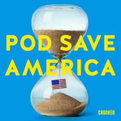

## Current Personal Status

So many things. So many tireds. What a time we live in.

I was reminded today that we should treat all relationships uniquely. Someone may be the polar opposite of us politically, but still be someone we can talk to and try to build common ground with. I'm not saying we need to engage everyone with that motive, but at least try it with longstanding relationships where the other person has fallen prey to lies and nonsense but you can still talk with them about other things. Connections are important. Remembering that other people are humans is important. It helps to avoid things like civil wars.

It doesn't mean you have to be besties with people that ultimately can be hard to be around. It just means sometimes try to find common ground on other things.

## Stuff I've recently enjoyed

### Podcasts

*Podcast episodes without links are members-only but I think are interesting enough to post in case you want to investigate them.*

David Pakman Member Feed – 9/25/25: TDPS Bonus Show
[Risky Bulletin – Risky Bulletin: EU users to get free Windows 10 extended security updates](https://overcast.fm/+5Sl-8b7Xc)
[Whisky Whiskey – 123: Divergence Otago Pinot Barrel Single Malt Whisky](https://overcast.fm/+BLIhduMgNw)
David Pakman Member Feed – 9/26/25: TDPS Bonus Show
The Race F1 Podcast (Members) – We answer your questions about working at The Race
[Pod Save America – Trump Has James Comey Indicted](https://overcast.fm/+5dsrfotIQ)
The 404 Media Podcast (Premium Feed) – We’re Suing ICE. Here’s Why
[MacStories Unwind – Big Mike and the Extended Shower Lifestyle](https://overcast.fm/+aQirw9jik)
Bring Back V10s (Members) – BBV10s Debrief: Malaysia 2015
[Uncanny Valley | WIRED – Is Silicon Valley Still the Tech Capital?](https://overcast.fm/+BFs15Ayg4Q)

### Books

[Fluke • 2025 • Brian Klaas • (In progress) You'd thinking finding out everything is random and our smallest choices and actions can change everything would be scary and depressing, but in fact this book is interesting and though provoking and not at all depressing. That sounds like I’m just tolerating it, but I’m in fact enjoying it quite a bit. • Loved It!
](/images/posts/png-image481d813ee50-review-8aece3be-1f6e-4a0c-a3b3-9d3105d407dc.jpg)
[To Say Nothing of the Dog • 2013 • Connie Willis • Book 3 of the Oxford Time Travel series. It's funny and cute and compelling, even if I miss Mr. Dunworthy's constant presence ala Doomsday Book. But Ned Henry and all the other characters make this a fun book that's hard to put down. • Loved It!
](/images/posts/png-image4ebabaea1b0-review-954dbef9-86ea-478b-a0dd-e2bc85854b6a.jpg)

### Movies

[The Equalizer 3 • 2023 • Antoine Fuqua • Sometimes you just want to watch crisp, effective killing of bad guys, and Denzel always delivers in spades. I particularly enjoyed watching Marco get stabbed with his own knife he was still holding. • Loved It!
](/images/posts/png-image4dfa8c43f10-review-d2bf8b83-4aab-4a2f-82a2-6010349e6a3d.jpg)
[Highest 2 Lowest • 2025 • Spike Lee • Denzel Washington is always great. This movie was ultimately more uplifting than I expected, and that's ok. The world needs more of that. • Liked It
](/images/posts/png-image41bf880d270-review-15992669-eb47-4747-b1eb-5684492ff8cd.jpg)

### TV Shows

[Black Rabbit • 2025 • It's hard to like the two main characters in this show, but they do become sympathetic characters over time. There's plenty of tension, action, and family dynamics to go around. Some people are bad for themselves and everyone around them. • Liked It
](/images/posts/png-image4871b18c150-review-6fbb83bc-9e41-4708-978d-2389029b8df7.jpg)

### YouTube

- [I Defeated the MAGA Final Boss LIVE ON CNN](https://www.youtube.com/watch?v=mv7QmN_tNcg&t=504s) — [Adam Mockler](https://www.youtube.com/@adammockler)
- [Stephen Miller SNAPS after getting MERCILESSLY BULLIED](https://www.youtube.com/watch?v=BpzQzFXzjwo) — [Adam Mockler](https://www.youtube.com/@adammockler)
- [The real reason Claude got dumber](https://www.youtube.com/watch?v=6qIZTmaJc0Y) — [Theo - t3․gg](https://www.youtube.com/@t3dotgg)
- [30 Facts You Didn't Know About Interstellar](https://www.youtube.com/watch?v=Qy8KaWpbBUk) — [The Why](https://www.youtube.com/@The_Why)
- [He never made a sound after being rescued from dog fights — not until he truly loved his owner.](https://www.youtube.com/watch?v=PqR5OTeWn1A) — [Heart of a Dog](https://www.youtube.com/@HeartofaDog-1)
- [Robert (Denzel Washington) Gets His Vengeance [CLIP] | The Equalizer (2014) | TNT](https://www.youtube.com/watch?v=fM7X8GQD5e4&t=22s) — [TNT](https://www.youtube.com/@TNT)
