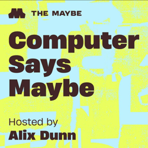

## Current Personal Status

You may have gotten the impression that I've dramatically slowed the pace on both posting here and posting podcasts at [Friends with Brews](https://friendswithbrews.com). That's because itt's true, I have. I have really had to prioritize work and family things, and frankly I sometimes just want to get away from the computer. But I have some plans for projects still, as well as getting back to this site and Friends with Brews.

They aren't dead yet!!

## Stuff I've recently enjoyed

### Podcasts

*Podcast episodes without links are members-only but I think are interesting enough to post in case you want to investigate them.*

 [Uncanny Valley | WIRED – How Data Centers Actually Work](https://overcast.fm/+BFs14I1T5o)
 Tech Won't Save Us (Premium) – Silicon Valley Doesn’t Know What Makes a Good City w/ Joanne McNeil
 The Race F1 Podcast (Members) – Dinner with Edd & Scott: Verstappen vs McLaren, Piastri’s struggle and more Mexico talking points
 [Computer Says Maybe – You seem lonely. Have a robot w/ Stevie Chancellor](https://overcast.fm/+BGreFtE6po)
 [Uncanny Valley | WIRED – WIRED Roundup: Protest Frogs, Google Bedbugs, AI Psychosis](https://overcast.fm/+BFs15_F8Xg)
 David Pakman Member Feed – 10/24/25: Bubble bursting as red states decline, Trump crushes farmers
 David Pakman Member Feed – 10/24/25: TDPS Bonus Show
 [MacStories Unwind – Notion Daily Notes and AI Browsers](https://overcast.fm/+aQirHcX8Q)
 [The Vergecast: Ad-Free Edition – ChatGPT enters the browser wars](https://overcast.fm/+BSp7tczwPw)
 The Race F1 Podcast (Members) – In-Car Insights: Edd and Scott in a bumpy minibus after Mexican GP day one

### Books

[A History of What Comes Next • M Sylvain Neuvel • 2021 • A wonderful historical fiction novel that becomes... sci-fi? Yes, and it's a great premise too. It's not always an easy read, because there is a lot of tension and bad times, but it IS a worthy read. • Loved It!
](/images/posts/png-image492cb8af700-review-a142100d-fff7-45c3-9a2c-cbf1609682df.jpg)

### Movies

[Havoc • 2025 • Gareth Evans • I'm all for a good violent movie now and again, but I'm also a fan of things being basically believable. Also the only likable character here was Ellie, played by Jessie Mei Li. Even Forest Whitaker seemed to be phoning it in for the most part. Not bad if you're working on something while you watch. • Decent
](/images/posts/png-image41818924df0-review-47de6e01-d96a-4fab-b1d6-062a25d547b7.jpg)

### TV Shows

[The Last Frontier • 2025 • Another Apple TV+ series. Two episodes in, not sure how I'm going to feel about it. Started off well in some ways, hand-wavy in others. Seems like it's worth giving a chance though. • Liked It
](/images/posts/png-image41b9a9fec20-review-7a31e41f-7f85-4844-9544-87b1d32b09d7.jpg)

### YouTube

- [Anthropic Finally Solved AI Memory & More AI Use Cases](https://www.youtube.com/watch?v=rsuU_ueV0fo&t=1s) — [The AI Advantage](https://www.youtube.com/@aiadvantage)
- [How Claude Solved AI's Biggest Problem](https://www.youtube.com/watch?v=Z9glbip8pZc) — [AI LABS](https://www.youtube.com/@AILABS-393)
- [Weekend Warm-Up | 2025 Mexico City Grand Prix](https://www.youtube.com/watch?v=r7xCjLcppzc&t=1925s) — [FORMULA 1](https://www.youtube.com/@Formula1)
- [Helicopter Crash at Huntington Beach — What Went Wrong?](https://www.youtube.com/watch?v=1nlGbJf737o&t=32s) — [Captain Steeeve](https://www.youtube.com/@CaptainSteeeve)
- [Drivers Look Ahead To Race Weekend | 2025 Mexico City Grand Prix](https://www.youtube.com/watch?v=oz72q2Dvf0E) — [FORMULA 1](https://www.youtube.com/@Formula1)
- [Should You Use OpenAI's New Browser?](https://www.youtube.com/watch?v=QHOTpStej2g&t=128s) — [The AI Advantage](https://www.youtube.com/@aiadvantage)
- [BREAKING: Appeals court issues Trump ruling we've WAITED FOR](https://www.youtube.com/watch?v=rmDpVQut2BA&t=68s) — [Brian Tyler Cohen](https://www.youtube.com/@briantylercohen)
- [How To Blur An Area Using Screenflow Tutorial - Hide Text With A Blur](https://www.youtube.com/watch?v=6WRq6ZNeUXo) — [PNUK](https://www.youtube.com/@pnuk)
- [Best AI for Developers Revealed Oct 2025!](https://www.youtube.com/watch?v=fuhx7VsH1mU&t=396s&pp=0gcJCQYKAYcqIYzv) — [Rob Shocks](https://www.youtube.com/@RobShocks)
- [Claude now has memory](https://www.youtube.com/watch?v=PupmfSttxlc) — [Anthropic](https://www.youtube.com/@anthropic-ai)
