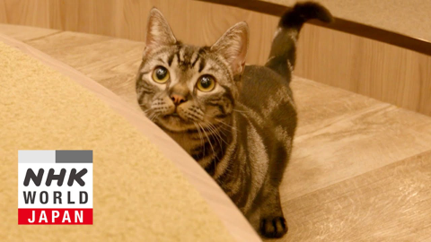
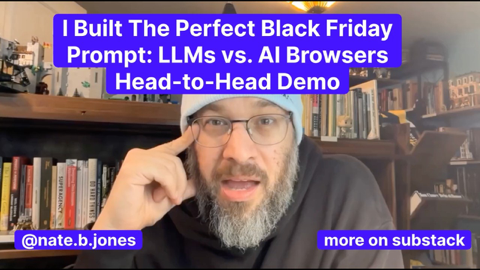
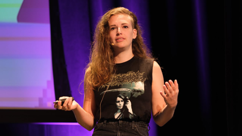
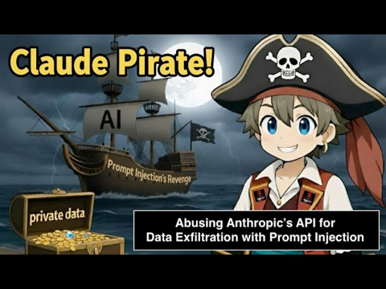

## Current Personal Status
>
> What do you do when you have more ideas than time and energy? I don't know... not do most of them, I guess is my answer. 😢

## Stuff I've recently enjoyed

### Podcasts

*Podcast episodes without links are members-only but I think are interesting enough to post in case you want to investigate them.*

 [Computer Says Maybe – Who Knows? Independent Researchers in a Platform Era w/ Brandi Geurkink](https://overcast.fm/+BGreEsOY9o)
 [MacStories Unwind – Turkey Trots, TV Affiliates, and Holiday Watch Plans](https://overcast.fm/+aQipbjDlA)
 [Judge John Hodgman – TEASER: Members Only Mailbag November 2025](https://maximumfun.org/episodes/judge-john-hodgman/teaser-members-only-mailbag-november-2025/)
 The 404 Media Podcast (Premium Feed) – Inside the Biggest Sting Operation Ever (with Michael Bobbitt)
 [Comfort Zone – It’s Charlie Chapman’s Fault](https://overcast.fm/+BI6NTuNd3o)
 Tech Won't Save Us (Premium) – Data Centers Are a Climate Enemy w/ Ketan Joshi
 The Race F1 Podcast (Members) – Cause of McLaren’s double DSQ + Ocon’s brake ‘problem’ - F1 Qatar GP media day takeaways with Scott
 The Race F1 Podcast (Members) – Vettel’s ‘torpedo’ comment, the top team contract he never signed and more - Kvyat answers members’ questions
 [Shell Game – Episode 2: Outdoor Debugging](https://overcast.fm/+BJNsZGRZVU)
 [Shell Game – Episode 6: The Future Isn’t Real](https://overcast.fm/+BJNsbQthj8)

### Books

[Buried in the Sky • 2012 • Climbers are nuts. People keep dying on these peaks in really unnecessary ways and it very often seems like the result of the most idiotic decisions on the part of people who are supposed to be experienced. Really gripping tale. • Loved It!
](/images/posts/png-image4fe5bf59280-review-07d00041-80c5-40df-96f4-1e73860e4edd.jpg)
[First Contact • 2025 • Becky Ferreira • A delightful look at the science, superstitions, stories, and suppositions behind the search for alien life throughout history. • Loved It!
](/images/posts/png-image447c967d8c0-review-c3a0b328-23e4-4f0e-bdf2-c3320ace2a6f.jpg)

### Movies

[Wick Is Pain • 2025 • Jeffrey Doe • A fun look behind the scenes and lives of the people who made the John Wick movies. Really only these people could have made these movies. • Loved It!
](/images/posts/png-image48b090780c0-review-9b121a86-9efa-44ef-94d0-3484b4c3a18b.jpg)

### TV Shows

[Pluribus • 2025 • In progress. I honestly didn't know what to think of this for about 1 and a half episodes, but wow, has it got me hooked now. Rhea Seehorn is always amazing and Karolina Wydra is perfect in her unsettling role as Zosia. • Loved It!
](/images/posts/png-image434192b3d00-review-d7b6f915-5eba-4de8-bb96-62f51502c240.jpg)
[Dark Winds • 2022 • Season 3 - Just starting Season 3. I think this series has evolved from a "must watch" to "there are things I like about it, and I'll get to it when and if I have time" show for me. There's a funny couple cameos in S3E1 though. • Liked It
](/images/posts/png-image44259b22750-review-1ab7b3f3-74fd-427c-ae6b-8623370cf16f.jpg)

### YouTube

Channel – [Jack Cocchiarella](https://www.youtube.com/@JackCocchiarellaShow)

[COLLAPSING Trump Posts SLUR As TOP OFFICIAL Exposes MRI Results!](https://www.youtube.com/watch?v=5U3SjwSYntk)

Channel – [NHK WORLD-JAPAN](https://www.youtube.com/@NHKWORLDJAPAN)

[Curiosity Saves the Cat - Science View](https://www.youtube.com/watch?v=jldxEVTniQA&t=35s)

Channel – [LawVS](https://www.youtube.com/@LawVS)

[McLaren’s FIA Plea Betrays Formula One](https://www.youtube.com/watch?v=8COXbJPknwE&t=8s&pp=0gcJCRYKAYcqIYzv)

Channel – [AI News & Strategy Daily | Nate B Jones](https://www.youtube.com/@NateBJones)

[I Tested 5 AI's To Figure Out Which Is Best at Black Friday Shopping—Demo + Prompts Included](https://www.youtube.com/watch?v=DcnTK7E1Ayc&t=11s)

Channel – [Lovable](https://www.youtube.com/@lovable)

[Build a STUNNING Portfolio Website From Scratch with AI (No Coding!)](https://www.youtube.com/watch?v=vmxwdQZPPOc&t=26s)

Channel – [UCCDH](https://www.youtube.com/@uccdh)

[The Web Revival and the Folk Life of Virtual Worlds (Daniel Murray)](https://www.youtube.com/watch?v=a00PHpSSFGo&t=7s)

Channel – [XOXO Festival](https://www.youtube.com/@xoxofest)

[Molly White, Citation Needed / Web3 Is Going Just Great - XOXO Festival (2024)](https://www.youtube.com/watch?v=MTaeVVAvk-c&t=5s)

Channel – [angieblah](https://www.youtube.com/@angieblah245)

[how i made my indie website (and why you should make one too)](https://www.youtube.com/watch?v=62NJbICVWkQ&t=15s)

Channel – [Embrace The Red](https://www.youtube.com/@embracethered)

[Claude Pirate! Data Exfiltration with Anthropic APIs and Prompt Injection](https://www.youtube.com/watch?v=2IoqhwqVI0s)

### Food

 [Home | Long's Vietnamese Kitchen LLC](https://longsvietnamesekitchen.square.site)

