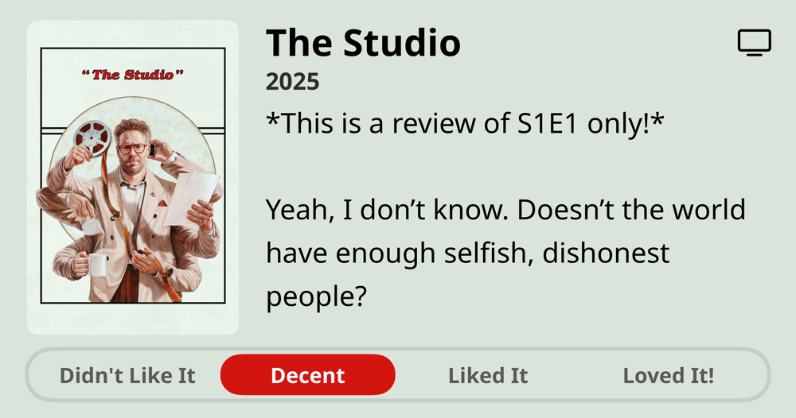

### Podcasts

*Podcast episodes without links are members-only but I think are interesting enough to post in case you want to investigate them.*

- [The Weekly Planet – 567 Severance Season 2 (with Sammy Petersen)](https://overcast.fm/+1HFLsNr74)
- [Otherwise Objectionable – Episode 3: Law and Disorder](https://overcast.fm/+BNy4NS77B0)
- The Race Members' Club 2025 – Lawson out, Tsunoda in: Why Red Bull are preparing an early driver change (ad-free)
- The 404 Media Podcast (Premium Feed) – The DNA of 15 Million People Is For Sale
- [Risky Bulletin – Risky Bulletin: Cyberattack hits Ukraine’s state railway](https://overcast.fm/+5Sl8gvenU)
- [F1: Beyond The Grid – Pierre Gasly: believing in Alpine](https://overcast.fm/+Nv8K3wuwA)
- [Risky Bulletin – Risky Bulletin: US removes Tornado Cash sanctions](https://overcast.fm/+5Sl8qE0Mo)
- [TRASHFUTURE – It Ain’t Half Austere](https://overcast.fm/+0MYuWFaM4)
- [Risky Bulletin – Between Two Nerds: The 0day fetish](https://overcast.fm/+5Sl9x61Fg)
- [P1 with Matt and Tommy – Chinese GP Driver Ratings](https://overcast.fm/+_U3o5U4ZQ)

### Books

*Don't be surprised when the book list stays constant for awhile. Reading time is harder to come by these days. 😞*  

### Movies

### TV Shows

### Music

### Food and Drink

- [Syun Izakaya](https://www.syunhillsboro.com/#21)
- [Sisters Coffee Company](https://sisterscoffee.com/)
- [Fair Trade Organic Bolivian Blend | Trader Joe's](https://www.traderjoes.com/home/products/pdp/fair-trade-organic-bolivian-blend-074367)
- [Wayfinder Beer](https://www.wayfinder.beer/) LA MAGIE - FRENCH PILSNER
