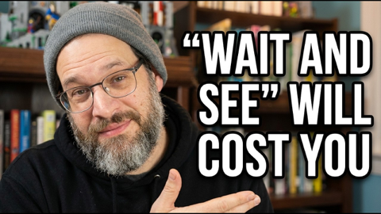

## Current Personal Status
>
> I just finished Sonoko Machida's 2020 book "The Convenience Store by the Sea", and I wish I had more. I think she has sequels. I'll have to see if they've been translated or not. I wouldn't mind owning them in Japanese also, but I'm a painfully slow novel reader in Japanese.

## Current Projects

- Learning Korean
- Expanding Paradigm's client base and launching its vulnerabilty management service
- Building up my running distance again

## Stuff I've recently enjoyed

### Podcasts

*Podcast episodes without links are members-only but I think are interesting enough to post in case you want to investigate them.*

 [Signal Hill – ESSAY | The Snail](https://overcast.fm/+BNUFiYCkd8)
 [Signal Hill – FEATURE | The Learning Play](https://overcast.fm/+BNUFhnFZrE)
 [Signal Hill – CALL-IN | On the Family Group Chat](https://overcast.fm/+BNUFiGMqaY)
 [Talk To Me In Korean – Level 1 Lesson 2](https://overcast.fm/+6-OK5nhEE)
 [Talk To Me In Korean – Level 1 Lesson 1](https://overcast.fm/+6-OLm8dQg)
 [Learn Korean Language – Learn Korean Language Episode No 01](https://overcast.fm/+BRUVX0TkUE)
 [Sales Logic - Selling Strategies That Work – The Most Important Sales Trends of 2026](https://overcast.fm/+X6nPA9hS8)
 [Whisky Whiskey – 151: Amber Lane Liquid Amber Single Malt Whisky](https://overcast.fm/+BLIhdqcn6k)
 [Talk Python To Me – #532: 2025 Python Year in Review](https://overcast.fm/+F4RB8y1no)
 [The Weekly Planet – 607 The Best & Worst of 2025 Awards](https://overcast.fm/+1HFLolJZQ)

### Books

[The Convenience Store by the Sea • First Time Read • 2020 • Sonoko Machida • I didn't know what to think of this book initially. It felt slightly stilted, whether due to translation or not, I'm not sure. But I kept reading. And it started drawing me in by brilliantly building intertwined moments of social interactions and vignettes of character development. • Loved It!
](/images/posts/png-image458cbadfd70-review-68981979-9b1f-4d9e-9ae9-1c29c838e7c5.jpg)
[Grid to Glory • 2025 • Alex Jacques • Alex Jacques is one of my favorite F1 commentators. His personality shines, and he's clearly a hard worker who knows what he's doing. The stories he's chosen for this book are compelling, but the writing style pulls me out of them. He uses sentence fragments instead of commas, and sometimes the background explanations are slightly muddled. Good, not great. • Decent
](/images/posts/png-image4dd09994160-review-c50952a1-62fd-4f67-a41d-85082a7e6f69.jpg)
[First Contact • 2025 • Becky Ferreira • A delightful look at the science, superstitions, stories, and suppositions behind the search for alien life throughout history. • Loved It!
](/images/posts/png-image447c967d8c0-review-c3a0b328-23e4-4f0e-bdf2-c3320ace2a6f.jpg)

### Movies

[Tinker Tailor Soldier Spy • 2011 • Tomas Alfredson • They don't make many movies like this anymore. Both intelligently written and yet not overly- wrought with twists and surprises, it's a subtly played movie staring Gary Oldman at his best, but with a stellar cast in general. Highly recommended. • Loved It!
](/images/posts/png-image48638ea78c0-review-3aedf0b6-0108-41da-a3e3-2096c4e6cd7e.jpg)
[Wick Is Pain • 2025 • Jeffrey Doe • A fun look behind the scenes and lives of the people who made the John Wick movies. Really only these people could have made these movies. • Loved It!
](/images/posts/png-image48b090780c0-review-9b121a86-9efa-44ef-94d0-3484b4c3a18b.jpg)

### TV Shows

[Plur1bus 1 • First Time Watch • 2025 • l've seen complaints about the slow pacing, but the people saying this must have never watched anything from Vince Gilligan before. He is NOT afraid to build a story. Season 1 was weird and compelling. Recommend! • Loved It!
](/images/posts/png-image4af1b3adda0-review-8a0fdb3c-07a2-4fde-8c58-981674a73262.jpg)

### YouTube

Channel – [AI News & Strategy Daily | Nate B Jones](https://www.youtube.com/@NateBJones)

[Make $500-$5K/mo with ChatGPT—Steal my Side-Gig System and Build Your Hustle with AI!](https://www.youtube.com/watch?v=8psoB8EFdc8&t=828s)

Channel – [Chris Norlund](https://www.youtube.com/@realchris)

[They finally admitted it's all fake](https://www.youtube.com/watch?v=I85SWB-D5R8)

Channel – [Captain Steeeve](https://www.youtube.com/@CaptainSteeeve)

[Emergency Landing in Hawaii Turns Tense After ATC Response | Captain Steeeve Reacts](https://www.youtube.com/watch?v=4_tjA-_BxN4&pp=0gcJCU0KAYcqIYzv)

Channel – [Patrick Boyle](https://www.youtube.com/@PBoyle)

[Does OpenAI expect a Government Bailout?](https://www.youtube.com/watch?v=cHiZ-7jI0Ew)

Channel – [AI News & Strategy Daily | Nate B Jones](https://www.youtube.com/@NateBJones)

[Anthropic's New Benchmark Changes Everything—Most People Will Miss Why](https://www.youtube.com/watch?v=X_EJi6yCuTM)

Channel – [Yamada Anthony](https://www.youtube.com/@Anchaninjapan)

[$770 Apartment Tour | Fukuoka, Japan](https://www.youtube.com/watch?v=whYH36kb75o)

Channel – [THE RACE](https://www.youtube.com/@WeAreTheRace)

[The best worst team F1’s ever had](https://www.youtube.com/watch?v=03HoQCOtRaY)

Channel – [Theo - t3․gg](https://www.youtube.com/@t3dotgg)

[OpenAI: Trapped in 2nd place](https://www.youtube.com/watch?v=_nxbZgZysT4)

Channel – [Casual Geographic](https://www.youtube.com/@mndiaye_97)

[The Depressing Reality of Being a "Small Cat"](https://www.youtube.com/watch?v=8QI5tZ14W64&t=322s)

