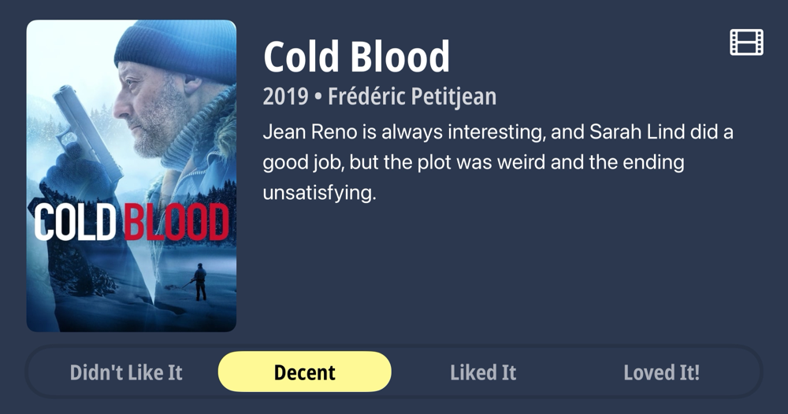
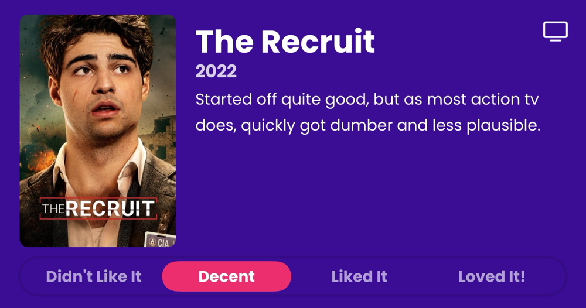
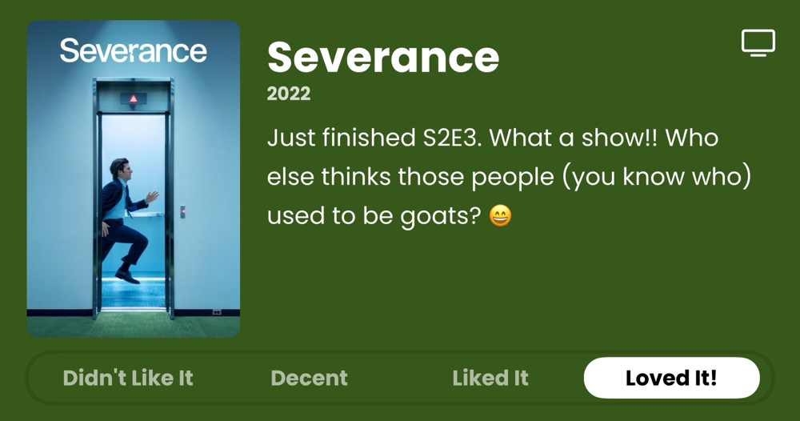

### Podcasts

*Podcast episodes without links are members-only but I think are interesting enough to post in case you want to investigate them.*

- [The Rebound – 531: Bananas Fact](https://overcast.fm/+De1m-RXSc)
- Six Colors – Continuity Camera theories, Ebooks and DRM, and Apple results (6C Podcast)
- The Race Members' Club 2025 – F1 Extra: Does F1 have a problem with tribal fan culture?
- [楽しいラジオ「ドングリFM」 – 1151 小学館のウラ漫が面白い #マンガワン](https://overcast.fm/+9ABKE3hg4)
- [Risky Bulletin – Risky Bulletin: Authorities seize the Cracked and Nulled cybercrime forums](https://overcast.fm/+5Sl9nZQdQ)
- [Ctrl-Alt-Speech – This Episode has Masculine Energy](https://overcast.fm/+BHRYF0Uzgk)
- [Judge John Hodgman – Cavy-at Emptor](https://overcast.fm/+YJM3iT000)
- Tech Won't Save Us (Premium) – The Problem With Cyberlibertarianism w/ Chris Gilliard
- [Accidental Tech Podcast: Unedited Live Stream – 624: Do Less Math in Computers](https://atp.fm/624)

### Books

*Don't be surprised when the book list stays constant for awhile. Reading time is harder to come by these days. 😞*

- [Fluke | Book by Brian Klaas | Simon & Schuster](https://www.simonandschuster.com/books/Fluke/Brian-Klaas/9781668006535) *Determinists should read this with an open mind.*
- [The Silo Series Collection](https://books.apple.com/us/book/the-silo-series-collection/id1602732974) *Even if you're watching the Apple TV+ series, READ THESE! They're different enough that it won't ruin everything, and they're both fun in their own ways. Plus (I don't know if you noticed), reading and watching things are different activities.*
- [Doomsday Book](https://books.apple.com/us/book/doomsday-book/id420427169) *Time travel done right in a very clever and compelling story.*
- [The Internet of Garbage by Sarah Jeong - The Verge](https://www.theverge.com/2018/8/28/17777330/internet-of-garbage-book-sarah-jeong-online-harassment) *Just started. Probably shouldn't read this in 2024, the year of the great enshittification.*

### Movies

### TV Shows

### Games

- [Baldur's Gate 3](https://baldursgate3.game/) *Peter got me into this! It's fun with friends. I really don't have time for it, but whatever.*

### Food and Drink

- [OYATSUPAN](https://www.oyatsupan.com/)
- [CHEESE & CRACK SNACK SHOP](https://www.cheeseandcrack.com/)
- [Wayfinder Beer](https://www.wayfinder.beer/)
- [Organic Genmaicha Loose Leaf Green Tea | Yamamotoyama– Yamamotoyama U.S.A.](https://yamamotoyama.com/products/organic-genmaicha-loose-green-tea)
