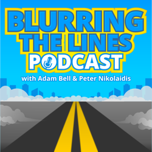
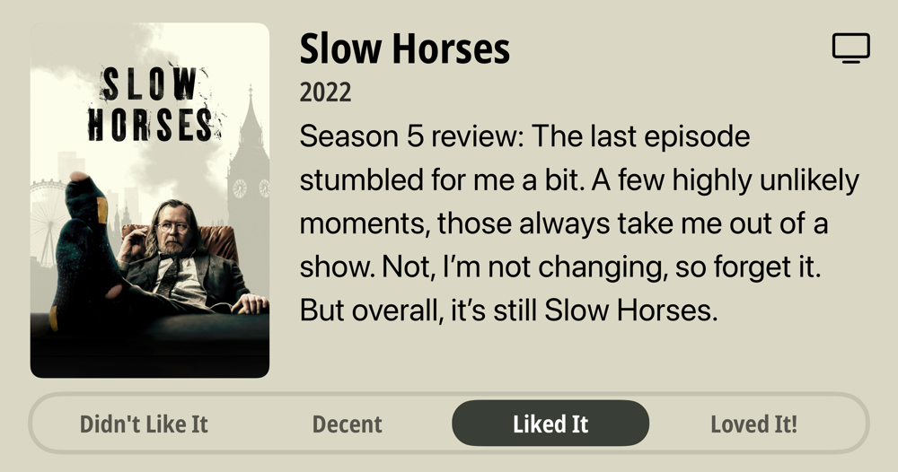

## Current Personal Status

All work and no play still makes not enough money. But hey, I *AM* working on a blog post in the Spotlight series!

## Stuff I've recently enjoyed

### Podcasts

*Podcast episodes without links are members-only but I think are interesting enough to post in case you want to investigate them.*

 [Decoder: Ad-Free Edition – LexisNexis CEO says the AI law era is already here](https://overcast.fm/+BSp8fcfrCs)
 [Talk Python To Me – #525: NiceGUI Goes 3.0](https://overcast.fm/+F4RDfu7Uk)
 [Risky Bulletin – Srsly Risky Biz: Peter Williams, Ex-ASD, Pleads Guilty to Selling Eight Exploits to Russia](https://overcast.fm/+5Sl8eMwQs)
 [Risky Business – Risky Business #812 — Alleged Trenchant exploit mole is ex-ASD](https://overcast.fm/+It0gJvYW0)
 David Pakman Member Feed – 10/29/25: Layoffs explode as Trump turns on farmers, half the country sues him
 David Pakman Member Feed – 10/29/25: TDPS Bonus Show
 [Blurring The Lines Podcast – Episode 238 – Time Zones, Tech Glitches, and Travel Tales](https://overcast.fm/+GsOk2UHEo)
 [kill switch – workslop: how AI is making you hate your coworkers](https://overcast.fm/+4qHr-Bda0)
 [Judge John Hodgman – Sole Benefishiary](https://overcast.fm/+YJM2MB7eI)
 The Race F1 Podcast (Members) – F1 Extra: Is Leclerc the modern day Arnoux?

### TV Shows

[Slow Horses • 2022 • Season 5 review: The last episode stumbled for me a bit. A few highly unlikely moments, those always take me out of a show. Not, I'm not changing, so forget it. But overall, it's still Slow Horses. • Liked It
](/images/posts/png-image4038ad32750-review-caf828be-d53f-475c-aa8b-64bdd3138075.jpg)
[The Last Frontier • 2025 • Another Apple TV+ series. Two episodes in, not sure how I'm going to feel about it. Started off well in some ways, hand-wavy in others. Seems like it's worth giving a chance though. • Liked It
](/images/posts/png-image41b9a9fec20-review-7a31e41f-7f85-4844-9544-87b1d32b09d7.jpg)

### YouTube

- [Malware of the Future: What an infected system looks like in 2025](https://www.youtube.com/watch?v=24dfe8q7Aq4&t=6s) — [PC Security Channel](https://www.youtube.com/@pcsecuritychannel)
- [Inside An F1 Driver’s Detailed Preparation Process | Psychology of Preparation | TAG Heuer](https://www.youtube.com/watch?v=I7pKRfEbfJI) — [FORMULA 1](https://www.youtube.com/@Formula1)
- [The Hack That Made China a Superpower: Operation Shady Rat](https://www.youtube.com/watch?v=y27B-sKIUHA) — [Cybernews](https://www.youtube.com/@cybernews)
- [ICE Agents Get EXACTLY What They Deserve from Fed-Up Police Officer](https://www.youtube.com/watch?v=Fhpvruy7Xjs) — [TYT Sports](https://www.youtube.com/@tytsports)
- [Sam, Jakub, and Wojciech on the future of OpenAI with audience Q&A](https://www.youtube.com/watch?v=ngDCxlZcecw&t=1073s) — [OpenAI](https://www.youtube.com/@OpenAI)
- [ICE Agent FACE PLANTS and Ruins His Life](https://www.youtube.com/watch?v=JYU3tWMm4I8) — [Adam Mockler](https://www.youtube.com/@adammockler)
- [Why Red Bull's F1 2026 delay has given Yuki Tsunoda fresh hope](https://www.youtube.com/watch?v=kZ3CCnGcc7o) — [THE RACE](https://www.youtube.com/@WeAreTheRace)
- [Trump suffers SCARY cognitive glitch](https://www.youtube.com/watch?v=hqBWjuJbrFQ&t=12s) — [David Pakman Show](https://www.youtube.com/@thedavidpakmanshow)
- [The Man Who Leaked Windows 95 & Went to Prison](https://www.youtube.com/watch?v=bKP5ZWFjWmU) — [Cybernews](https://www.youtube.com/@cybernews)
- [JUST IN: Canada's Carney Slams Trump’s ‘No Meeting’ Comment — Says Canada Won’t Be Ignored | AC1B](https://www.youtube.com/watch?v=wcLAL-VUpBY&pp=0gcJCQMKAYcqIYzv) — [DRM News](https://www.youtube.com/@DRMNewsInternational)
