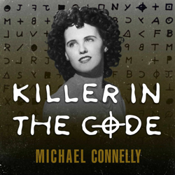
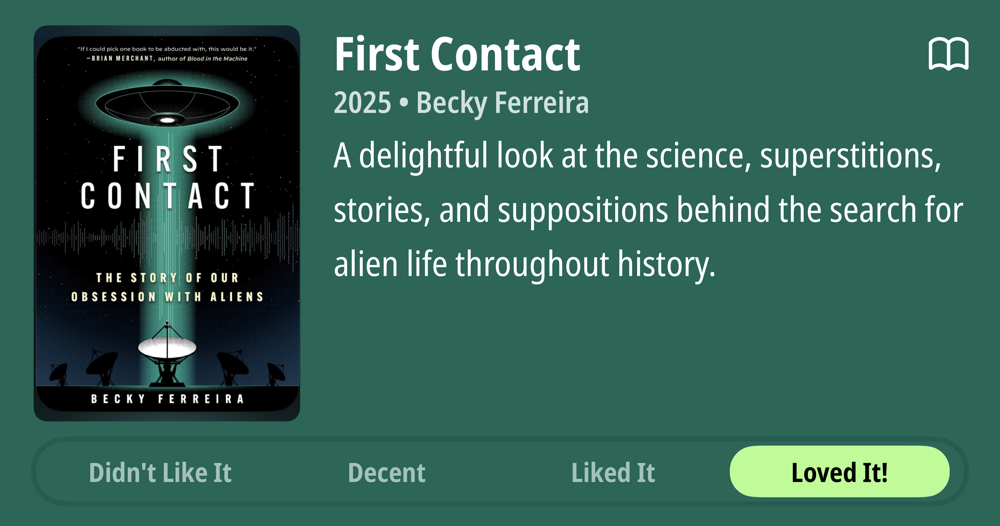
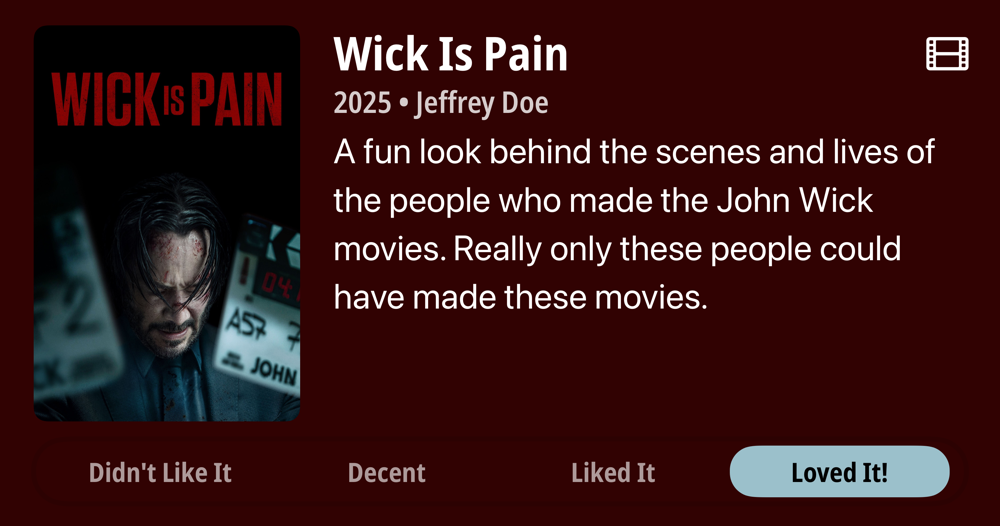
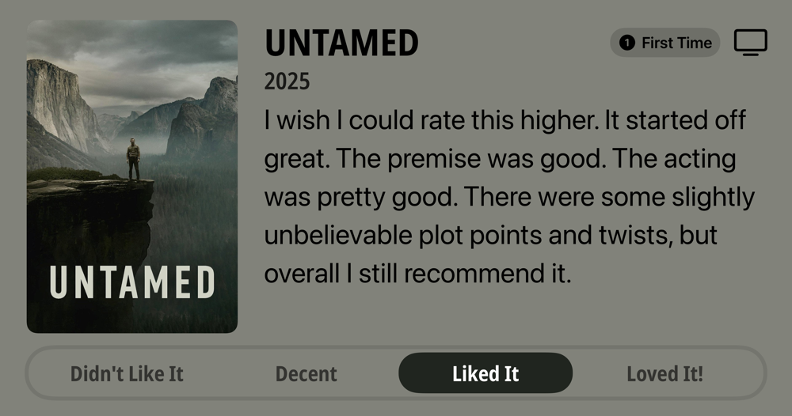
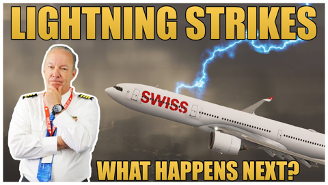
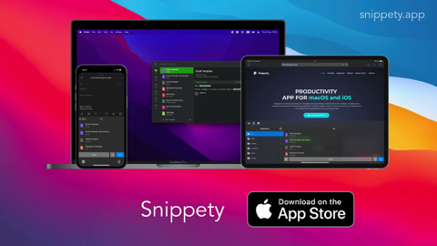
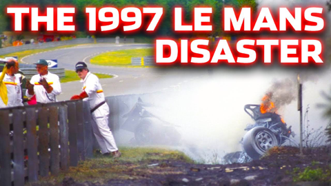
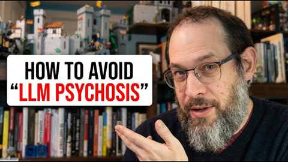
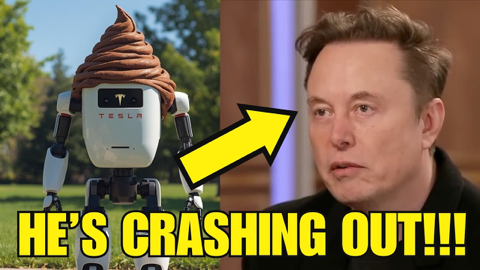
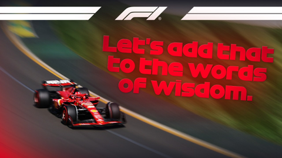

## Current Personal Status
>
> I have a mountain ahead that I have no choice to climb, so I'm f**king climbing it. 😄

## Current Projects

- Learning Korean
- Expanding Paradigm's client base and launching its vulnerabilty management service
- Building up my running distance again

## Stuff I've recently enjoyed

### Podcasts

*Podcast episodes without links are members-only but I think are interesting enough to post in case you want to investigate them.*

 [The Weekly Planet – Clash of the Titans - Caravan Of Garbage](https://overcast.fm/+1HFISkpSY)
 [Risky Bulletin – Risky Bulletin: Belarus deploys spyware on journalists’ phones](https://overcast.fm/+5Sl8D4wnA)
 [Whisky Whiskey – 147: The Macallan 18 Year Sherry Oak 2024 Single Malt Whisky](https://overcast.fm/+BLIhcSSSJ0)
 Judge John Hodgman – TEASER: Members Only Mailbag December 2025
 [The Weekly Planet – 606 Avatar: Fire & Ash](https://overcast.fm/+1HFJEmNw0)
 [Unclear and Present Danger – A Few Good Men](https://overcast.fm/+00hnGa_oA)
 [The Weekly Planet – Wrath of the Titans - Caravan Of Garbage](https://overcast.fm/+1HFKSAsOc)
 The 404 Media Podcast (Premium Feed) – The Shifting World of OSINT (with Craig Silverman)
 [Killer In The Code – Chapter 2: The Smoking Gun](https://overcast.fm/+BUVQloz22I)
 [Killer In The Code – Chapter 1: The Hidden Beneath The Hidden](https://overcast.fm/+BUVQkLa6KM)

### Books

[Grid to Glory • 2025 • Alex Jacques • Alex Jacques is one of my favorite F1 commentators. His personality shines, and he's clearly a hard worker who knows what he's doing. The stories he's chosen for this book are compelling, but the writing style pulls me out of them. He uses sentence fragments instead of commas, and sometimes the background explanations are slightly muddled. Good, not great. • Decent
](/images/posts/png-image4dd09994160-review-c50952a1-62fd-4f67-a41d-85082a7e6f69.jpg)
[First Contact • 2025 • Becky Ferreira • A delightful look at the science, superstitions, stories, and suppositions behind the search for alien life throughout history. • Loved It!
](/images/posts/png-image447c967d8c0-review-c3a0b328-23e4-4f0e-bdf2-c3320ace2a6f.jpg)

### Movies

[Tinker Tailor Soldier Spy • 2011 • Tomas Alfredson • They don't make many movies like this anymore. Both intelligently written and yet not overly- wrought with twists and surprises, it's a subtly played movie staring Gary Oldman at his best, but with a stellar cast in general. Highly recommended. • Loved It!
](/images/posts/png-image48638ea78c0-review-3aedf0b6-0108-41da-a3e3-2096c4e6cd7e.jpg)
[Wick Is Pain • 2025 • Jeffrey Doe • A fun look behind the scenes and lives of the people who made the John Wick movies. Really only these people could have made these movies. • Loved It!
](/images/posts/png-image48b090780c0-review-9b121a86-9efa-44ef-94d0-3484b4c3a18b.jpg)

### TV Shows

[Plur1bus 1 • First Time Watch • 2025 • l've seen complaints about the slow pacing, but the people saying this must have never watched anything from Vince Gilligan before. He is NOT afraid to build a story. Season 1 was weird and compelling. Recommend! • Loved It!
](/images/posts/png-image4af1b3adda0-review-8a0fdb3c-07a2-4fde-8c58-981674a73262.jpg)
[UNTAMED • First Time Watch • 2025 • I wish I could rate this higher. It started off great. The premise was good. The acting was pretty good. There were some slightly unbelievable plot points and twists, but overall I still recommend it. • Liked It
](/images/posts/png-image42abbc3f4f0-review-4677620a-9875-4737-8694-315fd092b752.jpg)

### Music

[primitive god • 2022 • Chris Ballew • I had no idea who Chris Ballew was (although obviously I'd heard of the Presidents of the United States of America) until I stumbled across his albums in Apple Music recently. To say he's prodigious is an understatement, but the good news is that a lot of it is very good, including "primitive god". Love it! • Loved It!
](/images/posts/png-image40c4b8c1520-review-ac176396-df13-46c9-b279-8570195ad525.jpg)

### YouTube

Channel – [Captain Steeeve](https://www.youtube.com/@CaptainSteeeve)

[Swiss A330 Declares PAN-PAN After Lightning Strike | Captain Steeeve Explains](https://www.youtube.com/watch?v=7XG_n9WYeuU)

Channel – Marques Brownlee and Epic Spaceman

[I shrunk down into an M5 chip](https://www.youtube.com/watch?v=Jh9pFp1oM7E&t=12s)

Channel – [Hank Green](https://www.youtube.com/@hankschannel)

[Why is Everyone So Wrong About AI Water Use??](https://www.youtube.com/watch?v=H_c6MWk7PQc&t=20s)

Channel – [Zen van Riel](https://www.youtube.com/@zenvanriel)

[Claude Code Just Got The Ultimate Dev Shortcut (LSP Explained)](https://www.youtube.com/watch?v=lffYEu5MhSQ)

Channel – [Snippety App](https://www.youtube.com/@AppSnippety)

[Snippety - productivity application for macOS, iOS, and iPadOS - Introduction](https://www.youtube.com/watch?v=NrI1gt6YfE8&t=285s)

Channel – [JakeSimRacing](https://www.youtube.com/@JakeSimRacing)

[The Forgotten Le Mans Tragedy: The Demise of Sébastien Enjolras (1997)](https://www.youtube.com/watch?v=7Gmrdz4eTLc)

Channel – [AI News & Strategy Daily | Nate B Jones](https://www.youtube.com/@NateBJones)

[If This Can Happen to an Ex-DeepMind Leader, It Can Happen to You](https://www.youtube.com/watch?v=AzOJ9QLgfIk)

Channel – [Chris Norlund](https://www.youtube.com/@realchris)

[Elon Musk Tesla CRASHING worse than I thought](https://www.youtube.com/watch?v=6b03ZXJvSGw)

Channel – [FORMULA 1](https://www.youtube.com/@Formula1)

[Best Team Radio Moments Of 2025 | Paramount+](https://www.youtube.com/watch?v=VR3JID6VVtM)

### Food

 [ROYCE' CHOCOLATE](https://roycechocolate.com)

