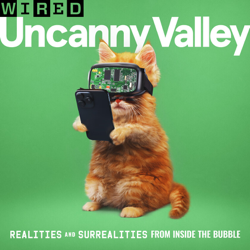
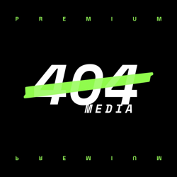
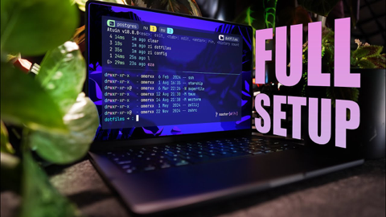
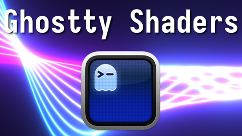
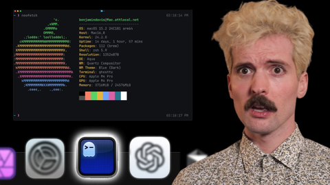

## Current Personal Status

I've been using [Warp](https://www.warp.dev) as my terminal app of choice, but now that the Claude and Claude Code combination is as good as it is, and integrates with so many things, I just found the Warp AI stuff getting in my way and getting annoying. So I spent last night (while my daughter and her friends were out terrorizing the trick-or-treaters) setting up a [Ghostty](https://ghostty.org/) configuration I liked.

All told, I wound up setting up [Ghostty](https://ghostty.org/), [Starship](https://starship.rs), and [vim-plug](https://github.com/junegunn/vim-plug). And now I really like it.

You can see from my [YouTube history](#youtube) below that I also jumped around in several Ghostty related videos too. 😄

## Stuff I've recently enjoyed

### Podcasts

*Podcast episodes without links are members-only but I think are interesting enough to post in case you want to investigate them.*

 David Pakman Member Feed – 10/31/25: They think we’re stupid as Epstein panic grows, grift falls apart
 [Whisky Whiskey – 133: Laphroaig Oak Select Single Malt Whisky](https://overcast.fm/+BLIhedZH14)
 [The Talk Show With John Gruber – 433: ‘Meat Bags’, With Brian Mueller](https://overcast.fm/+B7NA1J3qk)
 David Pakman Member Feed – 10/31/25: TDPS Bonus Show
 David Pakman Member Feed – 10/30/25: Trump demands nuke tests as Xi dominates him, 14 Republicans turn on Trump
 [Computer Says Maybe – Unlearning in the AI Era w/ Nabiha Syed at Mozilla Foundation](https://overcast.fm/+BGreGPYNuI)
 [The Vergecast: Ad-Free Edition – God will be declared by a panel of experts](https://overcast.fm/+BSp7tCff1Q)
 [MacStories Unwind – From the Wilds of Alaska to Lumiose City](https://overcast.fm/+aQipsqFps)
 [Uncanny Valley | WIRED – WIRED Roundup: Grokipedia, Real Estate AI Videos, Alpha School](https://overcast.fm/+BFs14nz9JI)
 The 404 Media Podcast (Premium Feed) – The Crackdown on ICE Spotting Apps (with Joshua Aaron)

### TV Shows

[Slow Horses • 2022 • Season 5 review: The last episode stumbled for me a bit. A few highly unlikely moments, those always take me out of a show. Not, I'm not changing, so forget it. But overall, it's still Slow Horses. • Liked It
](/images/posts/png-image4038ad32750-review-caf828be-d53f-475c-aa8b-64bdd3138075.jpg)
[The Last Frontier • 2025 • Another Apple TV+ series. Two episodes in, not sure how I'm going to feel about it. Started off well in some ways, hand-wavy in others. Seems like it's worth giving a chance though. • Liked It
](/images/posts/png-image41b9a9fec20-review-7a31e41f-7f85-4844-9544-87b1d32b09d7.jpg)

### YouTube

Channel – [DevOps Toolbox](https://www.youtube.com/@devopstoolbox)

[Ghostty is Probably The Best Terminal Emulator I've Ever Used](https://www.youtube.com/watch?v=3wq0RFYAvNo&t=220s&pp=0gcJCQMKAYcqIYzv)

Channel – [SavvyNik](https://www.youtube.com/@SavvyNik)

[Ghostty - Configure and Customize the Terminal](https://www.youtube.com/watch?v=zjUAUqcmZ3w&t=381s)

Channel – [DevOps Toolbox](https://www.youtube.com/@devopstoolbox)

[How I Setup My Mac Terminal To Make It Amazing](https://www.youtube.com/watch?v=oR_B2gQDVf4&pp=0gcJCQMKAYcqIYzv)

Channel – [Hevi](https://www.youtube.com/@HeviMaker)

[Wild Terminal Configurations with Ghostty Shader Support](https://www.youtube.com/watch?v=Elh8pvXHVxM)

Channel – [chantastic](https://www.youtube.com/@chantastic)

[My New Terminal for 2025 — setup, neovim, and TMUX, oh my!](https://www.youtube.com/watch?v=d46kVXe_XFM)

Channel – [Theo - t3․gg](https://www.youtube.com/@t3dotgg)

[My New Favorite Terminal Just Dropped](https://www.youtube.com/watch?v=VUxMfyzTM_Y)

Channel – [DevOps Toolbox](https://www.youtube.com/@devopstoolbox)

[Your shell prompt, ON STEROIDS // Starship](https://www.youtube.com/watch?v=G7aWxK4395Y)

Channel – [Henry Misc](https://www.youtube.com/@henrymisc)

[Ultimate Starship Shell Prompt Setup From Scratch](https://www.youtube.com/watch?v=v2S18Xf2PRo)

Channel – [PC Security Channel](https://www.youtube.com/@pcsecuritychannel)

[Malware of the Future: What an infected system looks like in 2025](https://www.youtube.com/watch?v=24dfe8q7Aq4)

Channel – [DevOps Toolbox](https://www.youtube.com/@devopstoolbox)

[How I Setup My Mac Terminal To Make It Amazing](https://www.youtube.com/watch?v=oR_B2gQDVf4)

