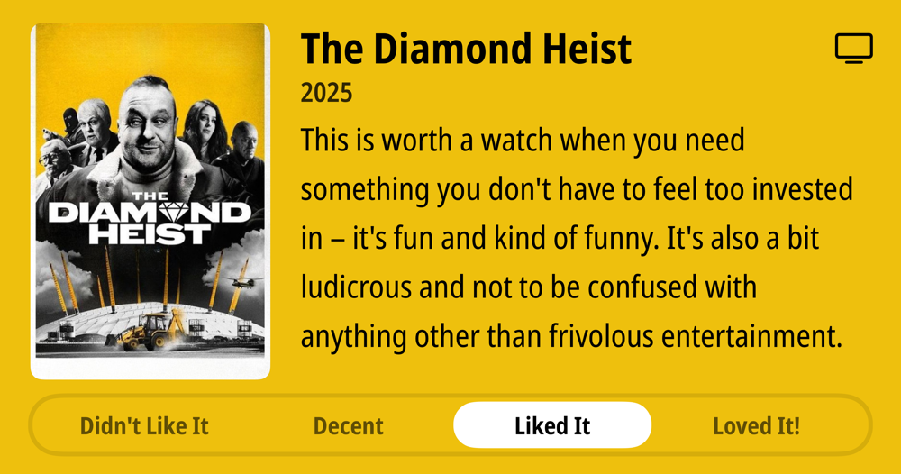

### Podcasts

*Podcast episodes without links are members-only but I think are interesting enough to post in case you want to investigate them.*

- [The Weekly Planet – The Bourne Identity - Caravan Of Garbage](https://overcast.fm/+1HFKh9Fks)
- The Race F1 Podcast (Members) – A new low? We answer your questions on Hamilton’s ‘terrible’ Ferrari start (ad-free)
- [Judge John Hodgman – Baby Grand Jury](https://overcast.fm/+YJM0yBe8M)
- The Race F1 Podcast (Members) – Edd answers your Saudi Arabian GP F1 driver rankings questions
- [Otherwise Objectionable – Episode 7: The Future of Speech Online](https://overcast.fm/+BNy4M2aeS4)
- [Otherwise Objectionable – Episode 6: The Rest of the World](https://overcast.fm/+BNy4Mz0jBU)
- [F1: Beyond The Grid – Piers Thynne: running McLaren’s championship-winning factory](https://overcast.fm/+Nv8KGh5Dg)
- The 404 Media Podcast (Premium Feed) – Cops Are Using AI Bots to Surveil People
- [Accidental Tech Podcast 636: Nose-Biting Territory](https://atp.fm/636)
- [Robot or Not? – 312: Unanchored Buoys](https://overcast.fm/+Ep2RGFq6Y)

### Books

[Doomsday Book • 1992 • Connie Willis A time traveler from the near future goes back to England of the 14th century and stumbles into the Black Death wiping everyone out all around her. Sounds horrible - and yet, it's a wonderful book. There are compelling characters in the future and in the past, and it's somehow compelling even while being a horrific portrayal of the plague. • Loved It!
](/images/posts/PngImage447C8168150-review-2d617e4e-0e07-4fe1-9145-de1376f3caa2.jpg)

### TV Shows

The Diamond Heist • 2025 • This is worth a watch when you need something you don't have to feel too invested in - it's fun and kind of funny. It's also a bit ludicrous and not to be confused with anything other than frivolous entertainment. • Liked It

Your Friends & Neighbors • 2025 • Bear in mind only two episodes have aired, so small sample size, but this is 100% my new favorite TV show. I didn't even intend to watch it until a friend mentioned it, and wow! Glad they did. • Loved It!

### Food and Drink

- [Yonder - Forecast Coffee Company](https://forecastcoffeecompany.com/product/yonder/)
- [Rogue Hazelnut Brown Ale](https://www.rogue.com/shop/beer/core/hazelnut-brown-ale/)
- [Wayfinder Beer](https://www.wayfinder.beer/) LA MAGIE - FRENCH PILSNER
