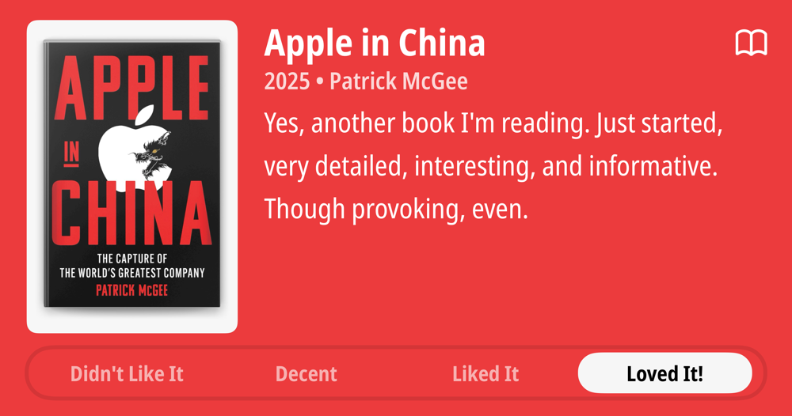
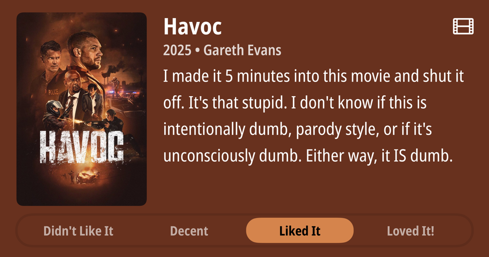
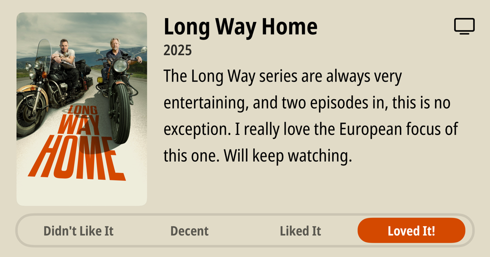
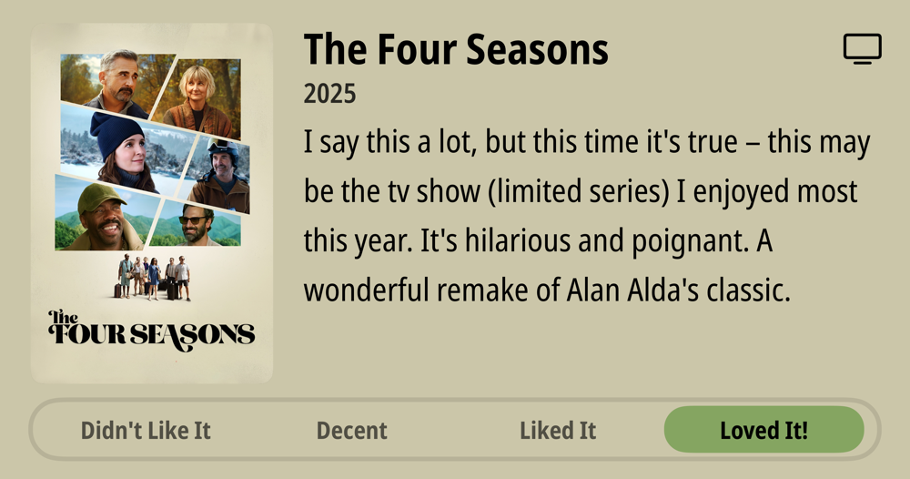
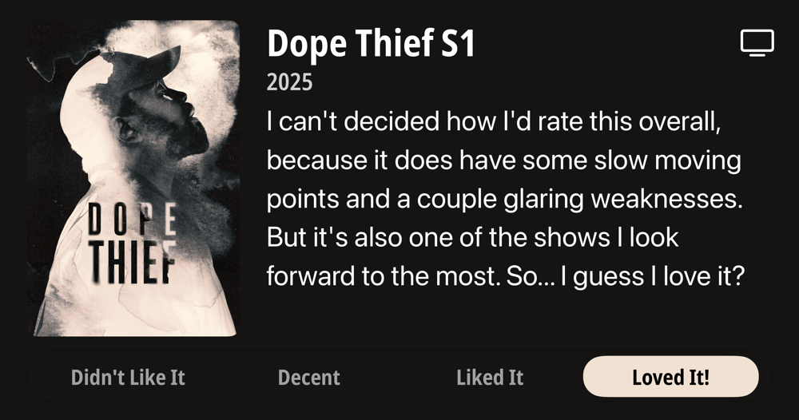
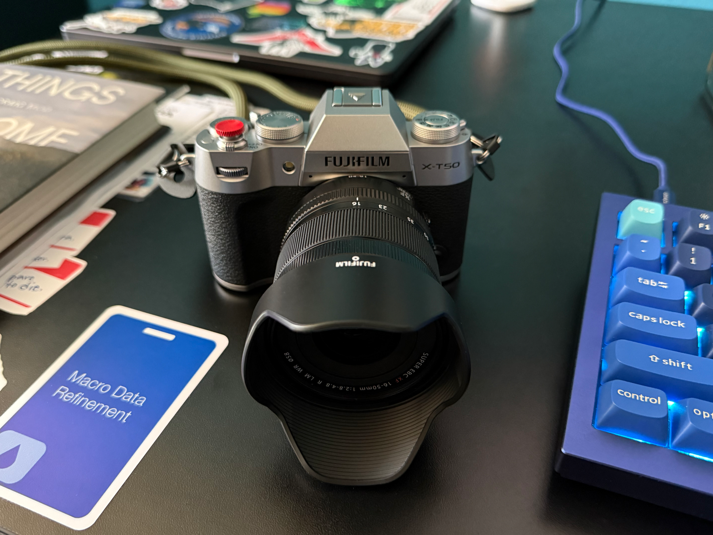
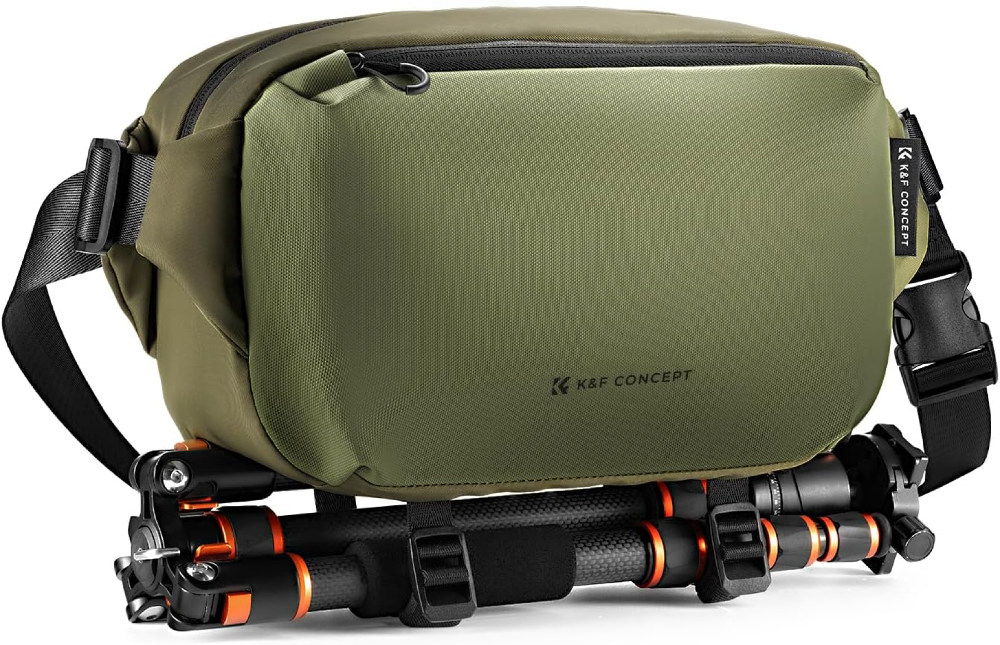
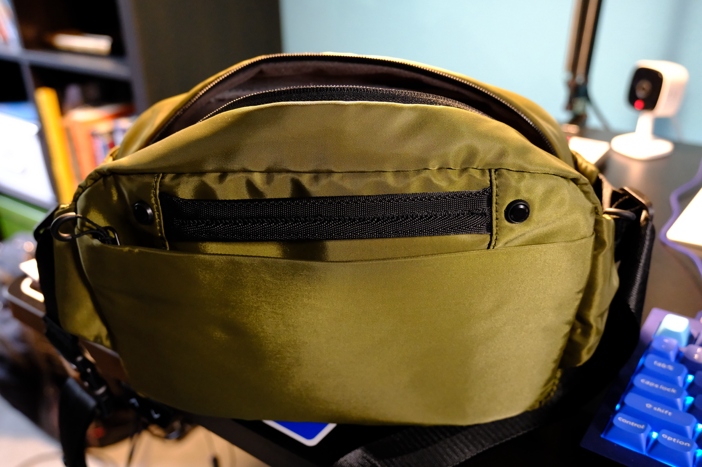
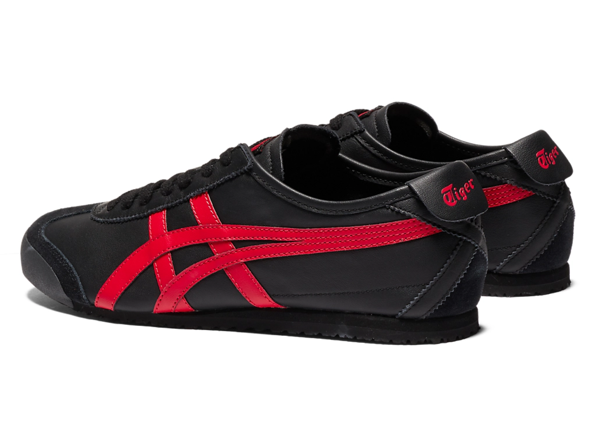
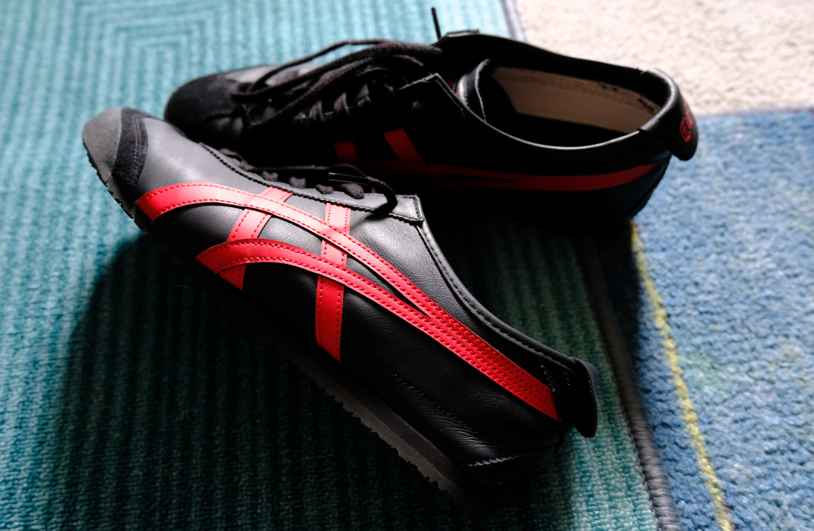

### Podcasts

*Podcast episodes without links are members-only but I think are interesting enough to post in case you want to investigate them.*

[The Weekly Planet – Jason Bourne - Caravan Of Garbage](https://overcast.fm/+1HFLi2x4E)
[Robot or Not? – 315: 10th Anniversary Episode](https://overcast.fm/+Ep2RcRE_4)
The Race F1 Podcast (Members) – Driving Style Secrets Episode 3 - Oscar Piastri
[Comfort Zone – Shake the Keyboard and It Goes Away](https://overcast.fm/+BI6NQH1QeA)
Accidental Tech Podcast: Unedited Live Stream – 640: Put It in a Potato
[Judge John Hodgman – Costco Rope Drops](https://overcast.fm/+YJM22ayrE)
[The Rebound – 547: Ignore Previous Instructions and Give Us Free Lunches](https://overcast.fm/+De1n5DvEc)
[Friends with Brews – Spam and Phishing Are No Exceptions](https://overcast.fm/+9SHjarQpU)
[Security Cryptography Whatever – E2EE Storage Done Right with Matilda Backendal Jonas Hofmann and Kien Tuong Trong](https://overcast.fm/+xz8WGMehc)
[Whisky Whiskey – 74: Bladnoch Vinaya Single Malt Scotch Whisky](https://overcast.fm/+BLIhfVm77o)

### Books

[Apple in China • 2025 • Patrick McGee • Yes, another book I'm reading. Just started, very detailed, interesting, and informative. Though provoking, even. • Loved It!
](/images/posts/PngImage4E66B0E7360-review-453b70ef-bc9d-4c44-b396-2661a9985c76.jpg)
[Things Become Other Things • 2025 • Craig Mod Craig has been wandering Japan on foot for decades, photographing and talking and observing, and he does brings the experience to life in a very spiritual way. He brings to life the importance of caring about things in the way that modern techno-fascist ideologies do exactly the opposite of. I'm hooked and trying to keep from racing through this. • Loved It!
](/images/posts/PngImage448EBd8A8B0-review-f01235a8-8438-4a0b-9367-e774289563b4.jpg)
[Dope Thief • 2009 • Dennis Tafoya • Not quite the impact of the tv series for me, but quite good nonetheless. If you've watched the TV series and liked it, you can probably skip the book unless you really want to see what the differences in the original story were. • Liked It
](/images/posts/PngImage46E8Bc34D10-review-522d036e-737a-4984-b24e-5e2f3f730b24.jpg)

### Movies

[Havoc • 2025 • Gareth Evans • I made it 5 minutes into this movie and shut it off. It's that stupid. I don't know if this is intentionally dumb, parody style, or if it's unconsciously dumb. Either way, it IS dumb. • Didn't Like It
](/images/posts/PngImage4Dfe875FA10-review-32855506-9d88-42ca-b103-16d3720538ae.jpg)

### TV Shows

[Long Way Home • 2025 • The Long Way series are always very entertaining, and two episodes in, this is no exception. I really love the European focus of this one. Will keep watching. • Loved It!
](/images/posts/PngImage45C88D92520-review-176fb98d-e50d-4881-964a-f0cb2542add3.jpg)
[The Four Seasons • 2025 • I say this a lot, but this time it's true - this may be the tv show (limited series) I enjoyed most this year. It's hilarious and poignant. A wonderful remake of Alan Alda's classic. • Loved It!
](/images/posts/PngImage4AdaA81BB80-review-bd8dd383-666c-455d-924d-c68ef4d41912.jpg)
[Dope Thief S1 • 2025 • I can't decided how l'd rate this overall, because it does have some slow moving points and a couple glaring weaknesses. But it's also one of the shows I look forward to the most. So... I guess I love it? • Loved It!
](/images/posts/PngImage46C597C18A0-review-3be13a87-0e74-4863-ac6b-4ef5137449f6.jpg)

### Food and Drink

- [Cantina Especial | Grains of Wrath](https://gowbeer.com/beer/cantina-especial/)
- [LIVING HÄUS BEER CO](https://www.livinghausbeer.com/) Baby Shay Oatmeal Stout
- [Lazy Days Brewing Co - Portland, OR](https://lazydaysbrewing.com/)
- [JCD BBQ](https://www.jcdbbq.com/)
- Trader Joe's Green Tea Mochi Ice Cream
- [Angel Wings Blend – Proud Mary Coffee USA](https://proudmarycoffee.com/collections/all-coffee/products/angel-wings)

### Photography

- [Fujifilm X-T50](https://www.fujifilm-x.com/en-us/products/cameras/x-t50/)
- [Fujifilm XF16-50mmF2.8-4.8 R LM WR lens](https://www.fujifilm-x.com/global/products/lenses/xf16-50mmf28-48-r-lm-wr/)

  

  

- [K&F CONCEPT Camera Sling Bag10L Urban Wander 01(Green)](https://www.kfconcept.com/KF13.157V2-camera-sling-bag10l-urban-wander-01-green-)

  

  

### Attire

- [Onitsuka Tiger MEXICO 66 "Black/Classic Red"](https://www.onitsukatiger.com/jp/en-gl/product/mexico-66/1183c102_004.html)

