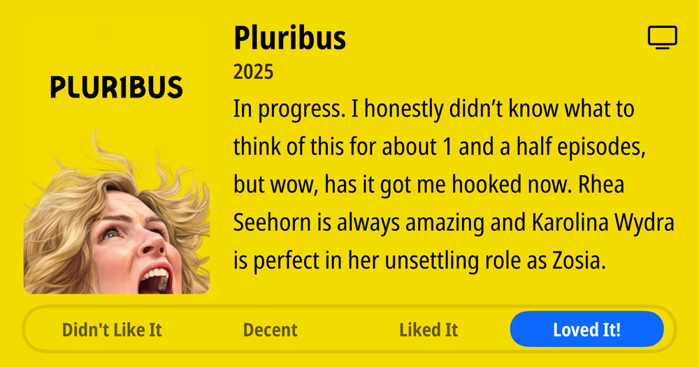
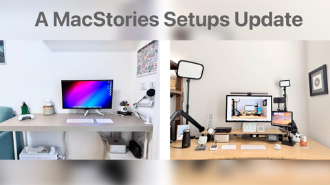

## Current Personal Status
>
> In recent episodes of [Friends with Brews](https://friendswithbrews.com) I've been using the [Riverside](https://riverside.com) combined audio and editing it there to produce the shows, but for [ep 93](https://friendswithbrews.com/93/) I used both of our audio tracks and edited everything in Logic Pro again. The result is the best sounding episode in a long time, audio quality-wise.  

> I also have to say that the [Izotope RX 11](https://www.izotope.com/en/products/rx.html) Dialogue Isolate plugin does a really nice job inside Logic Pro.  

> In site news, I created a link pruner to cautiously prune links for the [Links](/links) page. Well, Opus 4.5 made it, and I told it what to do and what not to do. This is my sum total experience with Opus 4.5 so far, and I have to say, it seems really good.

## Stuff I've recently enjoyed

### Podcasts

*Podcast episodes without links are members-only but I think are interesting enough to post in case you want to investigate them.*

 [NPC: Next Portable Console – Living on the Emulation Edge with the Odin 3](https://overcast.fm/+BI63oQiD2U)
 [Pluribus: The Official Podcast – S1E4: Zetna Fuentes](https://overcast.fm/+BTOhVBfohk)
 [Mac Geek Gab — Apple Tips, Tricks, and Troubleshooting – Call Haptics, Photo GeoData Warnings, and Space-Saving iPhone Tricks](https://overcast.fm/+6TZ9K4vKs)
 Decoder: Ad-Free Edition – What the climate story gets wrong
 [Risky Bulletin – Between Two Nerds: Telcos bad, Cloud good.](https://overcast.fm/+5Sl_4lc30)
 David Pakman Member Feed – 11/24/25: MAGA civil war explodes as economic cracks widen
 David Pakman Member Feed – 11/24/25: TDPS Bonus Show
 [Friends with Brews – Big 50](https://overcast.fm/+9SHiMANyQ)
 Accidental Tech Podcast – 666: We Have Nothing That Hot
 [Chit Chat Across the Pond – CCATP #824 — Adam Engst on Can Agentic Web Browsers Count?](https://overcast.fm/+FcgJ9suJQ)

### Books

[Buried in the Sky • 2012 • Climbers are nuts. People keep dying on these peaks in really unnecessary ways and it very often seems like the result of the most idiotic decisions on the part of people who are supposed to be experienced. Really gripping tale. • Loved It!
](/images/posts/png-image4fe5bf59280-review-07d00041-80c5-40df-96f4-1e73860e4edd.jpg)
[First Contact • 2025 • Becky Ferreira • A delightful look at the science, superstitions, stories, and suppositions behind the search for alien life throughout history. • Loved It!
](/images/posts/png-image447c967d8c0-review-c3a0b328-23e4-4f0e-bdf2-c3320ace2a6f.jpg)

### Movies

[Wick Is Pain • 2025 • Jeffrey Doe • A fun look behind the scenes and lives of the people who made the John Wick movies. Really only these people could have made these movies. • Loved It!
](/images/posts/png-image48b090780c0-review-9b121a86-9efa-44ef-94d0-3484b4c3a18b.jpg)

### TV Shows

[Pluribus • 2025 • In progress. I honestly didn't know what to think of this for about 1 and a half episodes, but wow, has it got me hooked now. Rhea Seehorn is always amazing and Karolina Wydra is perfect in her unsettling role as Zosia. • Loved It!
](/images/posts/png-image434192b3d00-review-d7b6f915-5eba-4de8-bb96-62f51502c240.jpg)
[Dark Winds • 2022 • Season 3 - Just starting Season 3. I think this series has evolved from a "must watch" to "there are things I like about it, and I'll get to it when and if I have time" show for me. There's a funny couple cameos in S3E1 though. • Liked It
](/images/posts/png-image44259b22750-review-1ab7b3f3-74fd-427c-ae6b-8623370cf16f.jpg)

### YouTube

Channel – [Jimmy Kimmel Live](https://www.youtube.com/@JimmyKimmelLive)

[Trump is Hot for Mamdani, Marjorie Taylor Greene Resigns from Congress & RFK Jr’s Explicit Poems](https://www.youtube.com/watch?v=BL0pFxTqK-A&t=634s)

Channel – [Mick Schumacher](https://www.youtube.com/@MickSchumacher)

[I'M RACING INDYCAR NEXT SEASON! Behind the scenes at my first IndyCar test!](https://www.youtube.com/watch?v=vLTjEsRoUek)

Channel – [Theo - t3․gg](https://www.youtube.com/@t3dotgg)

[Anthropic won. This is my new favorite model (sorry Gemini…)](https://www.youtube.com/watch?v=QzEsYFcaAkY&pp=0gcJCRUKAYcqIYzv)

Channel – [MacStories](https://www.youtube.com/@MacStories09)

[A MacStories Setups Update](https://www.youtube.com/watch?v=-RhQhl_QuJI&pp=0gcJCRUKAYcqIYzv)

Channel – [AI LABS](https://www.youtube.com/@AILABS-393)

[Claude Just Introduced a New Way To Fix Your UI](https://www.youtube.com/watch?v=eLDq5TfIHys)

Channel – [Patrick Boyle](https://www.youtube.com/@PBoyle)

[Does OpenAI expect a Government Bailout](https://www.youtube.com/watch?v=cHiZ-7jI0Ew&t=383s)

Channel – [Snazzy Labs](https://www.youtube.com/@snazzy)

[The iPad's Software Problem Is Permanent](https://www.youtube.com/watch?v=bnYLpA5kAbo)

Channel – [Air Crash Investigation](https://www.youtube.com/@Aviationaccidents)

[The Teen in the Cockpit – The Tragedy of Aeroflot Flight 593](https://www.youtube.com/watch?v=w5xjbfyq8bA)

Channel – [AI News & Strategy Daily | Nate B Jones](https://www.youtube.com/@NateBJones)

[Here's the 90 Slide 'AI Eats the World' Talk in 15 Minutes—Plus My Top Takeaways](https://www.youtube.com/watch?v=iGvJpBWWGOU&pp=0gcJCRUKAYcqIYzv)

### Food

 [Home | Long's Vietnamese Kitchen LLC](https://longsvietnamesekitchen.square.site)

