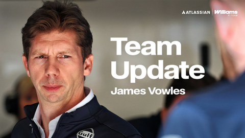
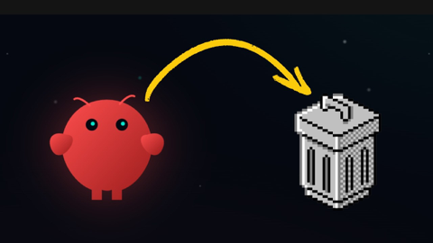
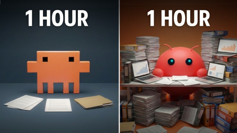
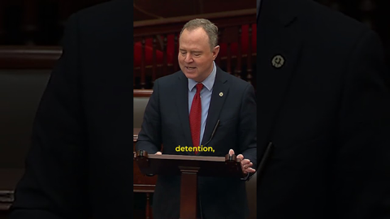
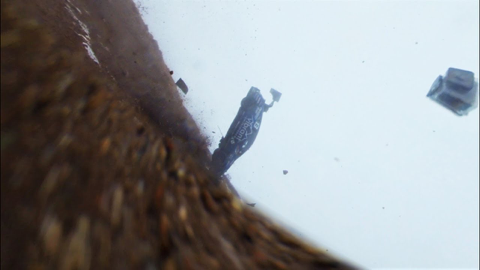

## Current Personal Status
>
> I have been playing with Clawdbot/Moltbot/[OpenClaw](https://openclaw.ai/), and there are some fascinating things about it, and some utterly enraging things about it, and some quite dangerous things about it. I'm not a person that likes huge fanaticism around things, and it's definitely getting that. But there are some aspects of it that do seem like the future of AI agents.

## Current Projects

- Japanese and Korean study (somewhat proficient in J, complete newb to K)

## Stuff I've recently enjoyed

### Podcasts

*Podcast episodes without links are members-only but I think are interesting enough to post in case you want to investigate them.*

 The 404 Media Podcast (Premium Feed) – How Identity Literally Changes What You See (with Samuel Bagg)
 Six Colors+ — Private – Apple results and immersive dogs
 [Killer In The Code – Chapter 6: A Mind For Murder](https://overcast.fm/+BUVQnEXGsM)
 [Comfort Zone – What is This, 1995?](https://overcast.fm/+BI6NTktZ0E)
 AppStories+ – Terminal Tips and Claude Code Workflows
 MacStories Unwind+ – Snowmageddon, Billionaire Blackmail, and Water Beds
 [Accidental Tech Podcast: Unedited Live Stream – 676: A Sternly Worded Instruction](https://atp.fm/676)
 The Race F1 Podcast (Members) – Mercedes’ ominous form, McLaren’s debut, and more on Williams’ shakedown absence (ad-free)
 [Comfort Zone – Where is Everybody?](https://overcast.fm/+BI6NRpGl7I)
 [Judge John Hodgman – No Running Backsies](https://overcast.fm/+YJM3davCM)

### Books

[The Best Science Fiction and Fantasy of the Year Volume 2 • Jonathan Strahan • Mar 1, 2008 • This is a really good and varied compilation of stories. The thing these books do well is introduce you to stories and authors you wouldn't have found yourself, and that are certainly interesting and thought-proving. *****
](/images/posts/png-image477b8a8df50-review-085d7f25-50b9-400e-a578-287471d5d87e.jpg)
[The Convenience Store by the Sea • First Time Read • 2020 • Sonoko Machida • I didn't know what to think of this book initially. It felt slightly stilted, whether due to translation or not, I'm not sure. But I kept reading. And it started drawing me in by brilliantly building intertwined moments of social interactions and vignettes of character development. • Loved It!
](/images/posts/png-image458cbadfd70-review-68981979-9b1f-4d9e-9ae9-1c29c838e7c5.jpg)

### Movies

[THE RIP • First Time Viewing • 2026 • Joe Carnahan • The implausibilities and obvious impossibilities are largely overcome by the plot premise and the likability of some of the characters. Have a Kirin and watch and you'll enjoy it. ***
](/images/posts/png-image47ce83965e0-review-0f62fa43-92c4-4650-8ff9-7a7bc650d6d0.jpg)

### TV Shows

[Shrinking • S3E1 • I still have mixed feelings about this show. Everyone is still snarky in the same way that big groups of friends/acquaintences actually aren't, and it does ruin the genuinely good overall story. ***
](/images/posts/png-image4272a21ca80-review-c8b45daa-b69f-4487-8382-ad44e00b4b16.jpg)

### YouTube

Channel – [Rebecca Watson (Skepchick)](https://www.youtube.com/@RebeccaWatson)

[Scott Adams: Too Dumb to Live](https://www.youtube.com/watch?v=IxUXjmqlarw)

Channel – [Atlassian Williams F1 Team](https://www.youtube.com/@WilliamsF1TV)

[“We are ready for Bahrain!” | James Vowles Team Update](https://www.youtube.com/watch?v=GHBhI1nm2ec)

Channel – [Better Stack](https://www.youtube.com/@betterstack)

[Skills Had ONE Job (They Failed)](https://www.youtube.com/watch?v=i0W90tlKfYg)

Channel – [Better Stack](https://www.youtube.com/@betterstack)

[Why I'm DELETING Clawdbot (Moltbot) After This](https://www.youtube.com/watch?v=CB6Ysb_BLcM&pp=2AasAtIHCQmRCgGHKiGM7w%3D%3D)

Channel – [Nick Saraev](https://www.youtube.com/@nicksaraev)

[Clawdbot Sucks, Actually](https://www.youtube.com/watch?v=esXXuejofgk)

Channel – [Nick Saraev](https://www.youtube.com/@nicksaraev)

[It Got Worse (Clawdbot)](https://www.youtube.com/watch?v=rPAKq2oQVBs)

Channel – [Keith Edwards](https://www.youtube.com/@keithedwards)

[Holy sh*t! Trump is giving up](https://www.youtube.com/watch?v=JS5W8QOhym8&pp=2AbdAg%3D%3D)

Channel – [Nate Herk | AI Automation](https://www.youtube.com/@nateherk)

[100 Hours Testing Clawdbot vs Claude Code (honest results)](https://www.youtube.com/watch?v=CBNbcbMs_Lc&pp=2Ab1Ag%3D%3D)

Channel – [Low Level](https://www.youtube.com/@LowLevelTV)

[bro wtf...](https://www.youtube.com/watch?v=mdYDG34YP4w)

Channel – [Sen. Adam Schiff](https://www.youtube.com/@senadamschiff)

[Enough is enough. Not one more dime for ICE.](https://www.youtube.com/watch?v=wGN6Y0IMr7c)

Channel – [ACUITY Instruments](https://www.youtube.com/@ACUiTYinstruments)

[(WARNING: Crash Footage) Will Au-Yeung's Drive Up Pikes Peak 2022](https://www.youtube.com/watch?v=ZjiNaKv_FHs&pp=0gcJCZEKAYcqIYzv)

Channel – [Allec Joshua Ibay](https://www.youtube.com/@AllecJoshuaIbay)

[Focused On Failure | United Airlines Flight 173](https://www.youtube.com/watch?v=l6yv_oNNlb8)

### Food

 [LONG'S VIETNAMESE KITCHEN (@longs_vietnamesekitchen) • Instagram photos and videos](https://www.instagram.com/longs_vietnamesekitchen/?hl=en)

