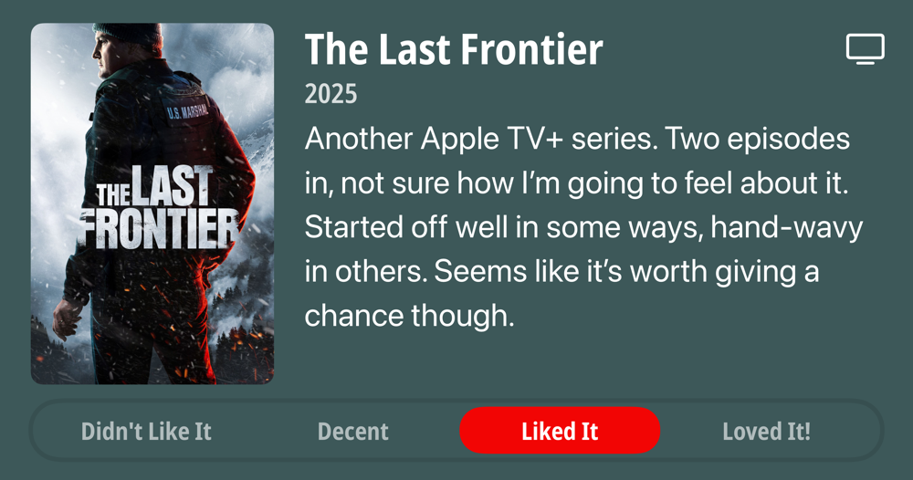

## Current Personal Status

Many vaccines were had, and I was sick for 2 days. PROOF THAT THEY'RE A SCAM!!!!!@#@!!

My 2024 M4 MacBook Pro has a broken Thunderbolt 5 port, just because I plug my hub into it all the time. I'm not rough. I don't abuse it. I just plug and unplug multiple times per day. Now that broken port is causing issues where the Mac can't go to sleep:

***panic(cpu 11 caller 0xfffffe003fad6598): Sleep transition timed out after 35 seconds while calling power state change callbacks. Suspected bundle: com.apple.iokit.IOThunderboltFamily. Thread 0x8b59f1.
Debugger message: panic***

## Stuff I've recently enjoyed

### Podcasts

*Podcast episodes without links are members-only but I think are interesting enough to post in case you want to investigate them.*

 [The MeidasTouch Podcast – Senator Baldwin Calls Out Trump’s Disastrous Shutdown](https://overcast.fm/+anFAJNwxE)
 [Risky Bulletin – Sponsored: Fighting fire with fire](https://overcast.fm/+5Sl9UBsn4)
 [Pod Save America – President of Peace Invades Chicago (feat. JB Pritzker)](https://overcast.fm/+5dspcy1vw)
 [kill switch – will blind gamers ever play Zelda like I do? (part 2)](https://overcast.fm/+4qHq7eMNk)
 [The MeidasTouch Podcast – Rep. Stevens Responds to Trump’s Disastrous Government Shutdown](https://overcast.fm/+anFAHdojU)
 [kill switch – playing video games while blind (part 1)](https://overcast.fm/+4qHpQEYUw)
 [The Vergecast – Maybe it’s real, maybe it’s Sora](https://overcast.fm/+QN1pK3C7M)
 [The MeidasTouch Podcast – Charlie Angus Reacts to Trump Canada Threats](https://overcast.fm/+anFAKNYaM)
 [The Weekly Planet – Tron: Legacy - Caravan Of Garbage](https://overcast.fm/+1HFKVZ1HU)
 [Uncanny Valley | WIRED – WIRED Roundup: Are We In An AI Bubble?](https://overcast.fm/+BFs17TeA1s)

### Books

[A History of What Comes Next • M Sylvain Neuvel • 2021 • A wonderful historical fiction novel that becomes... sci-fi? Yes, and it's a great premise too. It's not always an easy read, because there is a lot of tension and bad times, but it IS a worthy read. • Loved It!
](/images/posts/png-image492cb8af700-review-a142100d-fff7-45c3-9a2c-cbf1609682df.jpg)

### Movies

[The Equalizer 3 • 2023 • Antoine Fuqua • Sometimes you just want to watch crisp, effective killing of bad guys, and Denzel always delivers in spades. I particularly enjoyed watching Marco get stabbed with his own knife he was still holding. • Loved It!
](/images/posts/png-image4dfa8c43f10-review-d2bf8b83-4aab-4a2f-82a2-6010349e6a3d.jpg)
[Highest 2 Lowest • 2025 • Spike Lee • Denzel Washington is always great. This movie was ultimately more uplifting than I expected, and that's ok. The world needs more of that. • Liked It
](/images/posts/png-image41bf880d270-review-15992669-eb47-4747-b1eb-5684492ff8cd.jpg)

### TV Shows

[The Last Frontier • 2025 • Another Apple TV+ series. Two episodes in, not sure how I'm going to feel about it. Started off well in some ways, hand-wavy in others. Seems like it's worth giving a chance though. • Liked It
](/images/posts/png-image41b9a9fec20-review-7a31e41f-7f85-4844-9544-87b1d32b09d7.jpg)

### YouTube

- [ChatGPT’s App Store Moment Has Arrived](https://www.youtube.com/watch?v=HgXdOeSfsfk&pp=0gcJCfwJAYcqIYzv) — [Matt Maher](https://www.youtube.com/@MetalSole)
- [He cried all the way to the shelter 😭😭❤️ @graham.britt](https://www.youtube.com/watch?v=SLgWWgRWDQ0&pp=0gcJCfwJAYcqIYzv) — [We Love Animals](https://www.youtube.com/@We_Love_Animals)
- [🚨 Apple’s M5 MacBook Pro Is About to Launch - But There’s a Twist!](https://www.youtube.com/watch?v=0npDqRAfbGY) — [SaranByte](https://www.youtube.com/@SaranByte)
- [Jane Goodall reflects on hug from rescued chimpanzee](https://www.youtube.com/watch?v=YXKzGzSdMY8) — [Kristie Lu Stout](https://www.youtube.com/@klustout)
- [This Rice Cooker Hack Makes PERFECT Japanese Fried Rice a.k.a. CHAHAN](https://www.youtube.com/watch?v=3ZIJUVhtmBo&t=14s) — [JAPANESE COOKING CHANNEL](https://www.youtube.com/@JapaneseCookingChannel)
- [AI + me: It's difficult](https://www.youtube.com/watch?v=CctJNYYCPo0&t=38s) — [Maximilian Schwarzmüller](https://www.youtube.com/@maximilian-schwarzmueller)
- [The Kindness of Koreans Never Fails to Amaze Me 🇰🇷🥹 #닭곰탕](https://www.youtube.com/watch?v=xHGez1zIcNo&t=22s) — [Jipseekid](https://www.youtube.com/@Jipseekid)
- [Dog's emotional response to freedom from shelter](https://www.youtube.com/watch?v=XDjFlopnv2w) — [GeoBeats Animals](https://www.youtube.com/@GeoBeatsAnimals)
- [When Pilots Push Too Far.. | ALM Flight 980](https://www.youtube.com/watch?v=vK_7q9tixX4&t=11s) — [Mentour Pilot](https://www.youtube.com/@MentourPilot)
