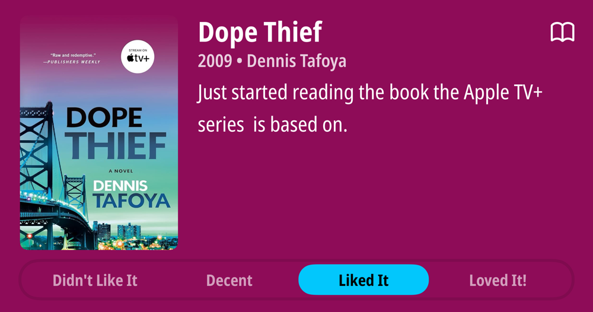
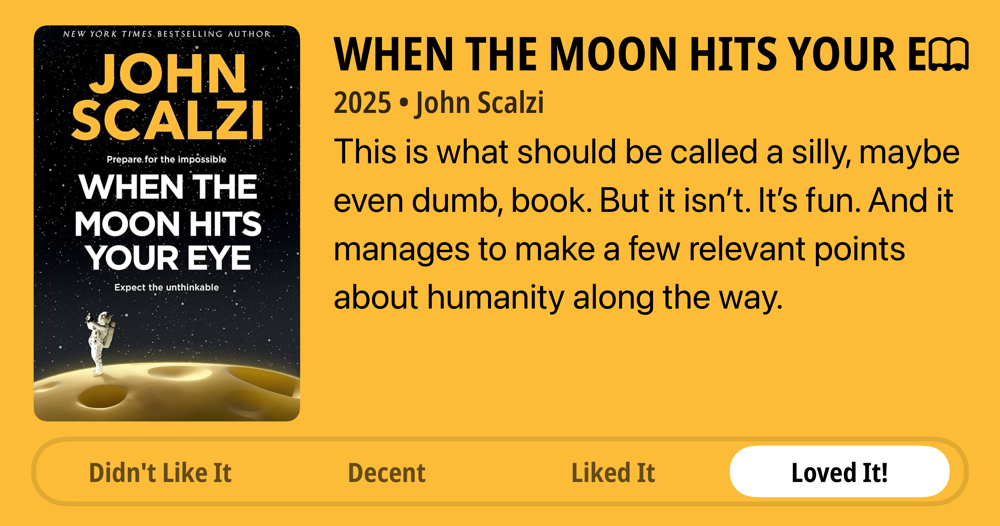

### Podcasts

*Podcast episodes without links are members-only but I think are interesting enough to post in case you want to investigate them.*

- [Whisky Whiskey – 64: Waitui 8 Year Single Malt Whisky](https://overcast.fm/+BLIhfSQtRk)
- [楽しいラジオ「ドングリFM」 – 1177 他人になめられていると思っているそこのあなた！](https://overcast.fm/+9ABIfEpxM)
- [P1 with Matt and Tommy – Reaction to Miami GP qualifying](https://overcast.fm/+_U3roZyHQ)
- The Race F1 Podcast (Members) – Scott and Jon on a mad Miami Saturday
- [The Rebound – 544: General Misery About Life and Technology](https://overcast.fm/+De1mp7EMc)
- The Race F1 Podcast (Members) – Antonelli’s shock first big F1 statement explained [ad-free video]
- System Crash – Eric Schmidt’s Pivot to Military AI Salesman
- [P1 with Matt and Tommy – Reaction to Miami GP sprint qualifying](https://overcast.fm/+_U3qIOP0U)
- Bring Back V10s (Members) – ⭐️ BBV10s Extra: Why didn’t Brundle win in F1? Your questions answered
- [The Weekly Planet – The Bourne Supremecy - Caravan Of Garbage](https://overcast.fm/+1HFIrxJTU)

### Books

[Dope Thief • 2009 • Dennis Tafoya Just started reading the book the Apple TV+ series is based on. • Liked It
](/images/posts/PngImage40Bd9F28480-review-625a28b3-ad34-42d4-bcc1-410daf6cb486.jpg)
[When the Moon Hits Your Eye • 2025 • John Scalzi This is what should be called a silly, maybe even dumb, book. But it isn't. It's fun. And it manages to make a few relevant points about humanity along the way. • Loved It!
](/images/posts/PngImage478AB806140-review-c6ab51ae-7a02-4f74-b2df-dc93d7044ffe.jpg)

### Movies

[Havoc • 2025 • Gareth Evans • I made it 5 minutes into this movie and shut it off. It's that stupid. I don't know if this is intentionally dumb, parody style, or if it's unconsciously dumb. Either way, it IS dumb. • Didn't Like It
](/images/posts/PngImage4Dfe875FA10-review-32855506-9d88-42ca-b103-16d3720538ae.jpg)

### TV Shows

[Dope Thief S1 • 2025 • I can't decided how l'd rate this overall, because it does have some slow moving points and a couple glaring weaknesses. But it's also one of the shows I look forward to the most. So... I guess I love it? • Loved It!
](/images/posts/PngImage46C597C18A0-review-3be13a87-0e74-4863-ac6b-4ef5137449f6.jpg)

### Food and Drink

- [JCD BBQ](https://www.jcdbbq.com/)
- Trader Joe's Green Tea Mochi Ice Cream
- [Angel Wings Blend – Proud Mary Coffee USA](https://proudmarycoffee.com/collections/all-coffee/products/angel-wings)
- [Kicking Horse Coffee - Smart Ass – Kicking Horse Coffee - USA](https://kickinghorsecoffee.com/collections/coffee/products/smart-ass-coffee)
- [Yonder - Forecast Coffee Company](https://forecastcoffeecompany.com/product/yonder/)
