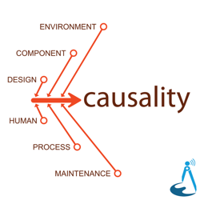
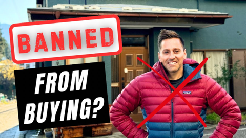
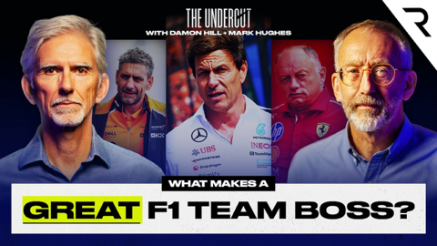

## Current Personal Status
>
> This week I feel overwhelmed with all the things I need and want to get done. I could easily just sleep all day most days, and I'm not sure what that's all about, but I have goals that I want to make progress on, so I'm not taking those naps that I want so much. No. Not happening.
>
> I do wish I was a cat though.

## Stuff I've recently enjoyed

### Podcasts

*Podcast episodes without links are members-only but I think are interesting enough to post in case you want to investigate them.*

 The Vergecast: Ad-Free Edition – I just want AI to rename my photos
 [Whisky Whiskey – 141: Ardbeg Uigeadail Single Malt Whisky](https://overcast.fm/+BLIhddlluo)
 AppStories+ – Designing for Liquid Glass: Outstanding Indie Apps
 [On Margins – s02e04 - W. David Marx — Blank Space: A Cultural History of the 21st Century](https://overcast.fm/+JG_NNHRgM)
 Bring Back V10s (Members) – BBV10s 1993 Revisited: Japanese GP
 [Podcast by Yuka Studio // ユカスタポッドキャスト – Ep.125 折り目が見えないiPhone Fold?! 気になる噂😲 今週のテックニュース](https://overcast.fm/+-w729Tygc)
 [Leave America: Unfiltered – Portugal Digital Nomad Dream or Paperwork Nightmare](https://overcast.fm/+BTxUcYw1Ls)
 The Race F1 Podcast (Members) – Qatar sprint race and qualifying debrief - In-car Insights
 [Causality – 61: West Gate Bridge](https://overcast.fm/+fjzSOcZ5o)
 The Race F1 Podcast (Members) – Qatar F1 sprint qualifying debrief - while hunting for a lost hire car

### Books

[Buried in the Sky • 2012 • Climbers are nuts. People keep dying on these peaks in really unnecessary ways and it very often seems like the result of the most idiotic decisions on the part of people who are supposed to be experienced. Really gripping tale. • Loved It!
](/images/posts/png-image4fe5bf59280-review-07d00041-80c5-40df-96f4-1e73860e4edd.jpg)
[First Contact • 2025 • Becky Ferreira • A delightful look at the science, superstitions, stories, and suppositions behind the search for alien life throughout history. • Loved It!
](/images/posts/png-image447c967d8c0-review-c3a0b328-23e4-4f0e-bdf2-c3320ace2a6f.jpg)

### Movies

[Wick Is Pain • 2025 • Jeffrey Doe • A fun look behind the scenes and lives of the people who made the John Wick movies. Really only these people could have made these movies. • Loved It!
](/images/posts/png-image48b090780c0-review-9b121a86-9efa-44ef-94d0-3484b4c3a18b.jpg)

### TV Shows

[Pluribus • 2025 • In progress. I honestly didn't know what to think of this for about 1 and a half episodes, but wow, has it got me hooked now. Rhea Seehorn is always amazing and Karolina Wydra is perfect in her unsettling role as Zosia. • Loved It!
](/images/posts/png-image434192b3d00-review-d7b6f915-5eba-4de8-bb96-62f51502c240.jpg)
[Dark Winds • 2022 • Season 3 - Just starting Season 3. I think this series has evolved from a "must watch" to "there are things I like about it, and I'll get to it when and if I have time" show for me. There's a funny couple cameos in S3E1 though. • Liked It
](/images/posts/png-image44259b22750-review-1ab7b3f3-74fd-427c-ae6b-8623370cf16f.jpg)

### YouTube

Channel – [Pilot Debrief](https://www.youtube.com/@pilot-debrief)

[The DEADLY Truth About The Dallas Air Show Crash!](https://www.youtube.com/watch?v=OFwoExC__MQ)

Channel – [Cat Dog Diary](https://www.youtube.com/@CatDogDiary-6868)

[Abandoned Puppy Meets Kitten for the First Time — His Reaction Will Melt Your Heart!](https://www.youtube.com/watch?v=_iKKA2DoG9k&pp=0gcJCRYKAYcqIYzv)

Channel – [Shu Matsuo Post](https://www.youtube.com/@shumatsuopost)

[Why YOU Can't Buy a House in Japan](https://www.youtube.com/watch?v=BID91xWyCnQ&pp=0gcJCRYKAYcqIYzv)

Channel – [Shu Matsuo Post](https://www.youtube.com/@shumatsuopost)

[How to Buy a Cheap Akiya House in Japan as a Foreigner (Step-By-Step)](https://www.youtube.com/watch?v=Zk0OgjTff2Q&t=7s)

Channel – [RetireJapan – Personal Finance in Japan](https://www.youtube.com/@RetireJapan_OG)

[Should YOU rent or buy your home in Japan?](https://www.youtube.com/watch?v=M0BzCHlEc2U)

Channel – [Matt Guy](https://www.youtube.com/@im.mattguy)

[Japan Might Ban Foreigners From Buying Homes: What’s Happening?](https://www.youtube.com/watch?v=-9d7aGO6L7o)

Channel – [Captain Steeeve](https://www.youtube.com/@CaptainSteeeve)

[“If You Want To Live…” – Newark ATC Breakdown | Captain Steeeve Reacts](https://www.youtube.com/watch?v=_leTSEOBvxE)

Channel – THE RACE and The Race Podcasts

[NEW Damon Hill F1 show! - The evolution of F1 team bosses | The Undercut E1](https://www.youtube.com/watch?v=-77L1oq0X9M&t=38s)

Channel – [PeriscopeFilm](https://www.youtube.com/@PeriscopeFilm)

[1962 NEW YORK AIRWAYS HELICOPTER SERVICE TO MANHATTAN  PROMOTIONAL FILM 34204](https://www.youtube.com/watch?v=AY18c0X4uWg)

