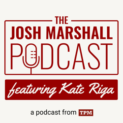

### Podcasts

*Podcast episodes without links are members-only but I think are interesting enough to post in case you want to investigate them.*

[Comfort Zone – Niléane’s Favorite Dinosaur](https://overcast.fm/+BI6NQYt6oQ)
![The true impact of F1’s new front wing rules [ad-free video]](../../assets/images/oc_artwork/5523677833009558-aedb91b8-3343-4982-b957-dc96de116ce0.png)The Race F1 Podcast (Members) – The true impact of F1’s new front wing rules
[Risky Bulletin – Srsly Risky Biz: Russia’s cybercriminals and spies are officially in cahoots](https://overcast.fm/+5Sl_3EKh0)
[How to Fix the Internet – Love the Internet Before You Hate On It](https://overcast.fm/+1CUfl5Jno)
[The Josh Marshall Podcast – The Never-ending Reckoning](https://overcast.fm/+TzjhmlVTM)
[Robot or Not? – 313: Tech](https://overcast.fm/+Ep2Smt5NA)
[Chit Chat Across the Pond – CCATP #814 — Adam Engst on Deep Linking and VPN Survey](https://overcast.fm/+FcgJ-vap0)
[Business Brain – The Entrepreneurs’ Podcast – Survival Entrepreneurship](https://overcast.fm/+8JFTVAucM)
[The Rebound – 548: Let’s Sound Naïve Together](https://overcast.fm/+De1mamKjs)
Trial Balloon – Night Moves

### Books

[Apple in China • 2025 • Patrick McGee • Yes, another book I'm reading. Just started, very detailed, interesting, and informative. Though provoking, even. • Loved It!
](/images/posts/PngImage4E66B0E7360-review-453b70ef-bc9d-4c44-b396-2661a9985c76.jpg)
[Things Become Other Things • 2025 • Craig Mod Craig has been wandering Japan on foot for decades, photographing and talking and observing, and he does brings the experience to life in a very spiritual way. He brings to life the importance of caring about things in the way that modern techno-fascist ideologies do exactly the opposite of. I'm hooked and trying to keep from racing through this. • Loved It!
](/images/posts/PngImage448EBd8A8B0-review-f01235a8-8438-4a0b-9367-e774289563b4.jpg)
[Dope Thief • 2009 • Dennis Tafoya • Not quite the impact of the tv series for me, but quite good nonetheless. If you've watched the TV series and liked it, you can probably skip the book unless you really want to see what the differences in the original story were. • Liked It
](/images/posts/PngImage46E8Bc34D10-review-522d036e-737a-4984-b24e-5e2f3f730b24.jpg)

### TV Shows

[Your Friends & Neighbors • 2025 • What a season! What a show! This ranks way up there on the all time favorites list. Very curious about where it goes next. • Loved It!
](/images/posts/PngImage408C8502Fa0-review-a1dd1633-678b-44fd-ad50-055df7276f98.jpg)
[Murderbot • 2025 • I haven't decided how I feel about this one enough to stop watching it or to know if I'll KEEP watching it very much longer. Could go either way. • Decent
](/images/posts/PngImage4B219998Fb0-review-496904a1-810a-48fa-8fe4-0834c60f82dc.jpg)
[Government Cheese • 2025 • Quirky and funny and I haven't really figured it out yet, but I'm along for the ride! • Loved It!
](/images/posts/PngImage4518932DAd0-review-b31a20ad-4155-48fd-8752-5f57ee733a28.jpg)
[Long Way Home • 2025 • The Long Way series are always very entertaining, and two episodes in, this is no exception. I really love the European focus of this one. Will keep watching. • Loved It!
](/images/posts/PngImage45C88D92520-review-176fb98d-e50d-4881-964a-f0cb2542add3.jpg)

### Food and Drink

- [Pacific Flyway – Water Avenue Coffee](https://wateravenuecoffee.com/collections/beans/products/pacific-flyway)
- [Tilikum Crossing Decaf - 12oz Whole Bean](https://www.portlandcoffeeroasters.com/consumer/tilikum-crossing-decaf-12oz-whole-bean)
- [Cantina Especial | Grains of Wrath](https://gowbeer.com/beer/cantina-especial/)
- [LIVING HÄUS BEER CO](https://www.livinghausbeer.com/) Baby Shay Oatmeal Stout
