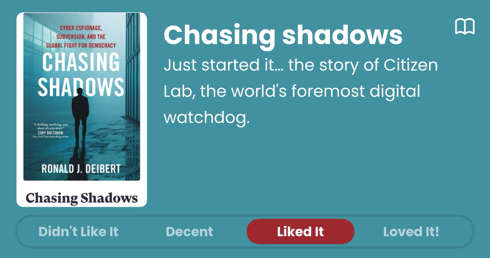
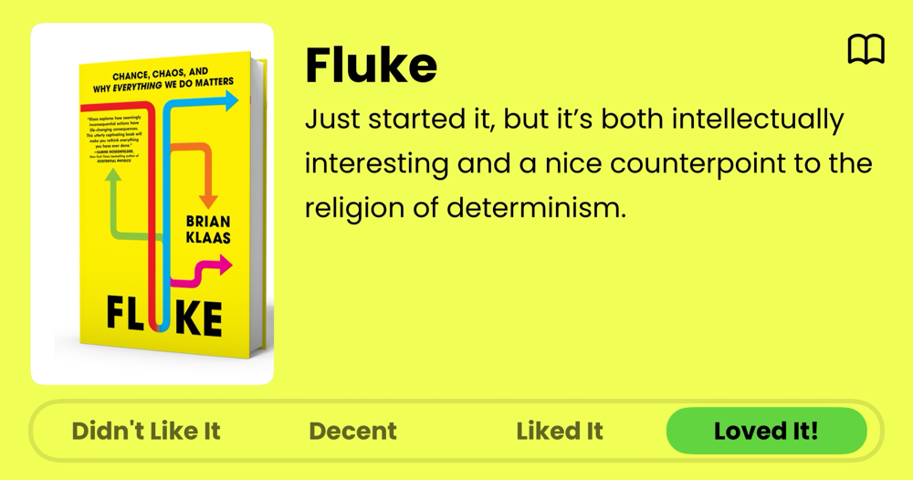
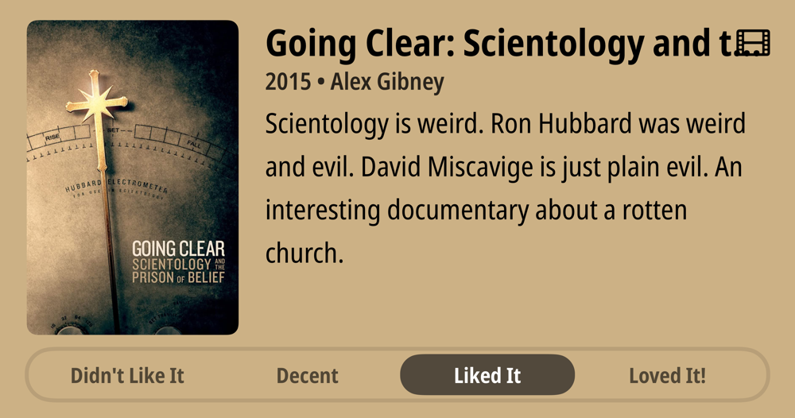
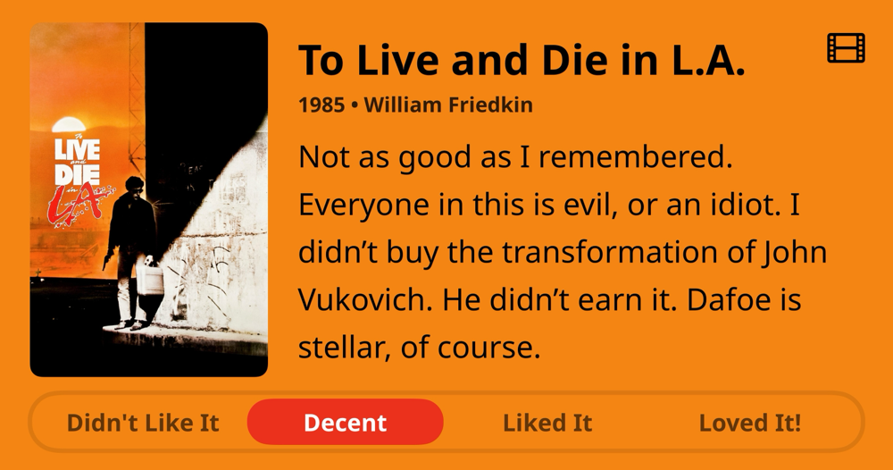
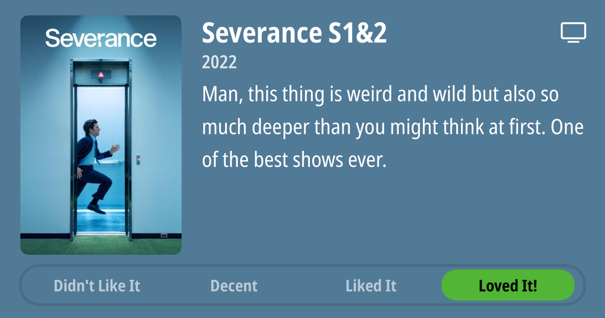
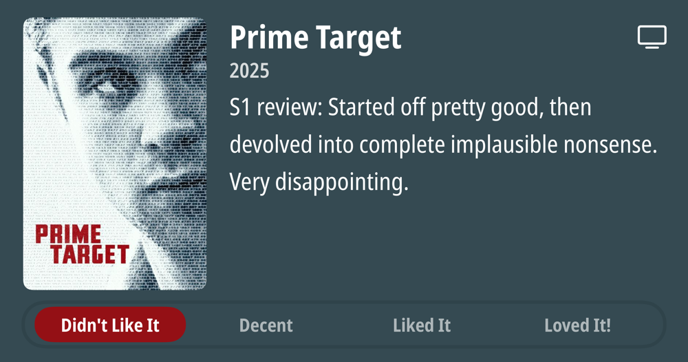
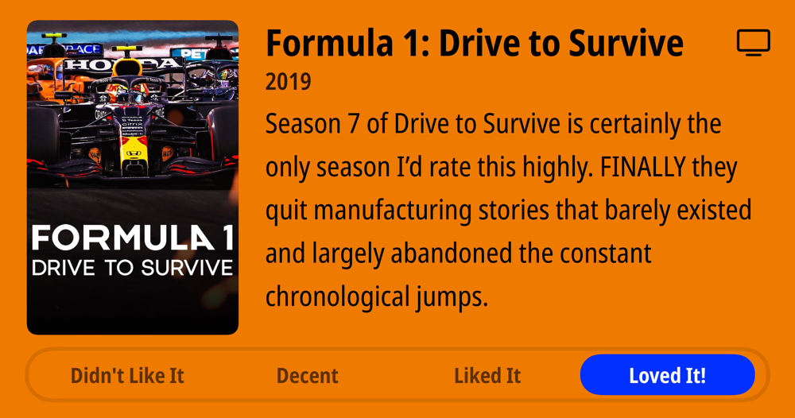
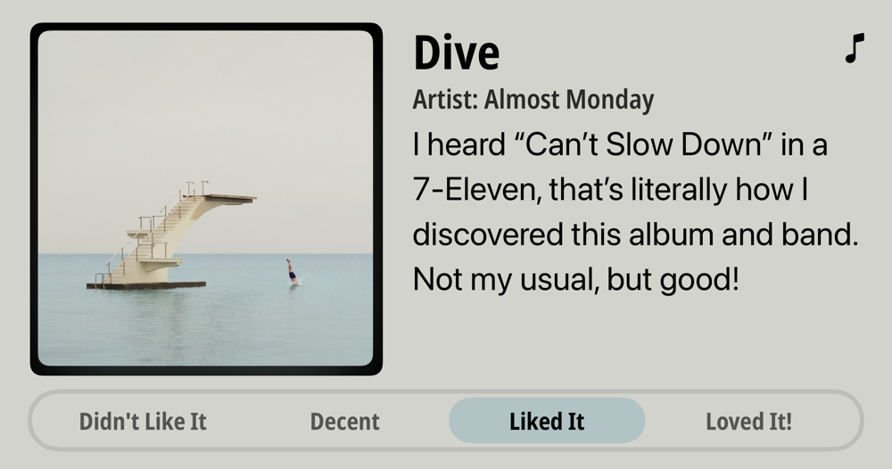

### Podcasts

*Podcast episodes without links are members-only but I think are interesting enough to post in case you want to investigate them.*

- [P1 with Matt and Tommy – Reaction to Chinese GP sprint qualifying](https://overcast.fm/+_U3ppmGSM)
- Accidental Tech Podcast – ATP Insider: Our Websites
- [Blurring The Lines Podcast – Episode 226 – Fear and Greed Index](https://overcast.fm/+GsOl1LdWY)
- [Otherwise Objectionable – Episode 2: The Dawn of the Internet](https://overcast.fm/+BNy4MTuHUs)
- [Formula For Success – Worst Wheel-to-Wheel Racer on the Grid?](https://overcast.fm/+_0VHj84h0)
- The Race Members' Club 2025 – The Race F1 Podcast pays tribute to Eddie Jordan, maverick team boss
- [Ctrl-Alt-Speech – Once You Slop, You Can’t Stop](https://overcast.fm/+BHRYE3y5Z4)
- [Otherwise Objectionable – Episode 1: The Most Misunderstood Law on the Internet](https://overcast.fm/+BNy4NYU84E)
- [Decoder with Nilay Patel – The movement to take down Tesla](https://overcast.fm/+QLdsUxWYc)
- [Accidental Tech Podcast: 631: The Colors Are the Pepperoni](https://atp.fm/631)

### Books

*Don't be surprised when the book list stays constant for awhile. Reading time is harder to come by these days. 😞*  

### Movies

### TV Shows

### Music

### Food and Drink

- [Syun Izakaya](https://www.syunhillsboro.com/#21)
- [Sisters Coffee Company](https://sisterscoffee.com/)
- [Fair Trade Organic Bolivian Blend | Trader Joe's](https://www.traderjoes.com/home/products/pdp/fair-trade-organic-bolivian-blend-074367)
- [Wayfinder Beer](https://www.wayfinder.beer/) LA MAGIE - FRENCH PILSNER
