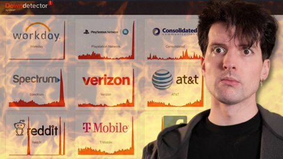
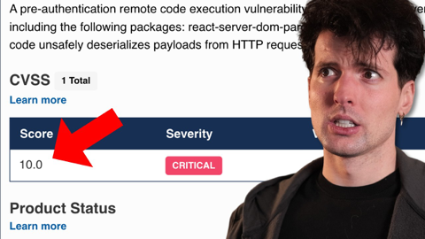

## Current Personal Status
>
> I started setting up the Sophos XGS 88 but it didn't go super well. Simple Setup never finished correctly and I'm going to wind up manually configuring everything. On top of it, although it seemed to be doling out IP addresses to my devices, none of them could reach the internet. For the sake of other humans in my house, I called it a day and put everything back to normal until everyone's out of the house except me sometime.

## Stuff I've recently enjoyed

### Podcasts

*Podcast episodes without links are members-only but I think are interesting enough to post in case you want to investigate them.*

 [Pluribus: The Official Podcast – S1E7: The Gap](https://overcast.fm/+BTOhXj_ymg)
 [Pluribus: The Official Podcast – S1E6: Jennifer Bryan](https://overcast.fm/+BTOhV84WcQ)
 [Comfort Zone – I Got a Flu From This Keyboard](https://overcast.fm/+BI6NQHNkVU)
 Accidental Tech Podcast – 669: Ternus, Take the Wheel
 [Faceless – 7: Facing the Truth](https://overcast.fm/+8kaU2JwSk)
 [Faceless – 6: Young Blood](https://overcast.fm/+8kaVeKggg)
 [Faceless – 5: Grains of Truth](https://overcast.fm/+8kaUG0MYA)
 [Faceless – 4: Four Wheels](https://overcast.fm/+8kaVLX-R0)
 [Faceless – 3: Goldilocks](https://overcast.fm/+8kaXlwgUs)
 The Vergecast: Ad-Free Edition – The geek’s guide to running faster

### Books

[First Contact • 2025 • Becky Ferreira • A delightful look at the science, superstitions, stories, and suppositions behind the search for alien life throughout history. • Loved It!
](/images/posts/png-image447c967d8c0-review-c3a0b328-23e4-4f0e-bdf2-c3320ace2a6f.jpg)

### Movies

[Tinker Tailor Soldier Spy • 2011 • Tomas Alfredson • They don't make many movies like this anymore. Both intelligently written and yet not overly- wrought with twists and surprises, it's a subtly played movie staring Gary Oldman at his best, but with a stellar cast in general. Highly recommended. • Loved It!
](/images/posts/png-image48638ea78c0-review-3aedf0b6-0108-41da-a3e3-2096c4e6cd7e.jpg)
[Wick Is Pain • 2025 • Jeffrey Doe • A fun look behind the scenes and lives of the people who made the John Wick movies. Really only these people could have made these movies. • Loved It!
](/images/posts/png-image48b090780c0-review-9b121a86-9efa-44ef-94d0-3484b4c3a18b.jpg)

### TV Shows

[Pluribus • 2025 • In progress. I honestly didn't know what to think of this for about 1 and a half episodes, but wow, has it got me hooked now. Rhea Seehorn is always amazing and Karolina Wydra is perfect in her unsettling role as Zosia. • Loved It!
](/images/posts/png-image434192b3d00-review-d7b6f915-5eba-4de8-bb96-62f51502c240.jpg)

### YouTube

Channel – [Theo - t3․gg](https://www.youtube.com/@t3dotgg)

[Anthropic gave MCP to the Linux Foundation](https://www.youtube.com/watch?v=5DeqL844pH0)

Channel – [Adam Mockler](https://www.youtube.com/@adammockler)

[We got him.](https://www.youtube.com/watch?v=CaFHHscC-co)

Channel – [Epic Lines](https://www.youtube.com/@EpicLinesClips)

[Jim Carrey’s HILARIOUS Old Captain Kirk Parody](https://www.youtube.com/watch?v=FgRE5Bp8QP4)

Channel – [Racing Avenue](https://www.youtube.com/@racingavenuechannel)

[Ex-Ferrari Mechanic Says Hamilton Could Be Next Schumacher But Team Risks Vicious Circle](https://www.youtube.com/watch?v=vhlDhnRtn1U)

Channel – [BM Tech Tutorials](https://www.youtube.com/@BMTechTutorials)

[How to Use Cloudflare DNS [2025 Guide]](https://www.youtube.com/watch?v=10S_vbRQVE8)

Channel – [Theo - t3․gg](https://www.youtube.com/@t3dotgg)

[Software Sucks Now](https://www.youtube.com/watch?v=FI5ba4RRE8U)

Channel – [Theo - t3․gg](https://www.youtube.com/@t3dotgg)

[React got hacked. It's really, really bad.](https://www.youtube.com/watch?v=UiCEejcV5N4&t=907s)

Channel – [Sen. Adam Schiff](https://www.youtube.com/@senadamschiff)

[A New Housing Boom In America](https://www.youtube.com/watch?v=kAVziUsENbE&t=50s)

Channel – [Patrick Boyle](https://www.youtube.com/@PBoyle)

[The Infinite Money Glitch is Broken!](https://www.youtube.com/watch?v=fhsrkvEY55s&t=1348s)

