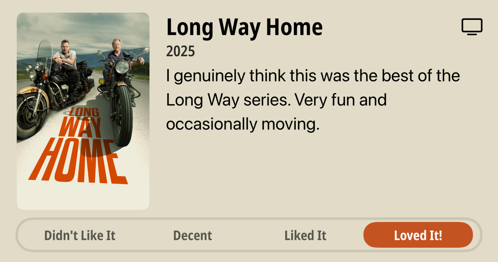

### Current Personal Status

Somehow I've managed to be sick the majority of the 3 weeks I've been back from Japan. EVEN MORE REASON I SHOULD NEVER HAVE COME BACK!!

Oh, well.

### Podcasts

*Podcast episodes without links are members-only but I think are interesting enough to post in case you want to investigate them.*

[P1 with Matt and Tommy – Our 2025 Belgian GP Predictions](https://overcast.fm/+_U3qvJIaE)
[Whisky Whiskey – 103: Cape Byron Chardonnay Cask Single Malt Whisky](https://overcast.fm/+BLIhe-uQbc)
[NPC: Next Portable Console – Hello from 1998: Revisiting Past Handhelds](https://overcast.fm/+BI63rrKx5M)
The Race F1 Podcast (Members) – Road to F1: Which Formula 1 team has the best junior roster?
[楽しいラジオ「ドングリFM」 – 1198 進撃のドンキ](https://overcast.fm/+9ABJOv3iI)
[Mac Geek Gab — Apple Tips, Tricks, and Troubleshooting – Stump The Geeks Live from Macstock 2025](https://overcast.fm/+6TZ_mt6yI)
Bring Back V10s (Members) – BBV10s Debrief: Monza 2003
[Decoder with Nilay Patel – Why tech billionaires want a ‘corporate dictatorship’](https://overcast.fm/+QLduW-PKE)
[Robot or Not? – 319: Market](https://overcast.fm/+Ep2Re1XD0)
[Whisky Whiskey – 102: Cape Byron Viognier Cask Single Malt Whisky](https://overcast.fm/+BLIhfMda_Q)

### Books

[Sir Lewis • 2025 • Michael Sawyer Look. Lewis is an actual role model, and he's also a true legend. This book was just a little too willing to bypass nuances in a couple cases and overstate its case. It did not need to do that, because Lewis' life and work speaks for itself. • Liked It
](/images/posts/PngImage498A9F6D680-review-9e725bb8-827b-4445-9e2c-5b07a9cad227.jpg)

### Movies

[Ballerina • 2025 • Len Wiseman • Sometimes you just want to see people get shot and stabbed, and this is a lot of fun for that. John Wick movies always have interesting choreography and fights. Ana de Armas is fine as Eve and the action is all very well done. • Loved It!
](/images/posts/PngImage4A7CA53B7C0-review-a5e3466d-ac29-4207-a480-7dd4a72f8beb.jpg)

### TV Shows

[Murderbot S1 • 2025 • I didn't expect to love this. I didn't even want to like it after a couple episodes. But I do! I love it! It's fun and somehow heartwarming. • Loved It!
](/images/posts/PngImage4Cee8279170-review-8f5cff22-2481-41cf-83f2-8ba425311f71.jpg)
[Somebody Feed Phil • 2018 • 8 seasons in, this is one of the happiest and insistently must-see shows I know of. Watch it. Pay for the goddamned Netflix account JUST FOR THIS. If you don't, I have to ask - why do you hate yourself? • Loved It!
](/images/posts/PngImage4Bbc86C7Ea0-review-99b30486-a314-4ae9-a35a-b140f463e70f.jpg)
[Long Way Home • 2025 • I genuinely think this was the best of the Long Way series. Very fun and occasionally moving. • Loved It!
](/images/posts/PngImage4283Bc41Ac0-review-6d7a7c39-ba51-49a4-8651-0c949db5c8a8.jpg)

### Food and Drink

- [Home | ramen-ryoma](https://www.ramenryoma.net/) Don't get me wrong, it's very good, but... it's not Japan. IT'S NOT JAPAN!!
- [Fuji Ramen](https://maps.apple.com/place?address=24-5,%20Asakusa%201-Ch%C5%8Dme,%20Taito,%20Tokyo,%20Japan%20111-0032&coordinate=35.712421,139.792413&name=Fuji%20Ramen&place-id=I8EE20D2C8493F88&map=explore) (富士らーめん) in Asakusa, Tokyo – A great ramen shop with a very friendly owner who tries to learn the languages of all his foreign guests. The ramen was delicious.
- [Matcha Cafe](instagram.com/kotobukiseian) in Asakusa, Tokyo – Wow, the matcha shakes and the matcha pudding and the Mozzarella cheese toast!
- [Michiya Tonkatsu](https://michiya-kagoshima.com/) (みちや) in Kagoshima – The best tonkatsu – not *I think*, but *I KNOW*, I've ever had, and I've had a lot of tonkatsu.
