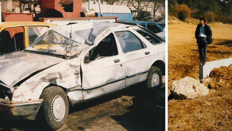
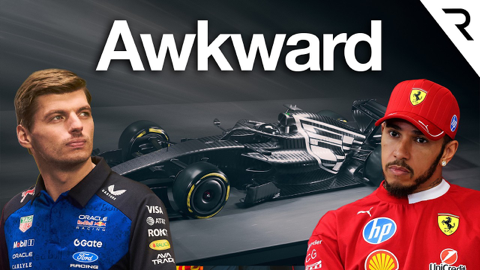

## Current Personal Status
>
> Created a cli dashboard for my website related utility scripts, which is nice - one place to run them all that does not depend on Shortcuts for anything.

## Current Projects

- Japanese and Korean study (somewhat proficient in J, complete newb to K)

## Stuff I've recently enjoyed

### Podcasts

*Podcast episodes without links are members-only but I think are interesting enough to post in case you want to investigate them.*

 [Risky Business – Risky Business #820 — Asian fraud kingpin will face Chinese justice (pew pew!)](https://overcast.fm/+It0iVEbp8)
 [Judge John Hodgman – Probst-bate Court](https://overcast.fm/+YJM2gPEpU)
 [We Contain Multitudes – 1: Premee Mohamed - The Bugge](https://overcast.fm/+BTf6HuCRI4)
 Tech Won't Save Us (Premium) – Reimagining Our Relationship with Digital Tech w/ Paris Marx
 AppStories+ – A Very ‘Just Build It’ Holiday
 Six Colors+ — Private – Corporate governance and an iPad-iPhone hybrid
 The Undercut with Damon Hill and Mark Hughes – When should F1 drivers retire? - The Undercut, episode 2 (ad-free)
 The Vergecast: Ad-Free Edition – Siri is a Gemini
 [The Incomparable Mothership – 800: Draft Science](https://overcast.fm/+kMbSBCZY)
 [Podcast by Yuka Studio // ユカスタポッドキャスト – Ep.130 SiriにGoogle Geminiが搭載される🔥 今週のテックニュース](https://overcast.fm/+-w73rmWwk)

### Books

[The Convenience Store by the Sea • First Time Read • 2020 • Sonoko Machida • I didn't know what to think of this book initially. It felt slightly stilted, whether due to translation or not, I'm not sure. But I kept reading. And it started drawing me in by brilliantly building intertwined moments of social interactions and vignettes of character development. • Loved It!
](/images/posts/png-image458cbadfd70-review-68981979-9b1f-4d9e-9ae9-1c29c838e7c5.jpg)
[Grid to Glory • 2025 • Alex Jacques • Alex Jacques is one of my favorite F1 commentators. His personality shines, and he's clearly a hard worker who knows what he's doing. The stories he's chosen for this book are compelling, but the writing style pulls me out of them. He uses sentence fragments instead of commas, and sometimes the background explanations are slightly muddled. Good, not great. • Decent
](/images/posts/png-image4dd09994160-review-c50952a1-62fd-4f67-a41d-85082a7e6f69.jpg)

### Movies

[The Perfect Neighbor • First Time Watch • 2025 • Geeta Gandbhir • You kind of have to be into crime documentaries to like this, but the real takeaway here is how stupid Stand Your Ground laws and the people who think they're a good idea are. Also, this lady was whack. • Liked It
](/images/posts/png-image4c91b6db330-review-a705ca39-8f1d-429b-a3bd-f461b37a31ea.jpg)

### YouTube

Channel – [Peter Windsor](https://www.youtube.com/@peterwindsor)

[Sir Frank Williams: the road crash by Peter Windsor](https://www.youtube.com/watch?v=Tbo8t13q-U0)

Channel – [THE RACE](https://www.youtube.com/@WeAreTheRace)

[F1 2026's most uncomfortable questions](https://www.youtube.com/watch?v=r3J7Buo-juw)

Channel – [Theo - t3․gg](https://www.youtube.com/@t3dotgg)

[Claude Cowork: a small taste of AGI](https://www.youtube.com/watch?v=IcQEaopx90g)

Channel – [Captain Steeeve](https://www.youtube.com/@CaptainSteeeve)

[ATC Gets Sharp on the Radio at SFO — What Went Wrong? | Captain Steeeve Reacts](https://www.youtube.com/watch?v=dY7tH5Hv64g)

Channel – [Andy Chats F1](https://www.youtube.com/@andychatsf1)

[The Day Alain Prost Had No Fuel & Still HUMILIATED His Rivals](https://www.youtube.com/watch?v=Czv9RvVlb7c&t=460s)

Channel – [Eric Tech](https://www.youtube.com/@EricWTech)

[Claude Code Just Got Way Better | Auto Claude Kanban Boards](https://www.youtube.com/watch?v=vPPAhTYoCdA&t=178s)

Channel – [eXtreme](https://www.youtube.com/@TheExtreme-Edge)

[The Terrifying Last Minutes of Todd Skinner](https://www.youtube.com/watch?v=qtWFowQIaRc)

Channel – [Theo - t3․gg](https://www.youtube.com/@t3dotgg)

[We need to talk about Ralph](https://www.youtube.com/watch?v=Yr9O6KFwbW4)

Channel – [C.W. Lemoine](https://www.youtube.com/@CWLemoine)

[Jeju Air 737 Crash Update - Cockpit Communications Analyzed](https://www.youtube.com/watch?v=h5ZulhWZADI)

Channel – [FORMULA 1](https://www.youtube.com/@Formula1)

[How Esteban Ocon Spends Time Away From Racing | Off The Grid](https://www.youtube.com/watch?v=KQlAz19tzY4&pp=0gcJCU8KAYcqIYzv)

Channel – [Captain Steeeve](https://www.youtube.com/@CaptainSteeeve)

[New NTSB Findings Raise Serious Questions About UPS Crash](https://www.youtube.com/watch?v=-eymH7PIh2c)

Channel – [Japan Animal Travels](https://www.youtube.com/@JapanAnimalTravels)

[80 Cats!? Inside Japan’s Dreamiest Cat Hotel!🐈🏨](https://www.youtube.com/watch?v=aCaUE0HBjNM&t=453s)

### Food

 [LONG'S VIETNAMESE KITCHEN (@longs_vietnamesekitchen) • Instagram photos and videos](https://www.instagram.com/longs_vietnamesekitchen/?hl=en)

