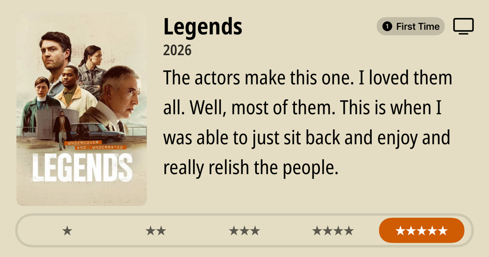
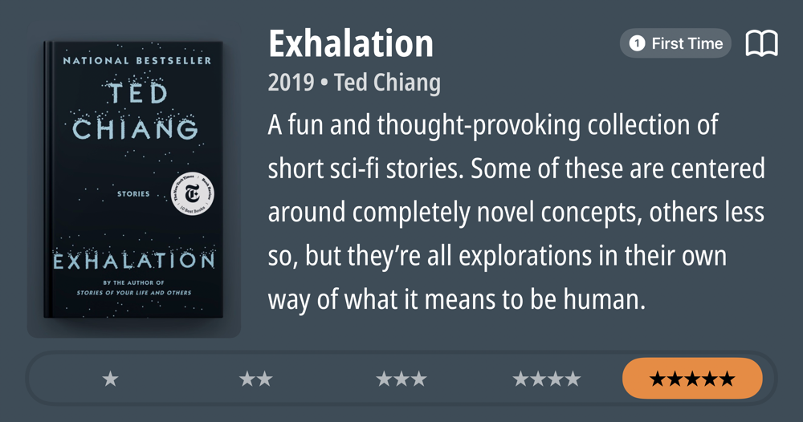
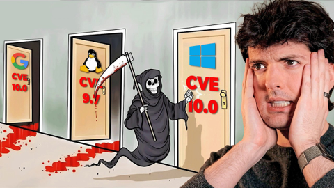
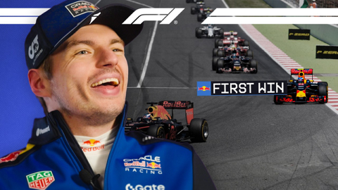
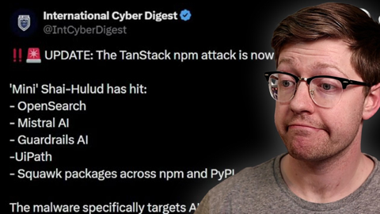
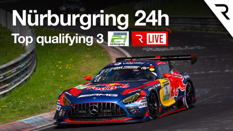
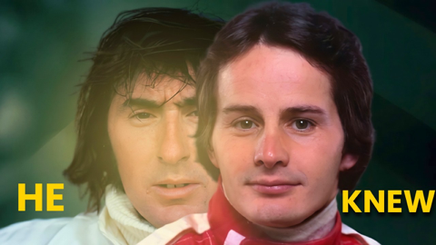
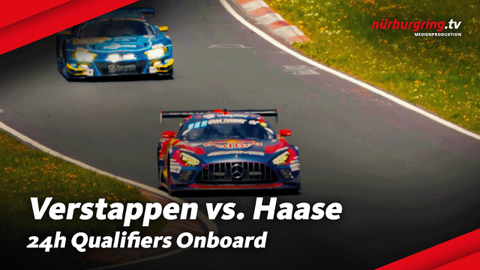
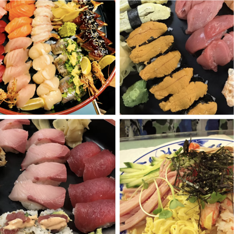

## Current Personal Status
>
> I made a fun update to [MikanRemote](/mikanremote-an-iphone-remote-control-for-my-mac) that I need to write about. I added some special controls for YouTube but they also seem to work in Netflix, etc.

## Current Projects

- I need to get back to studying Korean. I got derailed by my trip east and work since.

- [Friends with Brews](https://friendswithbrews.com) [YouTube channel](https://www.youtube.com/@FriendswithBrewsPodcast)

## Stuff I've recently enjoyed

### TV Shows

[Legends • 2026 • The actors make this one. I loved them all. Well, most of them. This is when I was able to just sit back and enjoy and really relish the people. *****
](/images/posts/png-image4dbb97ecf20-review-015b4382-d62f-46d3-b37c-e6252cd0c5e5.jpg)

### Podcasts

*Podcast episodes without links are members-only but I think are interesting enough to post in case you want to investigate them.*

 [Patrick Boyle On Finance – The Unanchored Central Banker: Manoj Pradhan on Inflation, Demographics, and Why AI Won’t Save Us](https://overcast.fm/+oGB7w59eY)
 MacStories Unwind+ – Is It the Shoes?
 The Race F1 Podcast (Members) – Verstappen at the Nurburgring 24: Josh’s bold prediction and day two recap
 Six Colors+ — Private – Vibe-coded apps and missed Mac opportunities
 Tech Won't Save Us (Premium) – The UK Government’s AI Obsession is a Big Risk w/ Will Dunn
 [Risky Business – Soap Box: Where does AI fit into cloud security?](https://overcast.fm/+It0gwbCY0)
 The Race F1 Podcast (Members) – 🔍 Driving Style Secrets S3 E3: The hidden technique behind Jenson Button’s smooth style
 [The Weekly Planet – Total Recall - Caravan Of Garbage](https://overcast.fm/+1HFJhI_J8)
 [Business History – From History Daily: John S. Pemberton Sells the First Glass of Coca-Cola](https://overcast.fm/+BSZV0lDb9k)
 [Accidental Tech Podcast – 691: A Menlo Phase](https://atp.fm/691)

### Books

[Exhalation • 2019 • Ted Chiang • A fun and thought-provoking collection of short sci-fi stories. Some of these are centered around completely novel concepts, others less so, but they're all explorations in their own way of what it means to be human. *****
](/images/posts/png-image46f28d750e0-review-a0f8e609-880b-4163-bda8-037d74d23c80.jpg)
[The Mastermind • Evan Ratliff • 2019 • Crime is fun, at least for the reader of good journalistic documentations of it, and Evan Ratliff is nothing if not a dogged and interested journalist. I read most of this online at some point, but the book is still incredibly fascinating. Paul Le Roux is quite a character. You won't be able to put this down. *****
](/images/posts/png-image44fcb606ac0-review-a25b8a5c-1425-41be-9d10-77e987cd396a.jpg)

### YouTube

Channel – [Theo - t3․gg](https://www.youtube.com/@t3dotgg)

[Everything is pwn’d now](https://www.youtube.com/watch?v=M_HxHr7du5M&t=1149s)

Channel – [FORMULA 1](https://www.youtube.com/@Formula1)

[Max Verstappen Reacts To 10 Races From His 10 Years At Red Bull](https://www.youtube.com/watch?v=rWWdSJZXhio)

Channel – [Nate Herk | AI Automation](https://www.youtube.com/@nateherk)

[3 Easy Ways to Deploy Your Claude Agents & Skills](https://www.youtube.com/watch?v=xJ5oz63mIec&t=208s)

Channel – [boybblue](https://www.youtube.com/@boybblue)

[JOHNNY RIVERS - Secret Agent  Man 1966](https://www.youtube.com/watch?v=6iaR3WO71j4)

Channel – [THE RACE](https://www.youtube.com/@WeAreTheRace)

[Why McLaren is escalating its attack on F1 team alliances](https://www.youtube.com/watch?v=mGQNl25zjho)

Channel – [Low Level](https://www.youtube.com/@LowLevelTV)

[what the hell is even happening](https://www.youtube.com/watch?v=UQhHpmMZIms)

Channel – [THE RACE](https://www.youtube.com/@WeAreTheRace)

[🔴 LIVE Top Qualifying 3 - 24h Nürburgring 2026](https://www.youtube.com/watch?v=0rZ91DvwrxQ)

Channel – [Ron](https://www.youtube.com/@Ron-RisingSunProperties)

[Beautiful 150K USD Home in Gifu, Japan](https://www.youtube.com/watch?v=K5US2IiSkjI&t=16s)

Channel – [Grooved Slick](https://www.youtube.com/@GroovedSlick)

[Pure Driving: Verstappen Very WET and DARK Lap of Nürburgring (Qualifying 2 N24 2026) No commentary](https://www.youtube.com/watch?v=SDF4NUTCcnU)

Channel – [Circuit Stories](https://www.youtube.com/@CircuitStoriesss)

[Jackie Stewart Was Right About Gilles Villeneuve… But Nobody Listened](https://www.youtube.com/watch?v=WX0mK0R7FpE)

Channel – [nürburgringtv](https://www.youtube.com/@nuerburgringtv)

[HAASE vs. VERSTAPPEN: The Rematch | Dual Onboards | Nürburgring 24h Qualifiers](https://www.youtube.com/watch?v=4_SguHHLSzk)

Channel – [Theo - t3․gg](https://www.youtube.com/@t3dotgg)

[I’m done.](https://www.youtube.com/watch?v=131yAOjxHHQ&pp=0gcJCQQLAYcqIYzv)

### Food

 [Toshi Restaurant](https://toshirestaurant.wixsite.com/beaverton)

